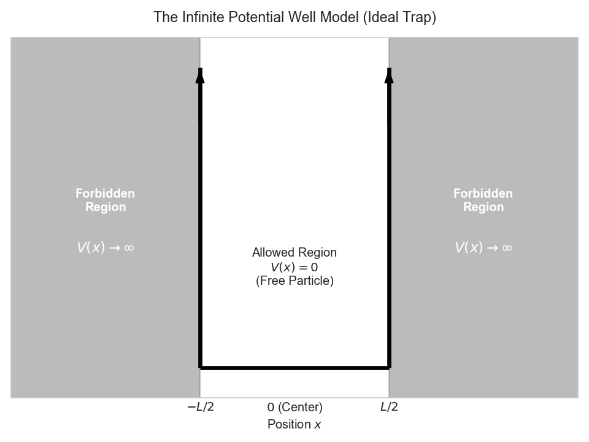
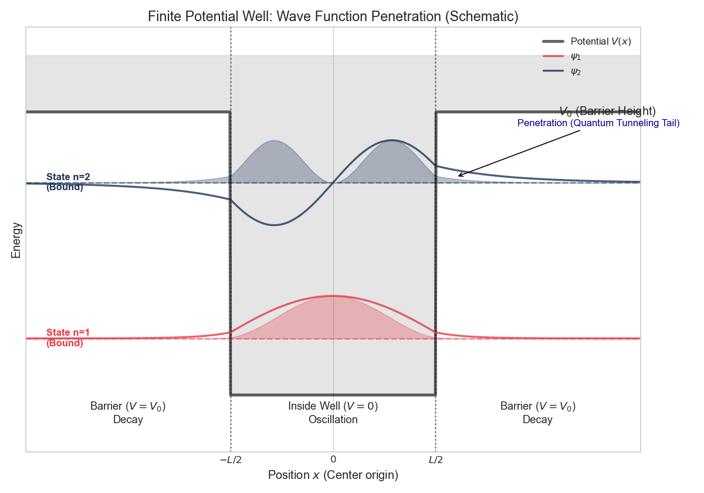

这篇文章最初是为了备考整理，但在复习过程中我越来越意识到量子力学在工程中的基础地位，因此决定把完整思路系统写下来。  
This article was initially written for exam review, but during that process I realized how fundamental quantum mechanics is for engineering, so I decided to document my notes in a structured way.
# 阅读后小结 <p> After Reading
<details>
    <summary>1. 推导波函数时为什么只重点看 x 方向？ / Why do we only focus on the x-axis when deriving the wave function?</summary>

**根本原因是：在 y、z 方向没有势阱约束，只有 x 方向存在受限边界。**<p>
**The fundamental reason is the absence of potential confinement (potential wells) in the y and z directions.**<p>
• x 方向：电子被势阱束缚，形成“驻波”，因此出现离散能级，这是需要量子求解的核心。<p>
• In the x-direction: The electron is trapped by the potential well , creating "Standing Waves." This leads to quantized energy levels (discrete states), which is the unique quantum phenomenon we need to solve for.<p>
• y、z 方向：没有势垒，电子近似自由粒子，表现为“行波”，能量连续，用经典图像即可近似处理。<p>
• In the y and z directions: There are no potential walls. The electron behaves like a Free Particle, traveling as "Traveling Waves." Its energy is continuous and follows classical physics logic, so we don't need to spend effort solving a complex Schrödinger equation for them.

</details>
<details>
    <summary>2. 为什么推导中常使用复指数形式（含虚数项）？ / Why is the complex form used in wavefunction derivation?</summary>

<a id="free-electron-dispersion"></a>
本节目标是得到自由电子色散关系 $E=\frac{p^2}{2m}$。由德布罗意关系可写为：  
First, our objective in this section is to derive $E = \frac{p^2}{2m}$. According to the de Broglie wave relations, we obtain:

$$E=\hbar \omega = \frac{(\hbar k)^2}{2m}$$

这意味着方程必须体现 $\omega$（频率）与 $k^2$（波数平方）成正比。<p>
This means that the equation must reflect that $\omega$ (frequency) is proportional to $k^2$ (the square of the wavenumber).<p>
若使用纯实函数形式：  
If we use a real-valued wavefunction:

$$\Psi = \cos(kx - \omega t)$$

对应能量项（时间导数）：
Corresponding to energy E: We need to take the derivative with respect to time $t$:
 
$$\frac{\partial \Psi}{\partial t} = \omega \sin(kx - \omega t)$$

对应动量平方项（空间二阶导）：
Corresponding to kinetic energy ($p^2$):  
对应到空间变量 $x$，需要做二阶导数：
We need to take the second derivative with respect to space $x$:

$$\frac{\partial^2 \Psi}{\partial x^2} = -k^2 \cos(kx - \omega t)$$

可以看到左右两侧出现 $\sin$ 与 $\cos$ 的相位不一致，难以形成稳定的本征方程匹配；因此采用复指数 $e^{i(kx-\omega t)}$ 更自然、也更便于算符求解。  
Regarding the de Broglie wave formula, the $sin$ on the left side is not always equal to the $cos$ on the right side. There is a phase difference, so the equation does not match cleanly. Therefore, the complex exponential form is used.
</details>
<details>
    <summary>3. 为什么经典波动方程不能直接用于电子？ / Why does the classical wave equation not apply to electrons?</summary>

本质原因：电子与光子遵循不同的能量-动量关系（色散关系）。<p>
It is because electrons and photons follow different Energy-Momentum Relations (Dispersion Relations).<p>

经典波动方程为：  
classical wave equation:

$$\frac{\partial^2 \Psi}{\partial x^2} - \frac{1}{v^2} \frac{\partial^2 \Psi}{\partial t^2} = 0$$

它隐含关系：  
It implies a mathematical relationship:

$$p^2 \propto E^2 \quad \text{or} \quad E \propto p$$

对光子：$E=cp$，能量与动量线性相关，因此与经典波动方程相容。  
For photons (Light): $E = cp$. Energy and momentum have a linear relationship. Therefore, photons perfectly fit the classical equation. ($E^2 = c^2 p^2$)

对非相对论电子（有质量 $m$）：满足牛顿动能关系  
For non-relativistic electrons, which have mass $m$, they follow Newton's kinetic energy formula:

$$E = \frac{p^2}{2m}$$

这意味着 $E\propto p^2$。映射到算符后是“时间一阶导”对应“空间二阶导”，与经典方程结构不一致。<p>
This means that energy ($E$) is proportional to the square of momentum ($p^2$). When converted to derivatives, it becomes: the first-order time derivative ($\partial_t$) $\propto$ the second-order spatial derivative ($\partial_{xx}$), which is a contradiction.<p>
结论：电子波是有质量且有色散的，需要使用薛定谔方程而不是经典波动方程。  
**The conclusion is that the classical wave equation describes massless, non-dispersive waves (with a constant wave speed). However, electron waves are massive and dispersive (their wave speed changes with wavelength), so a new equation — the Schrödinger equation (with a first-order derivative on the left and a second-order derivative on the right) — must be used.**
</details>

# 引言 <p> Introduce

在工程研究中必须引入量子力学，一个最直接的原因是摩尔定律正在逼近尺度极限。晶体管从微米级缩小到今天手机与 FPGA 常见的 3nm、2nm，甚至向 1nm 靠近后，量子效应已经不能忽略。  
One of the most straightforward reasons why we need to use quantum mechanics in engineering research is that Moore's Law has reached its limit. Moore's Law states that the number of transistors on an integrated circuit doubles every 18 to 24 months, and chip performance surges accordingly. However, the reason this law has been able to persist for decades is that transistors have been made smaller and smaller. From the early micrometer scale, transistors in current mobile phones and FPGAs have shrunk to 3 nanometers, 2 nanometers, and are even approaching 1 nanometer. At this point, it is no longer feasible to ignore quantum properties, which is why quantum mechanics is necessary.

# 经典理论的失效与二象性 <p> The Failure of Classical Physics & Duality
## 经典力学的适用边界 <p> The Limitations of Classical Physics
经典力学在高速、微观尺度和极端条件下会失效。速度接近光速时经典动量与速度叠加不再准确；在原子与粒子尺度上，波粒二象性与不确定性原理等现象也超出经典框架。  
The applicability of classical mechanics is limited when there are high-speed motions, microscopic scales, or extreme conditions. First, when the speed of an object approaches the speed of light, the law of velocity addition and the law of momentum in classical mechanics will fail. Second, when studying objects at the microscopic scale, such as atoms, molecules, and particles, the macroscopic approximations of classical mechanics are no longer applicable. At the microscopic scale, there are quantum mechanical effects, such as wave-particle duality and the uncertainty principle, which cannot be explained by the framework of classical mechanics.
## 波粒二象性 <p> Wave-Particle Duality

### 光的波动性 <p> Wave Nature of Light

光的波动性来自大量实验事实，不仅有杨氏双缝干涉，还有衍射、偏振等结果。基于这些实验可得到下列关系：<p>
The wave nature of light is derived from numerous experimental observations, not only Young's double-slit interference experiment, but also the diffraction experiment of light, the polarization experiment of light, and so on. Based on the achievements of predecessors, there are the following formulas:<p>

#### 光波关系（Maxwell 框架） <p> Maxwell's Equations for Light:
$$c=f\lambda$$
$c$：光速 / velocity of light<p>
$f$：频率 / frequency<p>
$\lambda$：波长 / wavelength<p>

### 光的粒子性 <p> The particle nature of light
光的粒子性同样由实验确认（如康普顿效应），并体现在离散能量与动量表达式中：<p>
The particle nature of light is also derived from numerous experimental observations, including the Compton effect. The particle nature of light is manifested in energy E and momentum p, with the following formulas:<p>
#### 光子的能量 <p> The energy level of a photon:

$$E=hf=h\frac{c}{\lambda}=h\frac{\omega}{2\pi}=\hbar\omega$$

$h$：普朗克常数 / Planck constant<p>

$\hbar$：约化普朗克常数，$\hbar=\frac{h}{2\pi}$ / reduced Planck constant

#### 光子的动量 <p> The kinetic energy of a photon:
$$p=\frac{h}{\lambda}=h\frac{k}{2\pi}=\hbar k$$

$k$：波数（单位空间相位变化率） / wavenumber

### 电子的波粒二象性 <p> Wave-Particle Duality of Electrons
#### 德布罗意波 <p> De Broglie Waves
由光子的动量关系 $p=\frac{h}{\lambda}$ 类比可得电子的德布罗意关系：  
Refer to the momentum equation of light $p=\frac{h}{\lambda}$

$$\lambda=\frac{h}{p}=\frac{h}{mv}$$

$m$：质量 / mass<p>
$v$：速度 / velocity<p>

### 哥本哈根诠释 <p> Copenhagen Interpretation
1. 量子系统状态可由波函数完整描述；波函数编码了观测者可获得的信息。<p>
1. The quantum state of a quantum system can be fully described by a wave function. The wave function represents all the information an observer has about the quantum system.<p>
2. 量子描述是概率性的，事件概率由波函数模平方给出。<p>
2. The description of a quantum system is probabilistic. The probability of an event is the square of the absolute value of the wave function.<p>
3. 不确定性原理指出位置与动量不能同时精确确定。  
3. The uncertainty principle states that in a quantum system, the position and momentum of a particle cannot be determined simultaneously.

# 波函数 <p> The Wave Function

## 一维波函数推导 <p> Derivation of the one-dimensional wave function

根据欧拉公式：  
According to Euler's Formula

$$e^{ix}=cos(x)+isin(x)$$

可将沿 x 方向传播的波写成：  
We can describe the wave propagating along the x-axis using the following formula.

$$\Psi(x,t)=Acos(k(x-vt)+\theta_0)$$

并利用关系：  
Here, based on this deduction

$$v=f\lambda=\frac{\omega}{2\pi} \cdot \frac{2\pi}{k}=\frac{\omega}{k}$$

与欧拉公式结合可知，上式本质上是在取复指数形式的实部：  
Combined with Euler's formula, it is found that what is actually being calculated is the real part.

$$\Psi(x,t)=Acos(kx-\omega t+\theta_0)=\mathrm{Re}[Ae^{i(kx-\omega t+\theta_0)}]$$

将 $Ae^{i\theta_0}$ 记为复振幅 $\widetilde{A}$，可把波函数简写为：  
Omitting the real part operation, here $Ae^{i\theta_0}$ is the complex amplitude. After replacing it with $\widetilde{A}$, the wave function is obtained.

$$ \Psi(x,t)=\widetilde{A}e^{i(kx-\omega t)}$$

## Born 统计解释与归一化
### Born 统计解释 <p> Born's Statistical Interpretation
这里要回答“波函数究竟表示什么”。Born 在 1926 年提出统计解释：波函数本身不可直接观测，但其模平方对应概率密度。<p>
This part is very interesting. First, we need to clarify what the Ψ we just derived is. Max Born put forward a bold hypothesis in 1926, which also earned him the Nobel Prize.<p>
核心思想是：波函数本身不能直接测量，但其模平方给出粒子在某处出现的概率密度。  
Core concept: the wavefunction itself has no direct physical meaning (you cannot measure it), but its modulus squared represents the probability density of a particle appearing at a certain location.
$$P(x, t) = |\Psi(x, t)|^2 = \Psi^*(x, t) \cdot \Psi(x, t)$$

<a href="">Maybe someone has found something interesting...（Tips:Correlation）</a>

### 归一化条件 <p> Normalization Condition
既然 $|\Psi|^2$ 是概率密度，则全空间概率和必须为 1（粒子一定在某处）。  
Since $|\Psi|^2$ represents the probability density, this leads to a logical necessity: **the electron must exist somewhere in the universe.**
如果沿整个 x 轴寻找该电子，总概率必须是 100%（即 1）。  
If we search for this electron along the entire x-axis, the total probability of finding it must be 100% (i.e., 1).

$$\int_{-\infty}^{+\infty} |\Psi(x, t)|^2 \ dx = 1$$

<a href="">Maybe someone has found something interesting...（Tips:Dirac delta function）</a>

归一化的核心作用是确定振幅常数 $\widetilde{A}$；否则方程只能给比例而非可计算预测。  
Normalization is the only tool used to calculate $\widetilde{A}$. Without normalization, our equation would only be a proportion, not an accurate prediction.

## 经典波动方程（达朗贝尔方程） <p> Classical Wave Equation(d'Alembert Equation)

从波函数出发，分别对 $x,t$ 做二阶求导：
Starting from the wave function, take the second derivative with respect to x and t respectively to obtain the formula:

$$\frac{\partial^2 \Psi}{\partial x^2} = (ik)^2 \Psi = -k^2 \Psi$$

$$\frac{\partial^2 \Psi}{\partial t^2} = (-i\omega)^2 \Psi = -\omega^2 \Psi$$

由 \( v=\frac{\omega}{k} \Rightarrow k^2=\frac{\omega^2}{v^2} \)，代入可得到经典波动方程：  
Using the previously derived formula \( v = \frac{\omega}{k} \), we can obtain \( k^2 = \frac{\omega^2}{v^2} \). Substituting this into the above second equation gives the classical wave equation:

$$\left(\frac{\partial^2}{\partial x^2} - \frac{1}{v^2} \frac{\partial^2}{\partial t^2}\right)\Psi(x,t)= 0$$

该方程描述真空中的经典电磁波传播规律，但并不适用于电子。<p>
The significance of this equation is: any light (electromagnetic wave) propagating in a vacuum must strictly obey this law.<p>
<a href="">Electrons cannot use this equation</a>

# 薛定谔方程 <p> The Schrödinger Equation
## 推导 <p> Derivation
从总能量守恒（动能 + 势能）出发：  
We start with the conservation of energy (kinetic energy plus potential energy):

$$E=K(t)+V(t)=\frac{p^2}{2m}+V(t)$$

引入两个常用量子算符：  
Here, two operators (the calculation process) are introduced:

$$\hat{p} = -i\hbar \frac{\partial}{\partial x}$$

$$\hat{E} = i\hbar \frac{\partial}{\partial t}$$

两侧同时作用于 $\Psi(x,t)$：
Both sides process $\Psi(x,t)$ simultaneously:

$$[-\frac{\hbar^2}{2m}\frac{\partial^2}{\partial x^2}+V(t)]\Psi(x,t)=i\hbar\frac{\partial}{\partial t}\Psi(x,t)$$

将括号项记为哈密顿算符 $\hat H$：
Substitute the Hamiltonian operator $\hat{H}$:

$$\hat{H}\Psi(x,t)=i\hbar\frac{\partial}{\partial t}\Psi(x,t)$$

## 含时薛定谔方程 <p> Time-Dependent Schrödinger Equation
从下式开始：
Starting from here:

$$\hat{H}\Psi(x,t)=i\hbar\frac{\partial}{\partial t}\Psi(x,t)$$

先作变量分离：
First, perform a parametric separation of the wave function:

$$\Psi(x,t)=\psi(x)f(t)$$

代回原方程：
Substitute back into the original formula:

$$\frac{1}{\psi(x)} \left[ -\frac{\hbar^2}{2m} \frac{d^2 \psi(x)}{dx^2} \right] + V(x) = \frac{i\hbar}{f(t)} \frac{df(t)}{dt}=E$$

也可写成哈密顿算符形式：
Or using the Hamiltonian operator $\hat{H}$:

$$\frac{\hat{H}\psi(x)}{\psi(x)}=\frac{i\hbar}{f(t)}\frac{df(t)}{dt}$$

等号左侧仅与空间有关，右侧仅与时间有关，因此它们都必须等于常数 $E$。  
The meaning here is that the left side of the equal sign is only related to the space x, the right side is only related to the time t, and both are equal to the constant $E$.

<a id="time-independent-schrodinger-equation"></a>
## 定态薛定谔方程 <p> Time-Independent Schrödinger Equation

由含时薛定谔方程可得：
This follows the time-dependent Schrödinger equation:

$$\frac{1}{\psi(x)} \left[ -\frac{\hbar^2}{2m} \frac{d^2 \psi(x)}{dx^2} \right] + V(x) = \frac{i\hbar}{f(t)} \frac{df(t)}{dt}=E$$

两边同乘 $\psi(x)$：
Multiply both sides by $\psi(x)$:

$$-\frac{\hbar^2}{2m} \frac{d^2 \psi(x)}{dx^2} + V(x)\psi(x)=E\psi(x)$$

整理为：
Handle it:

$$\psi(x) \left[ -\frac{\hbar^2}{2m} \frac{d^2}{dx^2}+V(x) \right]=E\psi(x)$$

写成哈密顿算符形式：
Substitute into the Hamiltonian operator $\hat{H}$:

$$\hat{H}\psi=E\psi$$

# 量子势阱（薛定谔方程的直接应用） <p> Quantum Well (Practical Application of Schrödinger Equation)

## 无限深势阱 <p> Infinite Barrier
<details>
  <summary style="cursor: pointer; color: #007bff; text-decoration: underline;">
    无限深方势阱示意图 / Infinite Square Potential Well Diagram
  </summary>
  
  <br> 
</details>

先看最简单模型：宽度为 $L$ 的一维无限深势阱。阱内势能为 0，阱外势能无穷大，电子被完全束缚在阱内。<p>
First, let's establish the simplest model. Imagine an electron trapped in a box with a width of $L$, where the walls are infinitely high, and the electron can never escape.<p>
阱内（$0 < x < L$）满足 $V(x)=0$，电子可在阱内传播。<p>
Inside the well ($0 < x < L$): $V(x) = 0$ (the electron flies freely).<p>
阱外（其余区域）满足 $V(x)=\infty$，电子到达该处的概率为 0。  
Outside the well (other regions): $V(x) = \infty$ (the electron can never reach there, with a probability of 0).

推导步骤如下：<p>
势能与时间无关，因此使用定态薛定谔方程 $\hat{H}\psi=E\psi$，在阱内 $V(x)=0$ 得到：  
The calculation is as follows: <p>
首先，由于势能不显含时间，采用定态薛定谔方程 $\hat{H}\psi=E\psi$；再结合阱内 $V(x)=0$，可得：  
First, since the potential energy does not change with time, we use the time-independent Schrödinger equation: $\hat{H}\psi=E\psi$. Also, because $V(x)=0$ in the L region, we obtain the following equation:
$$-\frac{\hbar^2}{2m} \frac{d^2 \psi}{dx^2} = E \psi$$

整理为：
Sorted out as:

$$\frac{d^2 \psi}{dx^2} + \frac{2mE}{\hbar^2} \psi = 0$$

结合之前的 $E=\frac{p^2}{2m}$ 可化为 Helmholtz 形式：
Reviewing the previous derivation $E=\frac{p^2}{2m}$, substituting $p=i\hbar$ gives the Helmholtz Equation

$$\frac{d^2 \psi}{dx^2} + k^2 \psi = 0$$

该常微分方程通解为：
At a glance, it's a differential equation, and the solution is:

$$\psi(x) = A \sin(kx) + B \cos(kx)$$

再施加边界条件（墙上概率为 0）：
Next are the boundary conditions, because it's impossible to be on the wall:

$$\psi(0)=B=0$$

$$\psi(L)=A\sin(kL)=0$$

因此量子化条件为 $kL=n\pi \ (n=1,2,3,\dots)$。  
This means that $kL = n\pi \quad (n = 1, 2, 3, \dots)$

归一化时，由于阱外波函数为 0，可写为：
Next, we investigate the normalization condition. The wave function outside the potential well is 0, so it can be simplified to:

$$\int_{0}^{L} |\psi(x)|^2 \ dx = 1$$

代入 $\psi(x)=A\sin\left(\frac{n\pi x}{L}\right)$：
Substitute $\psi(x) = A\sin\left(\frac{nx\pi}{L}\right)$

$$A^2 \int_{0}^{L} \sin^2\left( \frac{n\pi x}{L} \right) \ dx = 1$$

通过降幂积分可解得：
By power reduction, solving the equation gives:

$$A^2 = \frac{2}{L} \implies A = \sqrt{\frac{2}{L}}$$

归一化本征函数为：
The normalized wave function:

$$\psi_n(x) = \sqrt{\frac{2}{L}} \sin\left( \frac{n\pi x}{L} \right)$$

$$E_n = \frac{\hbar^2 k^2}{2m} = \frac{n^2 \pi^2 \hbar^2}{2m L^2}$$

### Python 仿真 <p> python simulation
<details>
  <summary>代码 / Code</summary>

```python
import numpy as np
import matplotlib.pyplot as plt

# --- 1. 物理参数设定 ---
L = 1.0          # 势井宽度 (比如 1nm)
x = np.linspace(0, L, 1000)  # 在 0 到 L 之间生成 1000 个点

# --- 2. 定义波函数 ---
# 公式: psi = sqrt(2/L) * sin(n * pi * x / L)
def get_psi(n, x, L):
    return np.sqrt(2/L) * np.sin(n * np.pi * x / L)

# --- 3. 绘图设置 ---
plt.figure(figsize=(8, 6), dpi=120) # 设置画布大小和清晰度
plt.title("Infinite Square Well: Wave Functions & Probability", fontsize=14)
plt.xlabel("Position $x/L$", fontsize=12)
plt.ylabel("Energy Levels (Schematic)", fontsize=12)

# 为了美观，我们设定一些颜色
colors = ['#FF5733', '#33FF57', '#3357FF'] # 红、绿、蓝
levels = [1, 2, 3] # 我们画前三个能级

# --- 4. 循环画出 n=1, 2, 3 ---
for i, n in enumerate(levels):
    # 计算波函数
    psi = get_psi(n, x, L)
    
    # 计算概率密度 |psi|^2
    prob = psi**2
    
    # 设定一个基准高度，代表能量 E_n
    # 为了显示清楚，我们人工拉开间距，不完全按 n^2 比例，否则 n=1 会被压扁
    energy_level = n * 40 
    
    # 画基准线 (虚线)
    plt.axhline(y=energy_level, color='gray', linestyle='--', alpha=0.5)
    plt.text(-0.1, energy_level, f'n={n}', color=colors[i], fontweight='bold', fontsize=12)
    
    # 画波函数 (实线) - 这里的 + energy_level 是为了把它平移上去
    # 乘以 5 是为了放大波幅，让它在图上看得更清楚
    plt.plot(x, psi * 5 + energy_level, color=colors[i], label=f'$\psi_{n}(x)$')
    
    # 画概率密度 (填充颜色)
    # fill_between(x轴, 下限, 上限)
    plt.fill_between(x, energy_level, (prob * 5) + energy_level, 
                     color=colors[i], alpha=0.2, label=f'$|\psi_{n}|^2$ Probability')

# --- 5. 画势井的墙壁 ---
plt.axvline(0, color='black', linewidth=3)
plt.axvline(L, color='black', linewidth=3)
plt.text(0, 0, 'V = $\infty$', ha='right', va='bottom', fontsize=12)
plt.text(L, 0, 'V = $\infty$', ha='left', va='bottom', fontsize=12)

# 隐藏 Y 轴刻度 (因为是示意图)
plt.yticks([])
plt.xlim(-0.2, 1.2) # 留一点边距

# 导出建议: plt.savefig('quantum_well.png')
plt.show()
```
</details>
<details>
  <summary>图像输出 / Matplotlib Output</summary>
  
  <details>
  <summary style="cursor: pointer; color: #007bff; text-decoration: underline;">
    无限深势阱的能量图
  </summary>
  
  <br> 

  </details>
要点：<p>
1. 阴影面积代表概率分布。<p>
2. 波函数过零点处概率为 0；波函数正负号体现相位信息。  
Key points: <p>
1. The area of the shadow is the probability. <p>
2. The position of the point where the wave function crosses 0: the probability is 0, and the presence of positive and negative values is due to the occurrence of the tunneling effect.
</details>

## 有限深势阱 <p> finite-depth potential well
<details>
  <summary style="cursor: pointer; color: #007bff; text-decoration: underline;">
    有限深方势阱示意图 / Finite Square Potential Well Diagram
  </summary>
  
  <br> 
</details>

类似地，对有限深势阱有：  
Similarly, according to the above diagram

$$
V(x) =
\begin{cases}
  0, & |x| < \frac{L}{2} \\\\
  V_0, & \text{otherwise}
\end{cases}
$$

解题需要分三区：区 I（左侧阱外）、区 II（阱内）、区 III（右侧阱外）。区 II 与无限深势阱形式相同：<p>
We need to divide into three domains: domain 1 ($x<-\frac{L}{2}$), domain 2 ($-\frac{L}{2}<x<\frac{L}{2}$), and domain 3 ($x>\frac{L}{2}$).<p>
先看区 II（$-\frac{L}{2}<x<\frac{L}{2}$），其形式与无限深势阱相同：  
First, let's analyze domain 2 ($-\frac{L}{2}<x<\frac{L}{2}$), which is similar to an infinite potential well:

$$\psi'' + k^2\psi = 0$$

其数学通解为：
The general solution in mathematics is:

$$\psi_{II}(x) = A_2\cos(kx) +B_2\sin(kx)$$

区 I（$x<-\frac{L}{2}$）：
Domain 1 ($x < -\frac{L}{2}$):

$$\psi'' - \kappa^2\psi = 0$$

数学通解：
The general solution in mathematics is:

$$\psi_I(x) = A_1e^{\kappa x} + B_1e^{-\kappa x}$$

物理约束：$x\to-\infty$ 时发散项必须去掉。<p>
最终保留：
Physical Constraints: When $x \to -\infty$, $e^{-\kappa x}$ becomes infinite (physically not allowed).<p>
因此最终解可写为：  
The final solution is:

$$\psi_I(x) = A_1e^{\kappa x}$$

区 III（$x>\frac{L}{2}$）：
Domain 3 ($x>\frac{L}{2}$):

$$\psi'' - \kappa^2\psi = 0$$

数学通解：
The mathematical general solution is:

$$\psi_{III}(x) = A_3e^{\kappa x} + B_3e^{-\kappa x}$$

同理，$x\to+\infty$ 时发散项去掉，得到：
Physical screening: As $x \to +\infty$, $e^{\kappa x}$ becomes infinite. The final solution is:

$$\psi_{III}(x) = B_3e^{-\kappa x}$$

利用边界连续条件可得到超越方程，从而求允许能级与对应概率分布：
Boundary conditions (the wave functions are the same at the boundary) can solve the transcendental functions, and thus solve for energy and probability:

$$k \tan(kL/2) = \kappa$$

### Python 仿真 <p> python simulation
<details>
  <summary>代码 / Code</summary>

```python
import numpy as np
import matplotlib.pyplot as plt

# --- 1. 设定示意性参数 ---
L = 2.0           # 井宽 (示意值，比如 2nm，从 -1 到 1)
V0 = 10.0         # 墙高 (示意值)
x = np.linspace(-L*1.5, L*1.5, 1000) # 画宽一点，展示墙外

# 定义区域
inside_mask = np.abs(x) <= L/2
outside_mask = np.abs(x) > L/2

# --- 2. 构造示意性波函数 (非精确解，仅做视觉展示) ---
# 我们需要手动调整 k (波数) 和 kappa (衰减系数) 来让图看起来像真的
# 关键点：能量越高(n越大)，kappa越小(衰减越慢，渗透越深)

def get_schematic_psi(n, x, L):
    psi = np.zeros_like(x)
    
    # --- 手动调参区 (Magic Numbers for visuals) ---
    if n == 1:   # 基态 (偶对称 cos)
        E_schematic = 2.0
        k = np.pi / (L * 1.1)  # 波长比无限井稍微长一点点
        kappa = 3.5            # 衰减较快
        
        # 井内
        psi[inside_mask] = np.cos(k * x[inside_mask])
        # 边界值 (用于缝合)
        boundary_val = np.cos(k * L/2)
        # 井外 (指数衰减)
        psi[outside_mask] = boundary_val * np.exp(-kappa * (np.abs(x[outside_mask]) - L/2))
        
    elif n == 2: # 第一激发态 (奇对称 sin)
        E_schematic = 7.5
        k = 2 * np.pi / (L * 1.15)
        kappa = 1.5            # 能量高了，衰减变慢了 (渗透更深!)
        
        # 井内
        psi[inside_mask] = np.sin(k * x[inside_mask])
        # 边界值
        boundary_val = np.sin(k * L/2)
        # 井外 (指数衰减，注意要乘 sign(x) 保持奇对称)
        psi[outside_mask] = boundary_val * np.exp(-kappa * (np.abs(x[outside_mask]) - L/2)) * np.sign(x[outside_mask])
        
    # 归一化视觉幅度
    psi = psi / np.max(np.abs(psi))
    return psi, E_schematic

# --- 3. 绘图设置 ---
plt.figure(figsize=(10, 7), dpi=120)
plt.style.use('seaborn-v0_8-whitegrid')

# 画势阱 V(x) 的轮廓
V_x = np.zeros_like(x)
V_x[outside_mask] = V0
plt.plot(x, V_x, color='black', linewidth=3, alpha=0.6, label='Potential $V(x)$')
plt.fill_between(x, V_x, V0+2, color='gray', alpha=0.2) # 给墙壁上色

# --- 4. 循环画出能级 n=1, n=2 ---
colors = ['#E63946', '#1D3557'] # 红、蓝
states = [1, 2]

for i, n in enumerate(states):
    psi, E_level = get_schematic_psi(n, x, L)
    prob = psi**2
    
    # 画能级基准线
    plt.axhline(E_level, color=colors[i], linestyle='--', alpha=0.5)
    plt.text(-L*1.4, E_level, f'State n={n}\n(Bound)', color=colors[i], va='center', fontweight='bold')
    
    # 画波函数 (稍微放大一点平移到能级上)
    scale_factor = 1.5
    plt.plot(x, psi * scale_factor + E_level, color=colors[i], linewidth=2, alpha=0.8, label=f'$\psi_{n}$')
    
    # 画概率密度 (重点展示渗透！)
    plt.fill_between(x, E_level, prob * scale_factor + E_level, color=colors[i], alpha=0.3)

# --- 5. 装饰图表 ---
# 标出关键区域
plt.axvline(-L/2, color='black', linestyle=':', alpha=0.5)
plt.axvline(L/2, color='black', linestyle=':', alpha=0.5)
plt.text(0, -1, 'Inside Well ($V=0$)\nOscillation', ha='center', fontsize=11)
plt.text(-L, -1, 'Barrier ($V=V_0$)\nDecay', ha='center', fontsize=11)
plt.text(L, -1, 'Barrier ($V=V_0$)\nDecay', ha='center', fontsize=11)

# 标注 V0
plt.text(L*1.1, V0, '$V_0$ (Barrier Height)', va='center', fontsize=12)

# 重点：标注渗透现象
plt.annotate('Penetration (Quantum Tunneling Tail)', 
             xy=(L/2 + 0.2, E_level + 0.2), 
             xytext=(L/2 + 0.8, E_level + 2),
             arrowprops=dict(facecolor='black', arrowstyle='->'),
             fontsize=10, color='darkblue')


plt.title('Finite Potential Well: Wave Function Penetration (Schematic)', fontsize=14)
plt.xlabel('Position $x$ (Center origin)', fontsize=12)
plt.ylabel('Energy', fontsize=12)
plt.yticks([]) # 隐藏Y轴刻度
plt.xticks([-L/2, 0, L/2], ['$-L/2$', '$0$', '$L/2$']) # 设置X轴刻度
plt.xlim(-L*1.5, L*1.5)
plt.ylim(-2, V0 + 3)
plt.legend(loc='upper right')

plt.tight_layout()
plt.show()
# plt.savefig('finite_well_schematic.png')
```
</details>
<details>
  <summary>图像输出 / Matplotlib Output</summary>
  
  <details>
  <summary style="cursor: pointer; color: #007bff; text-decoration: underline;">
    有限深势阱的能量图
  </summary>
  
  <br> 

  </details>
要点：<p>
1. 比较低能态（红）与高能态（蓝）：高能态在势垒中的尾部衰减更慢、渗透更深。<p>
2. 阱外阴影表示“经典禁区中的非零概率”，这正是隧穿效应的根源。  
Key points: <p>
1. Compare (low energy, red) and (high energy, blue). It will be found that the blue tail decays more slowly and extends farther. This is quite intuitive: the higher the electron energy, the more 'restless' it is, and the deeper it penetrates into the wall. <p>
2. Look at these colored shadows extending into the wall! In classical physics, this is an absolute forbidden zone. However, in quantum mechanics, the wave function does not suddenly cut off at the boundary but decays exponentially. This proves that electrons have a certain probability of existing inside the potential barrier. This is the fundamental reason for the 'tunneling effect'.
</details>

# 总结与不确定性原理 <p> Conclusion & Uncertainty Principle
## 海森堡不确定性原理 <p> Heisenberg Uncertainty Principle
在这篇结尾，必须面对量子力学最核心也最反直觉的结论：海森堡不确定性原理。<p>
为什么无限深势阱中 $n$ 不能取 0？若 $n=0$ 则 $E=0,p=0$，电子“静止不动”。这在经典力学可接受，但在量子体系中不允许，因为位置与动量不能同时精确确定。  
Before concluding the first note, we must confront the most fundamental and counterintuitive principle in quantum mechanics—the Heisenberg Uncertainty Principle.<p>
在无限深势阱里，若设量子数 $n=0$，会得到 $E=0$ 与 $p=0$，看似合理却与量子约束冲突；根本原因是位置与动量不能同时被精确确定。  
When we calculated the infinite potential well, why can the quantum number $n$ not be equal to 0? If $n = 0$, then $E = 0$ and momentum $p = 0$, which means the electron is stationary. In classical mechanics, it is perfectly reasonable to place a ball at the bottom of a box without moving it. But in quantum mechanics, this is forbidden. This is because the uncertainty principle states: we cannot precisely know both the position ($x$) and momentum ($p$) of a particle simultaneously.

$$\sigma_x \sigma_p \geq \frac{\hbar}{2}$$

$\sigma_x$：位置的不确定度 / Standard deviation (uncertainty) of position<p>
$\sigma_p$：动量的不确定度 / Standard deviation of momentum<p>

从傅里叶观点看：空间分布越窄（位置越确定），动量谱就越宽（动量越不确定）。因此当势阱很窄时，电子动量涨落增大，零点能不可避免。<p>
It can also be understood from the perspective of Fourier transform, which tells us that the narrower a signal is in the time domain (the more certain the position), the wider it must be in the frequency domain (the more uncertain the momentum). If you tightly confine an electron in an extremely small potential well $L$ (with a very small $\sigma_x$), the range of its momentum distribution $\sigma_p$ will increase dramatically, resulting in extremely high kinetic energy. This is why zero-point energy must exist—electrons are forced to fluctuate to satisfy the uncertainty principle.<p>

这给工程带来可控性：通过调节势阱宽度 $L$（例如材料厚度），可以精确改变能级 $E_n$，进而调控发光波长，这正是量子阱激光器的重要物理基础。  
So what does this mean for us? It means we have a means of control: by adjusting the width $L$ of the potential well (changing the material thickness), we can precisely control the energy levels $E_n$ of electrons (changing the color of the emitted light). This is the principle behind quantum well lasers.
