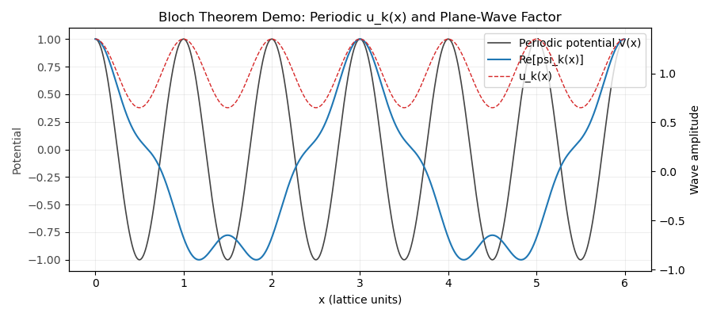
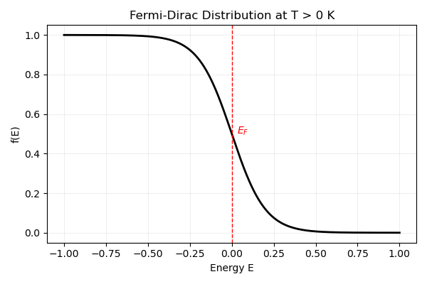
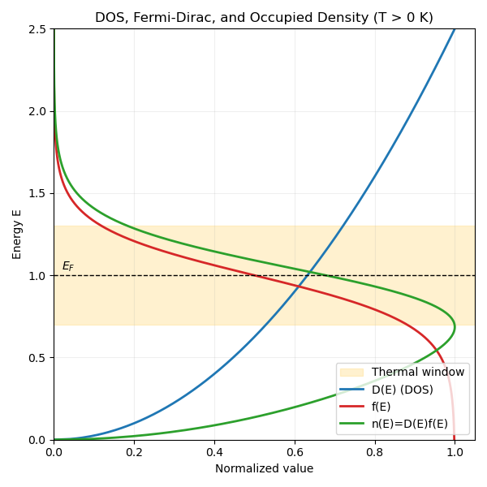

# 电子并非“位于某处”，而是“分布于态中”
# Electrons Are Not Located, They Are Distributed

> **核心前提**  
> 电子并不是以*局域粒子*的形式分布在*空间*里。  
> 它们是通过量子态在*概率*上分布的。  
> **Core premise**  
> Electrons are not distributed in *space* as localized particles.  
> They are distributed in *probability* through quantum states.

在经典力学中，问“粒子在哪里？”这个问题默认了一个前提：粒子在任意时刻都具有明确的位置 $x(t)$。对电子而言，这个假设在根本层面上并不成立。  
In classical mechanics, asking *“where is a particle?”* implicitly assumes that the particle has a well-defined position $x(t)$ at every moment in time. For electrons, this assumption fails at a fundamental level.

在量子力学中，电子不是由轨迹来描述,而是由波函数 $\psi(\mathbf r)$ 来描述。  
In quantum mechanics, an electron is not described by a trajectory, but by a wave function $\psi(\mathbf r)$.

$$
\rho(\mathbf r) = |\psi(\mathbf r)|^2
$$

量 $\rho(\mathbf r)$ 表示在测量时，在位置 $\mathbf r$ 附近找到电子的**概率密度**。  
$\rho$ 越大表示“更可能测到电子”，而不是电子“更强地存在”或像经典云团那样被涂抹开来。  
The quantity $\rho(\mathbf r)$ is the **probability density** of finding the electron near position $\mathbf r$ upon measurement.  
A larger value of $\rho$ means a higher probability, not a stronger presence or a smeared particle.

这一区分非常关键。  
This distinction is crucial.

电子并不是“藏在某个未知位置”,也不是像经典云团那样“扩散在空间中”。在测量之前，电子的位置根本不是一个**预先定义好的属性**。  
The electron is not *hidden* at an unknown position,  
nor is it *spread out* in space like a classical cloud.  
Before measurement, the position of the electron is simply **not a predefined property**.

量子力学提供的不是一张轨迹地图，而是一个支配测量结果的**概率结构**。  
What quantum mechanics provides is not a map of trajectories,  
but a **probabilistic structure** that governs measurement outcomes.

## 从概率密度到量子态
## From Probability Density to States

在 [Part 1 (time-independent Schrodinger equation)](../笔记-量子力学1-薛定谔公式/#time-independent-schrodinger-equation) 中，我们推导了  
In [Part 1 (time-independent Schrodinger equation)](../笔记-量子力学1-薛定谔公式/#time-independent-schrodinger-equation), we derived
$$\hat H\psi = E\psi$$
这正是“量子态”概念的来源。给定势能 $V(x)$ 和边界条件，只允许特定解 $\psi_n(x)$，每个解都对应一个能量本征态。  
This is where "states" actually come from. For a given potential $V(x)$ and
boundary conditions, only specific solutions $\psi_n(x)$ are allowed, and each
solution corresponds to an energy eigenstate.

因此，“态”不是抽象标签，而是由系统物理条件选出的数学解：  
So a "state" is not an abstract label. It is the mathematical solution selected
by the physics of the system:
- 势阱给出离散的 $\psi_n$ 和 $E_n$
- A potential well gives discrete $\psi_n$ and $E_n$
- 自由粒子允许连续的平面波解
- A free particle allows continuous plane-wave solutions

所以当我们说“电子分布”时，真正含义是：哪些本征态被占据。
概率密度 $\rho(\mathbf r)=|\psi(\mathbf r)|^2$ 只是这些态在位置表象下的投影。
When we say "electron distribution," what we really mean is: which eigenstates
are occupied. The probability density $\rho(\mathbf r)=|\psi(\mathbf r)|^2$ is
just the position-space projection of those states.
### 泡利不相容示意图
### Pauli Exclusion Sketch

每一条水平线代表一个允许的能量本征态。单箭头表示该态被一个电子占据；两个相反方向箭头表示该态已满占据。泡利不相容原理指出，不能把两个自旋相同的电子放进同一个量子态，所以每个能级最多容纳两个自旋相反的电子。  
Each horizontal line represents one allowed energy eigenstate. A single arrow
means one electron occupies that state; two opposite arrows mean the state is
fully occupied. Pauli exclusion says you cannot put two electrons with the same
spin into the same state, so each level holds at most two electrons with
opposite spins.

## 布洛赫定理
## Bloch's Theorem

在晶体里，势能是周期性的，因此允许态不再是自由空间中的简单平面波。布洛赫定理告诉我们，每个本征态都可以写成  
In a crystal, the potential is periodic, so the allowed states are not plain
free-space plane waves. Bloch's theorem says every eigenstate can be written as

$$
\psi_{\mathbf k}(\mathbf r) = u_{\mathbf k}(\mathbf r) e^{i\mathbf k \cdot \mathbf r}
$$

其中 $u_{\mathbf k}(\mathbf r)$ 与晶格同周期：$u_{\mathbf k}(\mathbf r + \mathbf R) = u_{\mathbf k}(\mathbf r)$。这正是从实空间走向 $k$ 空间的桥梁，也解释了为什么我们在能带里计数态，而不是沿用自由电子的连续能量。  
where $u_{\mathbf k}(\mathbf r)$ has the same periodicity as the lattice:
$u_{\mathbf k}(\mathbf r + \mathbf R) = u_{\mathbf k}(\mathbf r)$. This is the bridge from real space to $k$-space and is the reason we count states in bands instead of continuous free-particle energies.

  

    布洛赫定理示意（周期势 + 类布洛赫波） / Bloch theorem sketch (periodic potential + Bloch-like wave)
  

  
    
  

    灰色：周期势能 V(x)。 
    Gray: periodic potential V(x). 
    红色虚线：周期包络 u_k(x)。 
    Red dashed: periodic envelope u_k(x). 
    蓝色：psi_k(x) = u_k(x) * cos(kx) 的实部， 
    Blue: real part of psi_k(x) = u_k(x) * cos(kx)  
    展示了被晶格周期调制“包裹”的平面波。 
    showing a plane wave dressed by a lattice-periodic modulation.
  

### 晶格平移下的相位变化
### Phase Shift Under Lattice Translation

从布洛赫形式出发，  
Start from the Bloch form,

$$
\psi_k(x) = u_k(x)e^{ikx}, \quad u_k(x+a)=u_k(x)
$$

再平移一个晶格常数：  
and translate by one lattice constant:

$$
\psi_k(x+a)=u_k(x+a)e^{ik(x+a)}=u_k(x)e^{ika}e^{ikx}
$$

可以看到，平移后波形保持不变，唯一变化是一个相位因子：  
So the wave keeps the same shape after a shift by $a$, and the only change is a
phase factor:

$$
\psi(x+a) = e^{ika}\psi(x)
$$

这清楚说明了物理意义：晶格平移不改变概率密度，只改变由晶体动量 $k$ 携带的相位。  
This makes the physical meaning explicit: lattice translation does not alter
the probability density, only the phase carried by the crystal momentum $k$.

由于平移只引入相位，$k$ 就成为晶体中标记态的好量子数。既然态由 $k$ 标记，下一个自然问题就是：某一能量范围内有多少个 $k$ 态？这就引出了态密度。  
Because translation only adds a phase, $k$ becomes a good quantum label for
states in a crystal. Once states are labeled by $k$, the next natural question
is: how many $k$-states exist in a given energy range? This is the idea behind
the density of states.

## 态密度（DOS）
## Density of States (DOS)

为了干净地推导 DOS，我们把布洛赫定理与有限晶体、周期边界条件结合起来。对边长为 $L$ 的立方体，要求  
To derive DOS cleanly, combine Bloch's theorem with a finite crystal and
periodic boundary conditions. For a cube of side $L$, we require

$$
\psi(x+L)=\psi(x).
$$

代入布洛赫形式，得到相位因子必须满足  
Using the Bloch form, the phase factor must satisfy

$$
e^{ikL}=1 \Rightarrow k=\frac{2\pi}{L}n,\quad n\in\mathbb{Z}.
$$

所以允许的 $k$ 值在 $k$ 空间形成均匀网格，间距 $\Delta k = 2\pi/L$。每个 $k$ 态在三维 $k$ 空间中占据体积  
So allowed $k$ values form a uniform grid in $k$-space with spacing
$\Delta k = 2\pi/L$. Each $k$-state occupies a volume

$$
\Delta k^3 = \left(\frac{2\pi}{L}\right)^3
$$

于是，在 3D $k$ 空间里，半径从 $k$ 到 $k+dk$ 的薄球壳中包含的态数，等于球壳体积除以单态体积，再乘自旋简并因子 2：  
in 3D $k$-space. The number of states in a thin spherical shell between $k$ and
$k+dk$ is the shell volume divided by the $k$-state volume, with spin factor 2:

$$
dN = 2 \cdot \frac{4\pi k^2\ dk}{(2\pi/L)^3}
    = \frac{V}{\pi^2} k^2\  dk,
$$

其中 $V=L^3$ 是晶体体积。  
where $V=L^3$ is the crystal volume.

再结合 [自由电子色散关系](../笔记-量子力学1-薛定谔公式/#free-electron-dispersion)  
With the [free-electron dispersion](../笔记-量子力学1-薛定谔公式/#free-electron-dispersion)

$$
E=\frac{\hbar^2 k^2}{2m},
$$

使用 $g(E)=\frac{dN}{dE}=\frac{dN}{dk}\frac{dk}{dE}$ 可得  
we use $g(E)=\frac{dN}{dE}=\frac{dN}{dk}\frac{dk}{dE}$ to obtain

$$
g(E)=\frac{V}{2\pi^2}\left(\frac{2m}{\hbar^2}\right)^{3/2}\sqrt{E}.
$$

这就明确说明了为什么三维 DOS 随 $\sqrt{E}$ 增长。 
**物理意义：** 能量越高，对应的 $k$ 空间球壳越大，可占据态数就越多。 
This shows explicitly why the DOS grows as $\sqrt{E}$ in 3D. 
**Physical meaning:** higher energy means a larger $k$-space shell, so there are
more available states to occupy.

作为参考，3D DOS 还可写成  
For reference, the 3D DOS can also be written as
$$
g(E)=\frac{m}{\pi^2\hbar^3}\sqrt{2mE},
$$
这样更直观看到 $\hbar^{-3}$ 的依赖。  
which makes the $\hbar^{-3}$ dependence explicit.

在二维（按单位面积）中，DOS 与能量无关：  
In 2D (per unit area), the DOS is energy-independent:
$$
g_{2D}(E)=\frac{m}{\pi\hbar^2}.
$$

  

    DOS-能量关系（示意） / DOS vs Energy (schematic)
  

  
    
  

    $E_c$：导带底；$E_v$：价带顶；$E_g$：带隙。 
    $E_c$: conduction-band edge. $E_v$: valence-band edge. $E_g$: band gap. 
    带隙内部 DOS 为 0，在允许能带中上升。 
    The DOS is zero inside the gap and rises in the allowed bands.
  

## 费米-狄拉克分布
## Fermi-Dirac Distribution

### T = 0 K（阶跃函数）
### T = 0 K (Step Function)

在绝对零度下，费米能 $E_F$ 以下态全部占据，以上态全部为空：  
At absolute zero, every state below the Fermi energy $E_F$ is fully occupied
and every state above it is empty:

$$
f(E)=
\begin{cases}
1, & E < E_F \\\\
0, & E > E_F
\end{cases}
$$

这就是定义费米面的尖锐阶跃。此时占据是严格二值的：$f(E)$ 只有 1（占据）或 0（空态），反映了 $T=0$ 时不存在热激发。  
This is the sharp step that defines the Fermi surface.
Here the occupation is strictly binary: $f(E)$ is either 1 (occupied) or 0
(empty), reflecting the absence of thermal excitation at $T=0$.

  

    T = 0 K 下的 f(E)（阶跃函数） / f(E) at T = 0 K (step function)
  

  
    
  

    $E_F$ 为费米能。 
    $E_F$ is the Fermi energy. 
    在 $E_F$ 以下：全占据（$f=1$）。 
    Below $E_F$: fully occupied ($f=1$). 
    在 $E_F$ 以上：空态（$f=0$）。 
    Above $E_F$: empty ($f=0$).
  

### T > 0 K（热展宽）
### T > 0 K (Thermal Smearing)

在有限温度下，占据不再是尖锐阶跃。热激发会把一部分电子抬升到 $E_F$ 以上，并在 $E_F$ 以下留下空穴：  
At finite temperature, the occupation is no longer a sharp step. Thermal
excitation promotes some electrons above $E_F$ and leaves holes below:

$$
f(E)=\frac{1}{\exp\left(\frac{E-E_F}{k_B T}\right)+1}
$$

$k_B T$ 决定热能尺度。 
若 $E \gg E_F$，则 $f(E)\to 0$。 
若 $E \ll E_F$，则 $f(E)\to 1$。 
在 $E=E_F$ 处，占据恰为 $f(E_F)=\frac{1}{2}$。 
随着 $T$ 增大，$E_F$ 附近的过渡会变得更平滑。 
$k_B T$ sets the thermal energy scale. 
If $E \gg E_F$, then $f(E)\to 0$. 
If $E \ll E_F$, then $f(E)\to 1$. 
At $E=E_F$, the occupation is exactly $f(E_F)=\frac{1}{2}$. 
As $T$ increases, the transition around $E_F$ becomes smoother.

  

    T > 0 K 下的 f(E)（热展宽） / f(E) at T > 0 K (thermal smearing)
  

  
    0K 费米-狄拉克分布 / Fermi-Dirac distribution at T>0K" width="100%" height="auto">
  

    在 $E_F$ 附近的跃迁会在若干个 $k_B T$ 的范围内被展宽。 
    The transition around $E_F$ is smeared over a few $k_B T$. 
    有限温度会在 $E_F$ 上方产生电子、在下方产生空穴。 
    Finite temperature creates electrons above $E_F$ and holes below.
  

## 电子密度
## Electron Density

电子密度由 DOS 与占据概率加权积分得到：  
The electron density follows from integrating the DOS weighted by the
occupation probability:

$$
n=\int_{0}^{\infty} g(E)f(E)dE
$$

### T = 0 K（绝对零度）
### T = 0 K

在 $T=0$ 时，$f(E)$ 为阶跃函数，因此只有 $E_F$ 以下态有贡献：  
At $T=0$, $f(E)$ is a step, so only states below $E_F$ contribute:

$$
n=\int_{0}^{E_F} g(E)dE
$$

代入上面推导的 3D 自由电子 DOS，得到  
Using the 3D free-electron DOS derived above gives

$$
n=\frac{1}{3\pi^2}\left(\frac{2m}{\hbar^2}\right)^{3/2} E_F^{3/2}.
$$

反解费米能可得  
Solving for the Fermi energy gives

$$
E_F=\frac{\hbar^2}{2m}(3\pi^2 n)^{2/3}.
$$

### T > 0 K（有限温度）
### T > 0 K

在有限温度下，电子密度依旧是 DOS 乘占据概率的积分，但化学势会随温度变化：  
At finite temperature, the electron density is still the DOS weighted by
occupation, but the chemical potential becomes temperature dependent:

$$
n(T)=\int_0^\infty g(E)\,f(E,\mu,T)\,dE,\qquad
f(E,\mu,T)=\frac{1}{\exp\!\left(\frac{E-\mu(T)}{k_B T}\right)+1}.
$$

因此与 $T=0$ 不同，不再有 $E_F$ 处的“硬截止”；所有能量都可按不同权重贡献。  
So unlike $T=0$, there is no sharp upper cutoff at $E_F$; all energies can
contribute with different weights.

对简并电子气（$T\ll T_F$，且 $T_F=E_F/k_B$），Sommerfeld 展开给出  
For a degenerate electron gas ($T\ll T_F$, with $T_F=E_F/k_B$), the Sommerfeld
expansion gives

$$
n(T)\approx \int_0^{\mu(T)} g(E)\,dE
+\frac{\pi^2}{6}(k_B T)^2 g'(\mu(T)).
$$

在总密度 $n$ 固定时，化学势只会相对 $E_F$ 发生很小偏移：  
At fixed total density $n$, the chemical potential only shifts slightly from
$E_F$:

$$
\mu(T)\approx E_F\left[1-\frac{\pi^2}{12}\left(\frac{k_B T}{E_F}\right)^2\right].
$$

这也解释了为什么普通金属在室温下费米能级几乎不变：真正发生热重排的，只是 $E_F$ 附近约 $k_B T$ 宽度窗口内的电子。  
This is why in ordinary metals the Fermi level is almost unchanged at room
temperature: only electrons within an energy window of order $k_B T$ around
$E_F$ are thermally rearranged.

对非简并半导体（$E_c-\mu\gg k_B T$），常用近似为  
For non-degenerate semiconductors ($E_c-\mu\gg k_B T$), a common approximation
is

$$
n\approx N_c\exp\!\left(-\frac{E_c-\mu}{k_B T}\right),\qquad
N_c=2\left(\frac{2\pi m_e^* k_B T}{h^2}\right)^{3/2},
$$

它直接体现了载流子密度对温度的强依赖。  
which makes the strong temperature dependence of carrier density explicit.

  

    D(E)、f(E) 与 n(E)=D(E)f(E) / D(E), f(E), and n(E)=D(E)f(E)
  

  
    0K 电子密度示意 / Electron density at T>0K" width="100%" height="auto">

## 能带形成机制
## Band Structure Construction

在孤立原子中，电子占据离散的原子轨道，因此能级是离散的。大量原子排成周期晶格后，电子波函数相互重叠并发生耦合，使每条原子能级分裂成许多彼此很近的子能级。由于原子数极其巨大，这些分裂能级会密到近似连续，形成由禁带分隔的**能带**。  
In an isolated atom, electrons occupy discrete atomic orbitals, so the energy
levels are discrete. When many atoms arrange into a periodic lattice, their
electronic wavefunctions overlap and interact, causing each atomic level to
split into many closely spaced levels. Because the number of atoms is enormous,
these split levels become so dense that they appear nearly continuous, forming
**energy bands** separated by gaps.

在周期晶格中，允许态组织成由带隙分开的能带。每一条能带都来自一族由 $k$ 标记的 Bloch 态；在布里渊区边界处，周期势会耦合波矢相差一个倒格矢的态，从而打开带隙。这一步把单粒子波动力学与材料电子性质连接起来。  
In a periodic lattice, allowed electron states organize into energy bands
separated by gaps. Each band comes from a family of Bloch states labeled by $k$,
and gaps open at Brillouin zone boundaries where the periodic potential mixes
states with wavevectors differing by a reciprocal lattice vector. This is the
bridge from single-particle wave mechanics to the electronic properties of
materials.

  

    直接带隙半导体：E-k 图 / Direct-gap semiconductor: E-k diagram
  

  
    
  

    导带底与价带顶出现在同一个 k 点， 
    Conduction-band minimum and valence-band maximum occur at the same k, 
    这正是直接带隙的定义特征。 
    which is the defining feature of a direct band gap.
  

  

    由 2s/2p 能级形成能带（示意） / Band formation from 2s/2p levels (schematic)
  

  
    
  

    随着原子间距减小，离散的 2s/2p 能级会展宽成能带。 
    As atomic spacing decreases, discrete 2s/2p levels broaden into bands. 
    阴影区域表示能带之间的禁带。 
    The shaded region indicates the forbidden gap between bands.
  

> **核心观点：** 导电并不是电子“在原地移动”，而是电子“跃迁到可用态”。金属之所以导电，是因为在 $E_F$ 附近天然就有空态；半导体和绝缘体则需要热激发或光激发，在导带中产生电子（同时在价带留下空穴）。  
> **Key idea:** conduction is not about electrons "moving in place" but about
> electrons *changing to available states*. Metals conduct because empty states
> already exist near $E_F$. Semiconductors and insulators need thermal or optical
> excitation to create carriers in the conduction band (and holes in the valence
> band).

## 半导体（能带图）
## Semiconductors (Band Diagram)

  

    半导体能带示意（Ec, Ev, Eg） / Semiconductor band diagram (Ec, Ev, Eg)
  

  
    

## 有效质量
## Effective Mass

在带边附近，色散关系可以近似为抛物线：  
Near a band edge, the dispersion can be approximated as a parabola:

$$
E(k) \approx E_0 + \frac{\hbar^2 k^2}{2m^*}.
$$

**有效质量**由能带曲率定义：  
The **effective mass** is defined by the band curvature:

$$
\frac{1}{m^*} = \frac{1}{\hbar^2}\frac{d^2E}{dk^2}.
$$

它把能带结构与动力学联系起来：群速度满足  
This connects band structure to dynamics: the group velocity is

$$
v_g=\frac{1}{\hbar}\frac{dE}{dk},
$$

因此，能带越平（曲率越小），有效质量越大，对外场响应越慢。对价带而言，曲率可为负，这也是为什么我们把空穴当作正电载流子并赋予其自身有效质量。  
so a flatter band (small curvature) gives a heavier effective mass and slower
response to an external field. For valence bands, the curvature can be negative,
which is why holes are treated as positive carriers with their own effective
mass.

### DOS 中的有效质量
### Effective Mass in DOS

在带边附近，可以把 DOS 中的自由电子质量替换为有效质量：  
Near the band edge, we can replace the free-electron mass with the effective
mass in the DOS:
$$
g(E)=\frac{1}{2\pi^2}\left(\frac{2m^*}{\hbar^2}\right)^{3/2}\sqrt{E}.
$$

### 色散关系（带边附近）
### Dispersion Relation (Near Band Edge)

色散关系就是能量-动量关系 $E(k)$。在带边附近它近似抛物线，所以有效质量描述成立；离带边更远时，$E(k)$ 会偏离抛物线，有效质量也会随能量变化。  
The dispersion relation is simply the energy-momentum relation $E(k)$.
Near a band edge it is approximately parabolic, which is why the effective
mass description works. Farther away from the edge, $E(k)$ deviates from a
parabola and the effective mass becomes energy-dependent.

### 迁移率（半导体）
### Mobility (Semiconductors)

载流子迁移率为  
Carrier mobility is
$$
\mu=\frac{q\tau}{m^*},
$$
因此有效质量越小，通常迁移率越高（对外加电场响应更快）。  
so a smaller effective mass generally means higher mobility (faster response
to an applied field).
