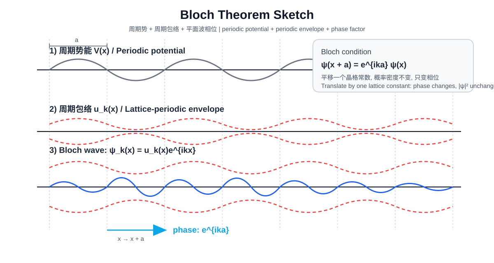
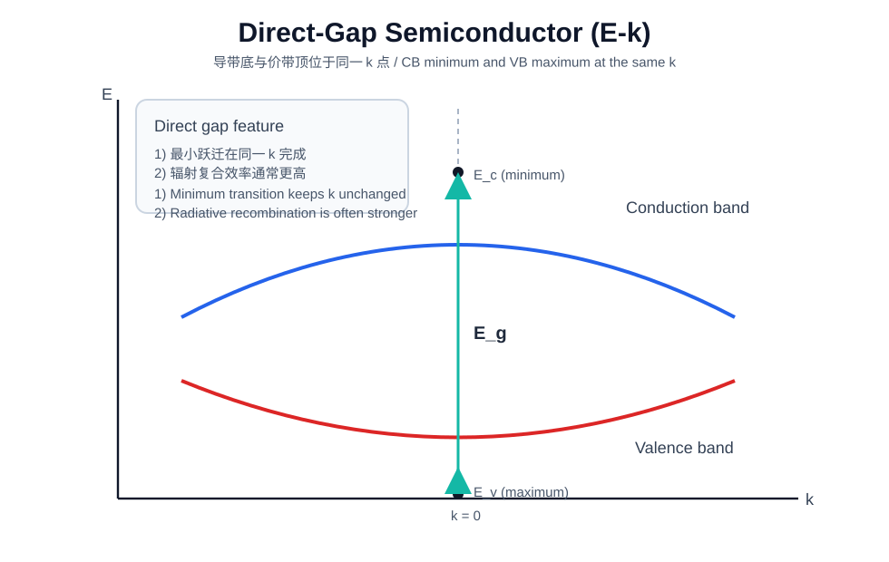
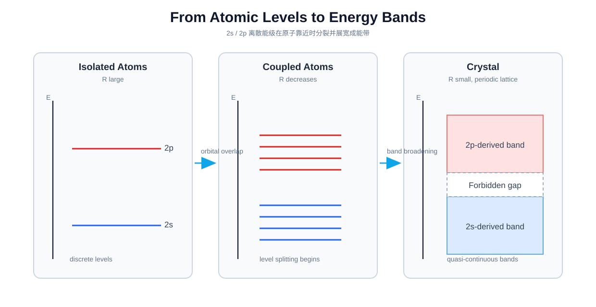
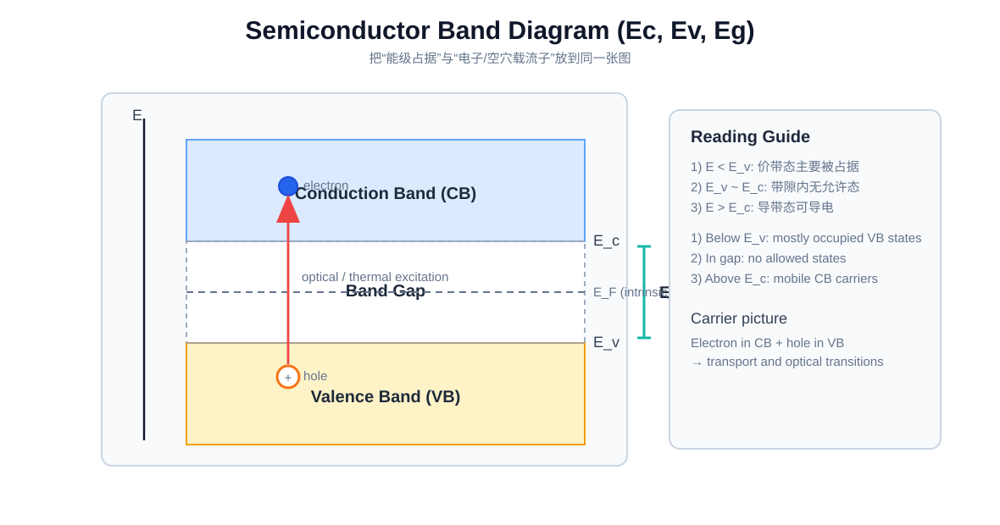
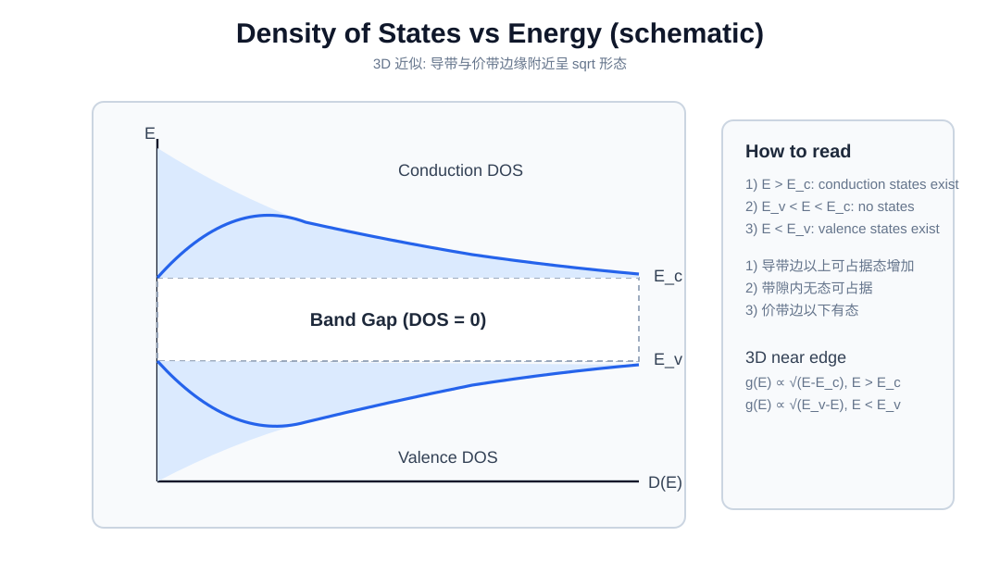
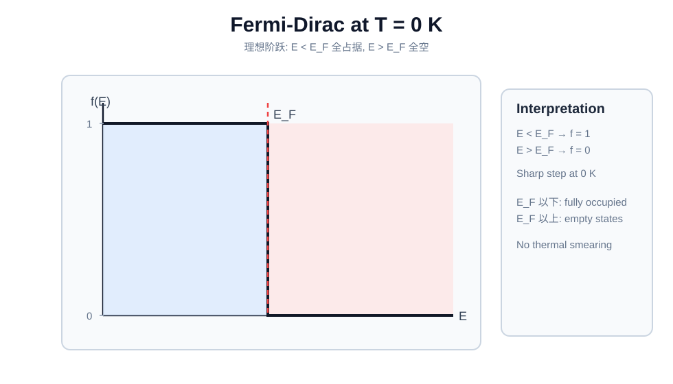
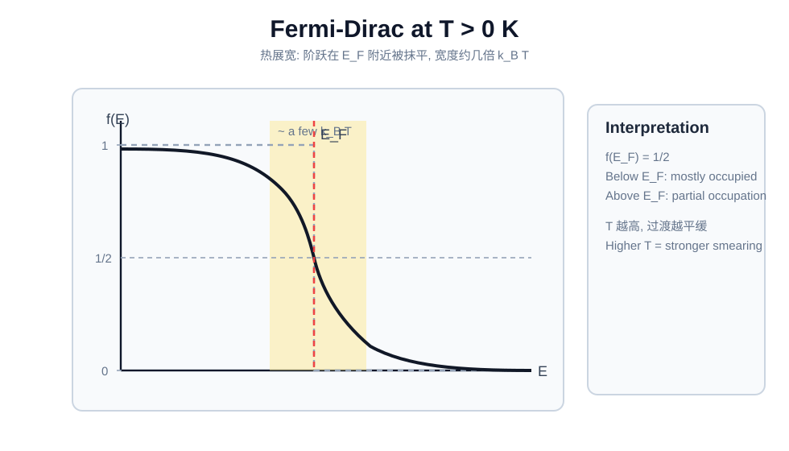
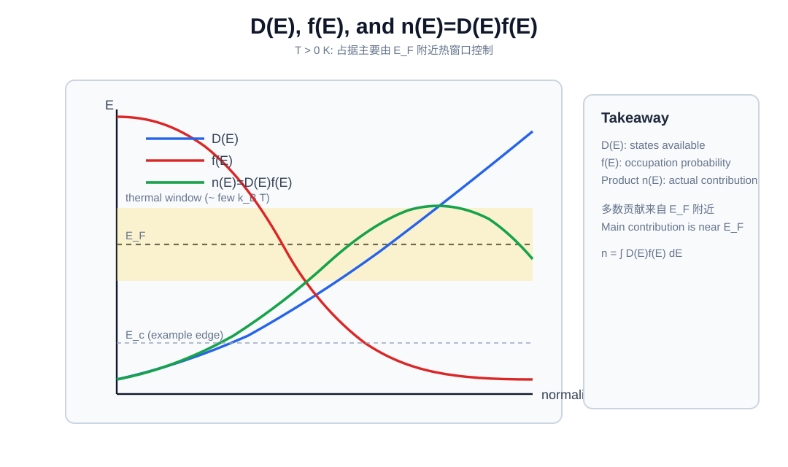
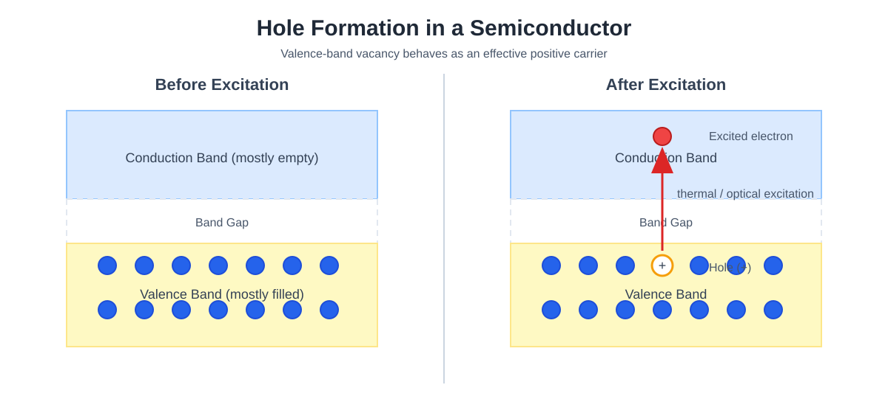

# 电子并非“位于某处”，而是“分布于态中” 
 Electrons Are Not Located, They Are Distributed

> **核心前提**  
> 电子并不是以*局域粒子*的形式分布在*空间*里。  
> 它们是通过量子态在*概率*上分布的。  
> **Core premise**  
> Electrons are not distributed in *space* as localized particles.  
> They are distributed in *probability* through quantum states.

在经典力学中，问“粒子在哪里？”默认了粒子在每个时刻都有明确位置 $x(t)$。对电子而言，这个假设在根本层面上并不成立。  
In classical mechanics, asking "where is a particle?" assumes a definite position $x(t)$ at every moment. For electrons, this assumption fails fundamentally.

在量子力学中，电子不是由轨迹描述，而是由波函数 $\psi(\mathbf r)$ 描述。  
In quantum mechanics, an electron is not described by a trajectory, but by a wave function $\psi(\mathbf r)$.

$$
\rho(\mathbf r)=|\psi(\mathbf r)|^2
$$

量 $\rho(\mathbf r)$ 是在测量时于 $\mathbf r$ 附近找到电子的**概率密度**。$\rho$ 越大表示“更可能被测到”，而不是“电子更强地存在”。  
The quantity $\rho(\mathbf r)$ is the **probability density** of finding the electron near $\mathbf r$ on measurement. Larger $\rho$ means higher probability, not a stronger local presence.

这一区分非常关键。  
This distinction is crucial.

电子并不是“藏在某个未知位置”，也不是“像经典云团那样摊开在空间里”。在测量前，位置并不是一个预先定义好的属性。  
The electron is neither hidden at an unknown position nor spread out like a classical cloud. Before measurement, position is not a predefined property.

量子力学给出的不是轨迹地图，而是支配测量结果的概率结构。  
Quantum mechanics provides not a map of trajectories, but a probabilistic structure governing measurement outcomes.

## 从概率密度到量子态 
 From Probability Density to States

在 [Part 1（定态薛定谔方程）](../笔记-量子力学1-薛定谔公式/#time-independent-schrodinger-equation) 中我们得到  
In [Part 1 (time-independent Schrodinger equation)](../笔记-量子力学1-薛定谔公式/#time-independent-schrodinger-equation), we derived
$$\hat H\psi=E\psi$$
这就是“态”的来源：给定势能 $V(x)$ 和边界条件，只允许特定解 $\psi_n(x)$，每个解对应一个能量本征态。  
This is where states come from: for a given potential $V(x)$ and boundary conditions, only specific solutions $\psi_n(x)$ are allowed, each corresponding to an energy eigenstate.

因此，“态”不是抽象标签，而是由系统物理条件选出的数学解：  
So a state is not an abstract label but a physically selected mathematical solution:
- 势阱给出离散的 $\psi_n$ 与 $E_n$  
- A potential well gives discrete $\psi_n$ and $E_n$.
- 自由粒子允许连续平面波解  
- A free particle allows continuous plane-wave solutions.

所以“电子分布”本质上是在问：哪些本征态被占据。$\rho(\mathbf r)=|\psi(\mathbf r)|^2$ 只是这些态在位置表象下的投影。  
So "electron distribution" means which eigenstates are occupied. $\rho(\mathbf r)=|\psi(\mathbf r)|^2$ is the position-space projection of those states.

### 泡利不相容示意图 
 Pauli Exclusion Sketch

每条水平线对应一个允许能级。单箭头表示一个电子占据；一对反向箭头表示该能级满占据。泡利不相容原理要求同一量子态不能有两个同自旋电子。  
Each horizontal line is an allowed energy eigenstate. One arrow means single occupancy; opposite arrows mean full occupancy. Pauli exclusion forbids two electrons with the same spin in the same state.

到这里我们已经知道“哪些态能被占据”以及“每个态最多能放多少电子”。下一步自然要问：在晶体这种周期环境里，允许态本身长什么样？  
At this point we know which states can be occupied and the occupancy limit per state. The next natural question is: what do allowed states look like in a periodic crystal?

## 布洛赫定理 
 Bloch's Theorem

在晶体中，势能是周期性的，因此允许态不再是自由空间平面波。布洛赫定理给出本征态形式  
In crystals, the potential is periodic, so allowed states are not free-space plane waves. Bloch's theorem gives
$$
\psi_{\mathbf k}(\mathbf r)=u_{\mathbf k}(\mathbf r)e^{i\mathbf k\cdot\mathbf r}
$$
其中 $u_{\mathbf k}(\mathbf r+\mathbf R)=u_{\mathbf k}(\mathbf r)$。这把实空间与 $k$ 空间联系起来，也是能带计数的基础。  
where $u_{\mathbf k}(\mathbf r+\mathbf R)=u_{\mathbf k}(\mathbf r)$. This bridges real space and $k$-space and underlies band-state counting.

  

    布洛赫定理示意（周期势 + 类布洛赫波） / Bloch theorem sketch (periodic potential + Bloch-like wave)
  

    
  

    灰色：周期势能 V(x)。 
    Gray: periodic potential V(x). 
    红虚线：周期包络 u_k(x)。 
    Red dashed: periodic envelope u_k(x). 
    蓝色：psi_k(x)=u_k(x)cos(kx) 的实部。 
    Blue: real part of psi_k(x)=u_k(x)cos(kx). 
  

### 晶格平移下的相位变化 
 Phase Shift Under Lattice Translation

从布洛赫形式出发  
Start from the Bloch form
$$
\psi_k(x)=u_k(x)e^{ikx},\quad u_k(x+a)=u_k(x)
$$
平移一个晶格常数 $a$ 得  
Translate by one lattice constant $a$:
$$
\psi_k(x+a)=u_k(x+a)e^{ik(x+a)}=u_k(x)e^{ika}e^{ikx}
$$
所以  
So
$$
\psi(x+a)=e^{ika}\psi(x)
$$
晶格平移只改变相位，不改变概率密度。正因为如此，$k$ 成为晶体中标记态的好量子数。  
Lattice translation changes only phase, not probability density. That is why $k$ is a good quantum label in crystals.

既然 $k$ 可以稳定地标记晶体态，就可以进一步追问：当原子靠近并形成晶格时，这些态会如何组织成能带？  
Since $k$ can robustly label crystal states, the next step is to ask how these states reorganize into bands as atoms come together into a lattice.

## 能带形成机制 
 Band Structure Construction

孤立原子有离散轨道与离散能级。大量原子进入周期晶格后，轨道重叠与耦合使原子能级分裂成大量近邻子能级，最终形成近似连续的能带，并由带隙分隔。  
Isolated atoms have discrete orbitals and energy levels. In a periodic lattice, overlap and coupling split each atomic level into many nearby levels, forming nearly continuous bands separated by gaps.

在布里渊区边界，周期势会耦合波矢相差倒格矢的态，从而打开带隙；这一步把单粒子波动力学直接连接到材料电子性质。  
At Brillouin-zone boundaries, the periodic potential mixes states differing by a reciprocal lattice vector, opening band gaps and linking single-particle wave mechanics to material properties.

  

    直接带隙半导体：E-k 图 / Direct-gap semiconductor: E-k diagram
  

    
  

    导带底与价带顶在同一 k 点。 
    Conduction-band minimum and valence-band maximum occur at the same k. 
  

  

    2s/2p 到能带的形成（示意） / Band formation from 2s/2p levels (schematic)
  

    
  

    原子间距减小时，离散能级展宽成能带。 
    As atomic spacing decreases, discrete levels broaden into bands. 
    阴影区域代表禁带。 
    The shaded region indicates the forbidden gap. 
  

## 半导体（能带图） 
 Semiconductors (Band Diagram)

  

    半导体能带示意（Ec, Ev, Eg） / Semiconductor band diagram (Ec, Ev, Eg)
  

    

有了能带图之后，下一步不只是“看形状”，而是要量化带边附近载流子的动态响应，这就引出有效质量。  
Once we have the band picture, the next step is not just to inspect shapes but to quantify carrier dynamics near band edges, which leads to effective mass.

## 有效质量 
 Effective Mass

在带边附近，色散关系可近似为抛物线  
Near a band edge, the dispersion is approximately parabolic:
$$
E(k)\approx E_0+\frac{\hbar^2k^2}{2m^\ast}.
$$
有效质量由曲率定义  
Effective mass is defined by curvature:
$$
\frac{1}{m^\ast}=\frac{1}{\hbar^2}\frac{d^2E}{dk^2}.
$$
曲率越小，$m^\ast$ 越大，响应越慢。价带曲率可为负，因此常用空穴作为正电载流子描述。  
Smaller curvature means larger $m^\ast$ and slower response. Valence-band curvature can be negative, so holes are treated as positive carriers.

### DOS 中的有效质量 
 Effective Mass in DOS

在带边近似下，可把自由电子质量替换为有效质量  
Near the band edge, replace free-electron mass by effective mass:
$$
g(E)=\frac{1}{2\pi^2}\left(\frac{2m^\ast}{\hbar^2}\right)^{3/2}\sqrt{E}.
$$

### 色散关系（带边附近） 
 Dispersion Relation (Near Band Edge)

色散关系就是能量-动量关系 $E(k)$。带边附近近似抛物线，远离带边后偏离抛物线，有效质量随能量变化。  
The dispersion relation is the energy-momentum relation $E(k)$. It is near-parabolic at the band edge and deviates farther away, making effective mass energy-dependent.

### 迁移率（半导体） 
 Mobility (Semiconductors)

迁移率
Mobility
$$
\mu=\frac{q\tau}{m^\ast}
$$
所以通常 $m^\ast$ 越小，迁移率越高。  
So smaller $m^\ast$ generally implies higher mobility.

不过只知道单个载流子的“轻重快慢”还不够，我们还需要知道每个能量附近有多少可用态，这就是态密度 DOS。  
Knowing how heavy or fast one carrier is still not enough; we also need the number of available states near each energy, i.e., the density of states (DOS).

## 态密度（DOS） 
 Density of States (DOS)

为推导 DOS，考虑边长 $L$ 的有限晶体并施加周期边界条件  
To derive DOS, consider a finite crystal of size $L$ with periodic boundary conditions:
$$
\psi(x+L)=\psi(x)
$$
代入布洛赫相位条件  
Using the Bloch phase condition:
$$
e^{ikL}=1\Rightarrow k=\frac{2\pi}{L}n,\quad n\in\mathbb Z.
$$
允许的 $k$ 在 $k$ 空间形成网格，间距 $\Delta k=2\pi/L$，每个态占据体积
Allowed $k$ points form a grid with spacing $\Delta k=2\pi/L$, each state occupying
$$
\Delta k^3=\left(\frac{2\pi}{L}\right)^3.
$$
3D 球壳 $[k,k+dk]$ 内态数（含自旋 2）
The number of states in a 3D shell $[k,k+dk]$ (including spin factor 2) is
$$
dN=2\cdot\frac{4\pi k^2 \mathrm{d}k}{(2\pi/L)^3}=\frac{V}{\pi^2}k^2 \mathrm{d}k
$$
其中 $V=L^3$。结合 [自由电子色散](../笔记-量子力学1-薛定谔公式/#free-electron-dispersion)
where $V=L^3$. With [free-electron dispersion](../笔记-量子力学1-薛定谔公式/#free-electron-dispersion)
$$
E=\frac{\hbar^2k^2}{2m},
$$
得到
we obtain
$$
g(E)=\frac{V}{2\pi^2}\left(\frac{2m}{\hbar^2}\right)^{3/2}\sqrt{E}.
$$
所以 3D DOS 随 $\sqrt{E}$ 增长。  
Hence 3D DOS grows as $\sqrt{E}$.

参考形式  
Equivalent form:
$$
g(E)=\frac{m}{\pi^2\hbar^3}\sqrt{2mE}.
$$
二维（单位面积）DOS 为常数  
In 2D (per unit area), DOS is constant:
$$
g_{2D}(E)=\frac{m}{\pi\hbar^2}.
$$

  

    DOS-能量关系（示意） / DOS vs Energy (schematic)
  

    
  

    $E_c$：导带底；$E_v$：价带顶；$E_g$：带隙。 
    $E_c$: conduction-band edge; $E_v$: valence-band edge; $E_g$: band gap. 
    带隙内 DOS 为零，允许带中上升。 
    DOS is zero in the gap and rises in allowed bands. 
  

到这里我们只数清了“有多少可用态（座位）”，还没回答“哪些态被占据（谁坐上去）”。这个占据问题由费米-狄拉克分布给出。  
So far we have counted available states ("how many seats"), but not occupancy ("who sits where"). Occupancy is provided by the Fermi-Dirac distribution.

## 费米-狄拉克分布 
 Fermi-Dirac Distribution

### T = 0 K（阶跃函数） 
 Step Function

绝对零度时，$E_F$ 以下全占据，以上全空：  
At absolute zero, states below $E_F$ are fully occupied and states above are empty:
$$
f(E)=
\begin{cases}
1,&E<E_F\\
0,&E>E_F
\end{cases}
$$
这是定义费米面的理想阶跃。  
This is the ideal step defining the Fermi surface.

  

    T = 0 K 下的 f(E)（阶跃） / f(E) at T = 0 K (step)
  

    
  

    $E_F$ 以下：$f=1$；$E_F$ 以上：$f=0$。 
    Below $E_F$: $f=1$; above $E_F$: $f=0$. 
  

### T > 0 K（热展宽） 
 Thermal Smearing

有限温度下，阶跃被热展宽：  
At finite temperature, the step is thermally smeared:
$$
f(E)=\frac{1}{\exp\left(\frac{E-E_F}{k_BT}\right)+1}
$$
$E\gg E_F$ 时 $f\to0$，$E\ll E_F$ 时 $f\to1$，且 $f(E_F)=1/2$。  
For $E\gg E_F$, $f\to0$; for $E\ll E_F$, $f\to1$; and $f(E_F)=1/2$.

  

    T > 0 K 下的 f(E)（热展宽） / f(E) at T > 0 K (thermal smearing)
  

    0K 费米-狄拉克分布 / Fermi-Dirac distribution at T>0K" width="100%" height="auto">
  

    跃迁在 $E_F$ 附近约几个 $k_BT$ 范围内被抹平。 
    The transition is smeared over a few $k_BT$ around $E_F$. 
  

现在我们已经有了两把钥匙：$g(E)$ 给出态的数量，$f(E)$ 给出占据概率。下一步自然就是把它们相乘并积分，得到总电子密度。  
Now we have both keys: $g(E)$ for state availability and $f(E)$ for occupation probability. The natural next step is to multiply and integrate them to obtain total electron density.

## 电子密度 
 Electron Density

电子密度由 DOS 与占据概率加权积分得到  
Electron density is obtained by DOS-weighted occupation:
$$
n=\int_0^{\infty} g(E)f(E)\mathrm{d}E
$$

### T = 0 K（绝对零度） 
 Absolute Zero

此时只有 $E_F$ 以下态贡献：  
Only states below $E_F$ contribute:
$$
n=\int_0^{E_F} g(E)\mathrm{d}E
$$
对 3D 自由电子气，得到  
For a 3D free-electron gas:
$$
n=\frac{1}{3\pi^2}\left(\frac{2m}{\hbar^2}\right)^{3/2}E_F^{3/2},
$$
因此  
so
$$
E_F=\frac{\hbar^2}{2m}(3\pi^2n)^{2/3}.
$$

### T > 0 K（有限温度） 
 Finite Temperature

有限温下化学势变为 $\mu(T)$：  
At finite temperature, the chemical potential becomes $\mu(T)$:
$$
n(T)=\int_0^{\infty} g(E)f(E,\mu,T)\mathrm{d}E,
\qquad
f(E,\mu,T)=\frac{1}{\exp\left(\frac{E-\mu(T)}{k_BT}\right)+1}.
$$

对简并电子气（$T\ll T_F$, $T_F=E_F/k_B$），Sommerfeld 展开  
For a degenerate gas ($T\ll T_F$, $T_F=E_F/k_B$), Sommerfeld expansion gives
$$
n(T)\approx\int_0^{\mu(T)} g(E)\mathrm{d}E+\frac{\pi^2}{6}(k_BT)^2g'(\mu(T)).
$$
固定总密度时，化学势仅有小偏移  
At fixed density, the chemical potential shifts only slightly:
$$
\mu(T)\approx E_F\left[1-\frac{\pi^2}{12}\left(\frac{k_BT}{E_F}\right)^2\right].
$$

非简并半导体近似为  
For non-degenerate semiconductors:
$$
n\approx N_c\exp\left(-\frac{E_c-\mu}{k_BT}\right),
\qquad
N_c=2\left(\frac{2\pi m_e^\ast k_BT}{h^2}\right)^{3/2}.
$$
它直接体现了载流子密度的强温度依赖。  
This explicitly shows the strong temperature dependence of carrier density.

  

    D(E), f(E), and n(E)=D(E)f(E)
  

    0K 电子密度示意 / Electron density at T>0K" width="100%" height="auto">

### 掺杂与电中性条件（半导体） 
 Doping and Charge Neutrality (Semiconductors)

在掺杂半导体中，施主与受主把“态的占据”转化为可控的载流子浓度。  
In doped semiconductors, donors and acceptors turn state occupancy into a controllable carrier density.

电中性条件写成  
Charge neutrality is written as
$$
n+N_A^-=p+N_D^+.
$$
其中 $N_D^+$ 是电离施主浓度，$N_A^-$ 是电离受主浓度。  
Here $N_D^+$ is the ionized donor concentration and $N_A^-$ is the ionized acceptor concentration.

在室温且浅能级近似下，常取完全电离：$N_D^+\approx N_D,\ N_A^-\approx N_A$。再结合质量作用律 $np=n_i^2$，可得  
At room temperature with shallow-level dopants, full ionization is often used: $N_D^+\approx N_D,\ N_A^-\approx N_A$. Combined with the mass-action law $np=n_i^2$, this gives
$$
n\approx N_D-N_A,\qquad p\approx\frac{n_i^2}{n}\quad (n\text{-type}),
$$
$$
p\approx N_A-N_D,\qquad n\approx\frac{n_i^2}{p}\quad (p\text{-type}).
$$
所以在仅施主掺杂且 $N_D\gg n_i$ 的 n 型 Si 中，常直接用 $n\approx N_D$。  
So for donor-only n-type Si with $N_D\gg n_i$, we often use $n\approx N_D$ directly.

### 从掺杂浓度到原子替位比例 
 From Doping Concentration to Atomic Substitution Fraction

若晶格常数为 $a$、单位胞含 $N_{\mathrm{uc}}$ 个原子，则原子密度为  
If the lattice constant is $a$ and each unit cell contains $N_{\mathrm{uc}}$ atoms, the atomic density is
$$
N_{\mathrm{atom}}=\frac{N_{\mathrm{uc}}}{a^3}.
$$
对 Si（金刚石结构）有 $N_{\mathrm{uc}}=8$，因此  
For Si (diamond structure), $N_{\mathrm{uc}}=8$, so
$$
N_{\mathrm{Si}}=\frac{8}{a^3}.
$$

目标施主浓度 $N_D$ 对应的替位分数为  
The substitution fraction for a target donor concentration $N_D$ is
$$
x_D=\frac{N_D}{N_{\mathrm{Si}}},
\qquad
\text{约为每 } \frac{1}{x_D} \text{ 个 Si 有 1 个 P}.
$$

例如 $a=0.543\,\mathrm{nm}$、$N_D=5\times 10^{18}\,\mathrm{cm^{-3}}$ 时  
For example, with $a=0.543\,\mathrm{nm}$ and $N_D=5\times 10^{18}\,\mathrm{cm^{-3}}$
$$
N_{\mathrm{Si}}\approx 5.0\times 10^{22}\,\mathrm{cm^{-3}},\qquad
x_D\approx 1.0\times 10^{-4}=0.01\%\approx 100\,\mathrm{ppm}.
$$
也就是大约每 $10^4$ 个 Si 原子替换 1 个 P 原子。  
That is roughly one P atom per $10^4$ Si atoms.

现在我们已经知道了载流子“有多少”（$n,p$）、“怎样占据”（$f$）以及“如何由掺杂定量设定”。下一步自然是把这些平衡态信息过渡到“有电场时如何产生电流”的非平衡输运图景。  
Now we know how many carriers there are ($n,p$), how states are occupied ($f$), and how doping quantitatively sets carrier density. The natural next step is to move from this equilibrium picture to nonequilibrium transport under an electric field.

## 从平衡占据到非平衡输运（含空穴） 
 From Equilibrium Occupation to Nonequilibrium Transport (Including Holes)

在热平衡时，分布函数 $f_0(E)$ 在动量空间各向同性，速度贡献彼此抵消，净电流为零。  
At thermal equilibrium, the distribution $f_0(E)$ is isotropic in momentum space, so velocity contributions cancel and net current is zero.

外加电场后，分布会发生微小偏移，可写成 $f=f_0+\delta f$。这个偏移由散射过程限制，而“偏移能维持多久”正是后面要定义的弛豫时间 $\tau$。  
Under an external field, the distribution is slightly shifted, written as $f=f_0+\delta f$. Scattering limits this shift, and “how long the shift survives” is exactly the relaxation time $\tau$ introduced next.

这时载流子获得平均定向速度（漂移速度），从而形成电流。对金属而言，主要是费米面附近电子参与输运；对半导体而言，导带电子和价带空穴都可能参与。  
Carriers then gain an average directed velocity (drift velocity), producing current. In metals, transport mainly comes from electrons near the Fermi surface; in semiconductors, both conduction-band electrons and valence-band holes can contribute.

空穴可以理解为“价带里缺了一个电子”形成的等效正电载流子，电荷取 $+e$。在电场中，电子漂移方向与电场相反，而空穴与电场同向。  
A hole can be viewed as an effective positive carrier created by a missing valence-band electron, with charge $+e$. In an electric field, electrons drift opposite to $E$, while holes drift along $E$.

  

    空穴形成示意 / Hole Formation Sketch
  

    
  

    左侧：激发前，价带电子近乎填满。 
    Left: before excitation, valence-band states are nearly filled. 
    右侧：激发后，一个电子被提升到导带，价带留下一个空穴（等效正电载流子）。 
    Right: after excitation, one electron is promoted to the conduction band, leaving a hole in the valence band (an effective positive carrier). 
  

具体的定常漂移电流表达式（同时包含电子与空穴）我们在下一节统一给出。  
The explicit steady-state drift-current expression (including both electrons and holes) is presented in the next section.

有了这个“平衡占据 -> 受场偏移 -> 漂移电流”的桥接，下面的 $\rho,\sigma,\tau,\mu,v_d$ 就不再是孤立定义，而是同一条输运链上的参数。  
With this bridge — equilibrium occupation -> field-induced shift -> drift current — the quantities $\rho,\sigma,\tau,\mu,v_d$ are no longer isolated definitions but linked parameters on one transport chain.

## 定常状态下的电子运动 
 Electron Motion in Steady State

在 Drude 近似下，电子一方面受电场加速，另一方面被散射“拉回”平衡，可写成平均运动方程  
Under the Drude approximation, electrons are accelerated by the electric field and relaxed by scattering, giving the average equation of motion

$$
m^\ast\frac{d\mathbf v}{dt}=-e\mathbf E-\frac{m^\ast}{\tau}\mathbf v.
$$

在定常状态（$d\mathbf v/dt=0$）下得到漂移速度  
In steady state ($d\mathbf v/dt=0$), the drift velocity is
$$
\mathbf v_d=-\frac{e\tau}{m^\ast}\mathbf E,\qquad
|v_d|=\frac{e\tau}{m^\ast}E.
$$

于是迁移率定义与弛豫时间直接关联  
So mobility is directly tied to relaxation time
$$
\mu\equiv\frac{|v_d|}{E}=\frac{e\tau}{m^\ast}.
$$

电子电流密度可写成  
The electron current density can be written as
$$
\mathbf J_n=-ne\mathbf v_d=\frac{ne^2\tau}{m^\ast}\mathbf E=ne\mu_n\mathbf E.
$$

因此电导率与电阻率满足  
Therefore conductivity and resistivity satisfy
$$
\sigma=\frac{ne^2\tau}{m^\ast}=ne\mu,\qquad
\rho=\frac{1}{\sigma}.
$$

常用单位：$\rho[\Omega\cdot\mathrm{m}]$，$\sigma[\mathrm{S/m}]$，$\mu[\mathrm{m^2/(V\cdot s)}]$（工程上也常用 $\mathrm{cm^2/(V\cdot s)}$）。  
Common units: $\rho[\Omega\cdot\mathrm{m}]$, $\sigma[\mathrm{S/m}]$, and $\mu[\mathrm{m^2/(V\cdot s)}]$ (engineering often uses $\mathrm{cm^2/(V\cdot s)}$).

对半导体，电子与空穴共同贡献漂移电流  
For semiconductors, both electrons and holes contribute to drift current
$$
\mathbf J=e\left(n\mu_n+p\mu_p\right)\mathbf E.
$$

若样品长度为 $L$、外加电压为 $V$，可取 $E\approx V/L$，从而  
If a sample has length $L$ and applied voltage $V$, use $E\approx V/L$, then
$$
|v_d|=\mu\frac{V}{L}.
$$

这样，$\tau,\mu,v_d,\sigma,\rho$ 就不再是割裂定义，而是同一条“受场驱动 + 散射平衡”的定常输运链。  
This unifies $\tau,\mu,v_d,\sigma,\rho$ as one steady-transport chain governed by field driving plus scattering balance.

## 导电图景总结 
 Conduction Picture Summary

> **核心观点：** 导电不是电子“在原地移动”，而是电子“跃迁到可用态”。金属在 $E_F$ 附近天然有空态，所以容易导电；半导体与绝缘体需要热激发或光激发来产生导带电子和价带空穴。  
> **Key idea:** conduction is not electrons "moving in place" but electrons transitioning into available states. Metals conduct easily because empty states already exist near $E_F$; semiconductors and insulators need thermal or optical excitation to create carriers.

既然热激发与电场都能改变占据，最后一步自然是光场：光子既可以把电子从价带激发到导带（吸收），也可以在复合时带走能量（发光），并在受激条件下产生光放大。  
Since thermal excitation and electric fields can modify occupation, the natural final step is optical fields: photons can excite electrons across the band gap (absorption), carry away recombination energy (emission), and under stimulated conditions produce optical gain.

## 从输运到光学跃迁 
 From Transport to Optical Transitions

### 受激辐射与激光基本条件 
 Stimulated Emission and Laser Conditions

受激辐射是指入射光子诱导激发态载流子辐射出一个“同频率、同相位、同方向”的光子，这是激光放大的微观来源。  
Stimulated emission means an incident photon induces an excited carrier to emit another photon with the same frequency, phase, and propagation direction, which is the microscopic origin of laser amplification.

激光通常需要三条条件：  
A laser typically requires three conditions:
1. 反转布居：高能态粒子数多于低能态。 Population inversion: more carriers occupy higher-energy states than lower-energy states.
2. 净增益为正：材料增益大于总损耗。 Positive net gain: material gain exceeds total loss.
3. 光学反馈：谐振腔让光往返放大。 Optical feedback: a resonator allows repeated round-trip amplification.

可简写为  
This is often summarized as
$$
g_{\mathrm{net}}=g-\alpha_{\mathrm{loss}}>0.
$$

### 带隙与发光波长 
 Band Gap and Emission Wavelength

带边复合发光时，光子能量近似等于带隙  
For near-band-edge radiative recombination, photon energy is approximately the band gap:
$$
E_\gamma\approx E_g,\qquad
\lambda=\frac{hc}{E_\gamma}\approx\frac{1240}{E_g}\ \text{nm}\quad (E_g\ \text{in eV}).
$$

当 $E_g=5.0\ \mathrm{eV}$ 时  
When $E_g=5.0\ \mathrm{eV}$
$$
\lambda\approx\frac{1240}{5.0}\approx 248\ \mathrm{nm},
$$
位于紫外波段。  
which lies in the ultraviolet range.

### 吸收系数与光强衰减 
 Absorption Coefficient and Intensity Decay

若忽略界面反射与散射，只考虑体吸收，Lambert-Beer 定律可写成  
If interface reflection and scattering are neglected and only bulk absorption is considered, the Lambert-Beer law is
$$
\frac{dI}{dz}=-\alpha I.
$$

积分后得到  
After integration, we get
$$
I(z)=I_0 e^{-\alpha z},\qquad
I(d)=I_0 e^{-\alpha d}.
$$

于是透射率与吸收率分别为  
So the transmittance and absorbed fraction are
$$
T\equiv\frac{I(d)}{I_0}=e^{-\alpha d},\qquad
A\equiv1-T=1-e^{-\alpha d}.
$$

要注意吸收系数通常随波长变化，即 $\alpha=\alpha(\lambda)$。  
Note that the absorption coefficient is usually wavelength-dependent, i.e. $\alpha=\alpha(\lambda)$.

若 $\alpha=1.0\times10^5\ \mathrm{cm^{-1}}$，厚度 $d=100\ \mathrm{nm}=1.0\times10^{-5}\ \mathrm{cm}$，则  
If $\alpha=1.0\times10^5\ \mathrm{cm^{-1}}$ and thickness is $d=100\ \mathrm{nm}=1.0\times10^{-5}\ \mathrm{cm}$, then
$$
T=e^{-\alpha d}=e^{-1}\approx 0.368,\qquad
A\approx 0.632.
$$
所以透射后的光强约为 36.8%，对应吸收约 63.2%。  
So the transmitted intensity is about 36.8%, corresponding to about 63.2% absorption.

这样，输运里的 $\tau,\mu,\sigma$ 与光学里的 $E_g,\lambda,\alpha$ 就连成了一条连续主线：都由“能带结构 + 占据分布 + 跃迁/散射过程”共同决定。  
This links transport quantities $\tau,\mu,\sigma$ and optical quantities $E_g,\lambda,\alpha$ into one continuous storyline: all are jointly determined by band structure, occupation, and transition/scattering processes.
