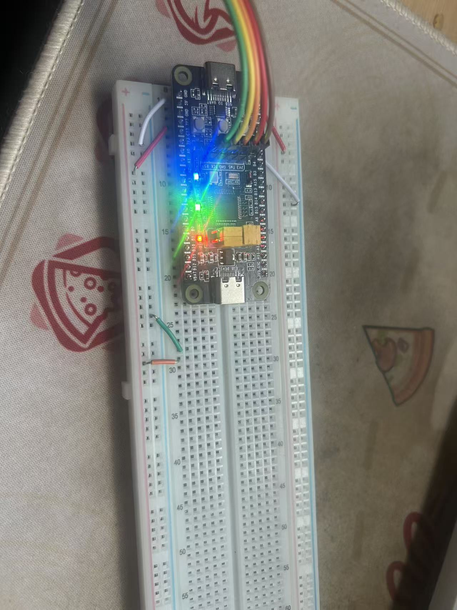
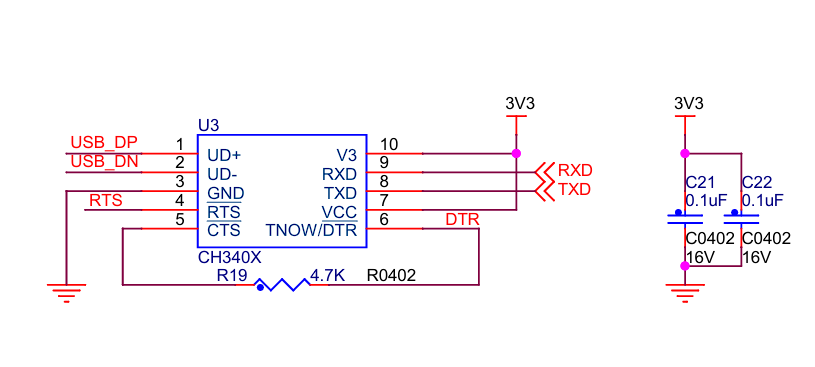

# Background 

Having spent a long time learning STM32 development with Keil MDK (Keil5), I began to encounter significant workflow inefficiencies. A prime example is the *printf* redirection: in Keil, we typically rely on rewriting the *fputc* function. However, this often requires repetitive boilerplate code for every new project. seeking a more modern workflow, I migrated to CLion. Although setting up the toolchain (STM32CubeMX + CLion + MinGW/OpenOCD) took me a whole day and was incredibly demanding, the result was worth the effort.

# Describe

The issue arose while I was experimenting with *multiple USART channels* for data transmission. I was following a tutorial based on Keil and attempted to port the code to my CLion environment. This involved adapting the low-level I/O retargeting from Keil's *fputc* to the GCC-compatible *_write function*. After compiling and flashing the firmware to my STM32 board, the system appeared to run, but *communication failed completely*.

# Root Cause

*A Physical Layer Wiring Error.* (Surprisingly, the issue was not in the software porting or the toolchain, but in a simple hardware misconnection.)(>_<)🔨

# Troubleshooting 

## 1. try to understand how the code works

<details>
  <summary>main.c</summary>
  
```C
/* USER CODE BEGIN Header */
/**
  ******************************************************************************
  * @file           : main.c
  * @brief          : Main program body
  ******************************************************************************
  * @attention
  *
  * Copyright (c) 2025 STMicroelectronics.
  * All rights reserved.
  *
  * This software is licensed under terms that can be found in the LICENSE file
  * in the root directory of this software component.
  * If no LICENSE file comes with this software, it is provided AS-IS.
  *
  ******************************************************************************
  */
/* USER CODE END Header */
/* Includes ------------------------------------------------------------------*/
#include "main.h"
#include "usart.h"
#include "gpio.h"

/* Private includes ----------------------------------------------------------*/
/* USER CODE BEGIN Includes */
#include <stdio.h>
/* USER CODE END Includes */

/* Private typedef -----------------------------------------------------------*/
/* USER CODE BEGIN PTD */
#define LENGTH 64
/* USER CODE END PTD */

/* Private define ------------------------------------------------------------*/
/* USER CODE BEGIN PD */

/* USER CODE END PD */

/* Private macro -------------------------------------------------------------*/
/* USER CODE BEGIN PM */

/* USER CODE END PM */

/* Private variables ---------------------------------------------------------*/

/* USER CODE BEGIN PV */
uint8_t Rxbuff1[LENGTH];
uint8_t Rxbuff2[LENGTH];
/* USER CODE END PV */

/* Private function prototypes -----------------------------------------------*/
void SystemClock_Config(void);
/* USER CODE BEGIN PFP */
void USART_SendString(UART_HandleTypeDef *huart, char *str);
/* USER CODE END PFP */

/* Private user code ---------------------------------------------------------*/
/* USER CODE BEGIN 0 */

/* USER CODE END 0 */

/**
  * @brief  The application entry point.
  * @retval int
  */
int main(void)
{

  /* USER CODE BEGIN 1 */

  /* USER CODE END 1 */

  /* MCU Configuration--------------------------------------------------------*/

  /* Reset of all peripherals, Initializes the Flash interface and the Systick. */
  HAL_Init();

  /* USER CODE BEGIN Init */

  /* USER CODE END Init */

  /* Configure the system clock */
  SystemClock_Config();

  /* USER CODE BEGIN SysInit */

  /* USER CODE END SysInit */

  /* Initialize all configured peripherals */
  MX_GPIO_Init();
  MX_USART1_UART_Init();
  MX_USART2_UART_Init();
  /* USER CODE BEGIN 2 */
  HAL_UARTEx_ReceiveToIdle_IT(&huart1, Rxbuff1, LENGTH);
  HAL_UARTEx_ReceiveToIdle_IT(&huart2, Rxbuff2, LENGTH);
  printf("准备出发咯");
  /* USER CODE END 2 */

  /* Infinite loop */
  /* USER CODE BEGIN WHILE */
  while (1)
  {
    /* USER CODE END WHILE */

    /* USER CODE BEGIN 3 */
  }
  /* USER CODE END 3 */
}

/**
  * @brief System Clock Configuration
  * @retval None
  */
void SystemClock_Config(void)
{
  RCC_OscInitTypeDef RCC_OscInitStruct = {0};
  RCC_ClkInitTypeDef RCC_ClkInitStruct = {0};

  /** Initializes the RCC Oscillators according to the specified parameters
  * in the RCC_OscInitTypeDef structure.
  */
  RCC_OscInitStruct.OscillatorType = RCC_OSCILLATORTYPE_HSE;
  RCC_OscInitStruct.HSEState = RCC_HSE_ON;
  RCC_OscInitStruct.HSEPredivValue = RCC_HSE_PREDIV_DIV1;
  RCC_OscInitStruct.HSIState = RCC_HSI_ON;
  RCC_OscInitStruct.PLL.PLLState = RCC_PLL_ON;
  RCC_OscInitStruct.PLL.PLLSource = RCC_PLLSOURCE_HSE;
  RCC_OscInitStruct.PLL.PLLMUL = RCC_PLL_MUL9;
  if (HAL_RCC_OscConfig(&RCC_OscInitStruct) != HAL_OK)
  {
    Error_Handler();
  }

  /** Initializes the CPU, AHB and APB buses clocks
  */
  RCC_ClkInitStruct.ClockType = RCC_CLOCKTYPE_HCLK|RCC_CLOCKTYPE_SYSCLK
                              |RCC_CLOCKTYPE_PCLK1|RCC_CLOCKTYPE_PCLK2;
  RCC_ClkInitStruct.SYSCLKSource = RCC_SYSCLKSOURCE_PLLCLK;
  RCC_ClkInitStruct.AHBCLKDivider = RCC_SYSCLK_DIV1;
  RCC_ClkInitStruct.APB1CLKDivider = RCC_HCLK_DIV2;
  RCC_ClkInitStruct.APB2CLKDivider = RCC_HCLK_DIV1;

  if (HAL_RCC_ClockConfig(&RCC_ClkInitStruct, FLASH_LATENCY_2) != HAL_OK)
  {
    Error_Handler();
  }
}

/* USER CODE BEGIN 4 */
void HAL_UARTEx_RxEventCallback(UART_HandleTypeDef *huart, uint16_t Size)
{
  if(huart->Instance == USART1)
  {
    USART_SendString(&huart1, "\r\nUSART1 received data,send to USART2:\r\n");
    HAL_UART_Transmit_IT(&huart2, Rxbuff1, Size);
    USART_SendString(&huart1, "\r\nUSART1 Sending finished\r\n");
    HAL_UARTEx_ReceiveToIdle_IT (&huart1, Rxbuff1, LENGTH);
  }
  else if(huart->Instance == USART2)
  {
    USART_SendString(&huart2, "\r\nUSART2 received data,send to USART1:\r\n");
    HAL_UART_Transmit_IT(&huart1, Rxbuff2, Size);
    USART_SendString(&huart2, "\r\nUSART2 Sending finished\r\n");
    HAL_UARTEx_ReceiveToIdle_IT(&huart2, Rxbuff2, LENGTH);
  }
}

void USART_SendString(UART_HandleTypeDef *huart, char *str)
{
  while (*str)
  {
    HAL_UART_Transmit(huart, (uint8_t *)str, 1, HAL_MAX_DELAY);
    str++;
  }
}

int _write(int file, char *ptr, int len)
{
  HAL_UART_Transmit(&huart1, (uint8_t *)ptr, len, HAL_MAX_DELAY);
  return len;
}
/* USER CODE END 4 */

/**
  * @brief  This function is executed in case of error occurrence.
  * @retval None
  */
void Error_Handler(void)
{
  /* USER CODE BEGIN Error_Handler_Debug */
  /* User can add his own implementation to report the HAL error return state */
  __disable_irq();
  while (1)
  {
  }
  /* USER CODE END Error_Handler_Debug */
}
#ifdef USE_FULL_ASSERT
/**
  * @brief  Reports the name of the source file and the source line number
  *         where the assert_param error has occurred.
  * @param  file: pointer to the source file name
  * @param  line: assert_param error line source number
  * @retval None
  */
void assert_failed(uint8_t *file, uint32_t line)
{
  /* USER CODE BEGIN 6 */
  /* User can add his own implementation to report the file name and line number,
     ex: printf("Wrong parameters value: file %s on line %d\r\n", file, line) */
  /* USER CODE END 6 */
}
#endif /* USE_FULL_ASSERT */

```

</details>


# STEP 1 c0m check
<details>
  <summary>c0mlist.py</summary>
  
```python
import serial.tools.list_ports

# 获取所有串口设备列表
ports_list = list(serial.tools.list_ports.comports())

if len(ports_list) <= 0:
    print("No serial port device found. Please check if the USB is plugged in tightly!")
else:
    print("The following serial port devices are found:")
    for port in ports_list:
        print(f"Port number:{port.device} - Description:{port.description}")
```

</details>

```
The following serial port devices are found:
Port number:COM3 - Description:USB-SERIAL CH340 (COM3)
Port number:COM5 - Description:USB-SERIAL CH340 (COM5)
Port number:COM1 - Description:通信端口 (COM1)
```

*No Problem , maybe printf function?*


# STEP 2 Switch into Keil5

Main change:

```c
int _write(int file, char *ptr, int len)
{
  HAL_UART_Transmit(&huart1, (uint8_t *)ptr, len, HAL_MAX_DELAY);
  return len;
}
```
to

```c
int fputc(int ch , FILE *f)
{
	HAL_UART_Transmit(&huart1 , (uint8_t *)&ch , 1 , HAL_MAX_DELAY);
	return ch;
}
```

*Still can't work , maybe the circuit?*


# STEP 3 Internal circuit check(LEDs)
 
```c
HAL_GPIO_WritePin(GPIOA, LED_R_Pin|LED_G_Pin|LED_B_Pin, GPIO_PIN_RESET);
```

<details>
  <summary style="cursor: pointer; color: #007bff; text-decoration: underline;">
    photo
  </summary>
  
  <br> 
</details>

*No problem , maybe my mistake?*


# STEP 4 Check the Schematic Diagram

<details>
  <summary style="cursor: pointer; color: #007bff; text-decoration: underline;">
    Schematic Diagram
  </summary>
  
  <br> 
</details>