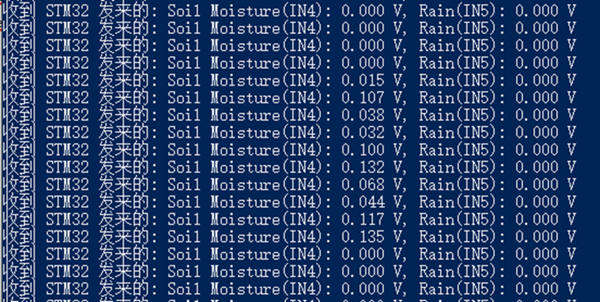
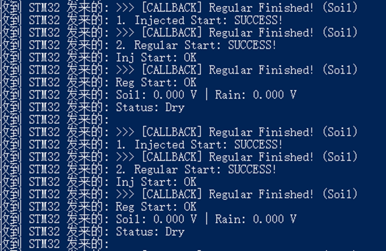
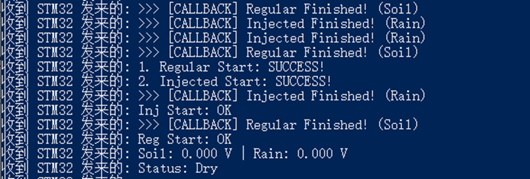

# Problem Description
I was just learning how to use *Regular Group* and *Injected Group* by *ADC*, and this is the signal the port received:

<details>
  <summary style="cursor: pointer; color: #007bff; text-decoration: underline;">
    Port Monitoring
  </summary>
  
  <br> 
</details>

Regular Group(Soil Moisture) worked normally, but Injected Group didn't work.

# Troubleshooting 

## Step 1: Code review

<details>
  <summary>main.c</summary>
  
```c
while (1)
{


  HAL_ADC_Start_IT(&hadc1);
  HAL_ADCEx_InjectedStart_IT(&hadc1);
  voltage[0] = (float)adc_value[0] * 3.3f / 4095.0f;
  voltage[1] = (float)adc_value[1] * 3.3f / 4095.0f;

  printf("Soil: %.3f V | Rain: %.3f V\r\n", voltage[0], voltage[1]);
  HAL_Delay(1000); // 休息 1 秒
}

void HAL_ADC_ConvCpltCallback(ADC_HandleTypeDef* hadc)
{
  if(hadc->Instance == ADC1)
  {
    adc_value[0] = HAL_ADC_GetValue(hadc);
  }
}

void HAL_ADC_InjectedConvCpltCallback(ADC_HandleTypeDef* hadc)
{
  if(hadc->Instance == ADC1)
  {
    adc_value[1] = HAL_ADCEx_InjectedGetValue(hadc, ADC_INJECTED_RANK_1);
  }
}

```

</details>

## Step 2: Process Monitoring
Use *printf* to check every steps.

<details>
  <summary>main.c</summary>
  
```c
while (1)
{


  HAL_ADC_Start_IT(&hadc1);
  HAL_ADCEx_InjectedStart_IT(&hadc1);

  HAL_StatusTypeDef status_inj = HAL_ADCEx_InjectedStart_IT(&hadc1);
  HAL_StatusTypeDef status_reg = HAL_ADC_Start_IT(&hadc1);
  if (status_reg == HAL_OK) printf("1. Regular Start: SUCCESS!\r\n");
  else
  {
    // 这里的 status_reg 很有可能是 2 (HAL_BUSY)
    printf("1. Regular Start: FAILED! Code=%d (2=BUSY)\r\n", status_reg);

    // 看看此时 ADC 的内部状态
    printf("   -> ADC State: 0x%lX\r\n", HAL_ADC_GetState(&hadc1));
  }
  if (status_inj == HAL_OK) printf("2. Injected Start: SUCCESS!\r\n");
  else printf("2. Injected Start: FAILED! Code=%d\r\n", status_inj);


  if(HAL_ADCEx_InjectedStart_IT(&hadc1) == HAL_OK) printf("Inj Start: OK\r\n");
  if(HAL_ADC_Start_IT(&hadc1) == HAL_OK)           printf("Reg Start: OK\r\n");


  voltage[0] = (float)adc_value[0] * 3.3f / 4095.0f;
  voltage[1] = (float)adc_value[1] * 3.3f / 4095.0f;

  printf("Soil: %.3f V | Rain: %.3f V\r\n", voltage[0], voltage[1]);

  // 简单的判断
  if (voltage[1] > 0.5f) printf("Status: Raining!\r\n");
  else printf("Status: Dry\r\n");

  printf("\r\n");
  HAL_Delay(1000); // 休息 1 秒
}

void HAL_ADC_ConvCpltCallback(ADC_HandleTypeDef* hadc)
{
  if(hadc->Instance == ADC1)
  {
    adc_value[0] = HAL_ADC_GetValue(hadc);
  }
  printf(">>> [CALLBACK] Regular Finished! (Soil)\r\n");
}

void HAL_ADC_InjectedConvCpltCallback(ADC_HandleTypeDef* hadc)
{
  if(hadc->Instance == ADC1)
  {
    adc_value[1] = HAL_ADCEx_InjectedGetValue(hadc, ADC_INJECTED_RANK_1);
  }
  printf(">>> [CALLBACK] Injected Finished! (Rain)\r\n");
}
```

</details>

<details>
  <summary style="cursor: pointer; color: #007bff; text-decoration: underline;">
    Port Monitoring
  </summary>
  
  <br> 
  
</details>

Identify the problem，injected callback function didn't work.

## Step 3: The solution

```c
void HAL_ADCEx_InjectedConvCpltCallback(ADC_HandleTypeDef* hadc)
{
  if(hadc->Instance == ADC1)
  {
    adc_value[1] = HAL_ADCEx_InjectedGetValue(hadc, ADC_INJECTED_RANK_1);
  }
  printf(">>> [CALLBACK] Injected Finished! (Rain)\r\n");
}

```
<details>
  <summary style="cursor: pointer; color: #007bff; text-decoration: underline;">
    Port Monitoring
  </summary>
  
  <br> 
  
</details>

Finished.

# Conclusion

After comparing my code against the STM32 HAL driver source code, I realized my mistake. It was a classic "naming convention" error.
The HAL library uses *Weak Symbols* (__weak) for callbacks. If you misspell the function name, the compiler won't throw an error; it simply ignores your function and uses the empty default one.<p>
Regular Group Callback: HAL_ADC_ConvCpltCallback<p>
Injected Group Callback: HAL_ADCEx_InjectedConvCpltCallback<p>
I was missing the *Ex*! Since Injected channels are considered an "Extended" feature in some STM32 families, their callbacks are defined in the Extension (stm32fxxx_hal_adc_ex.c) file.<p>