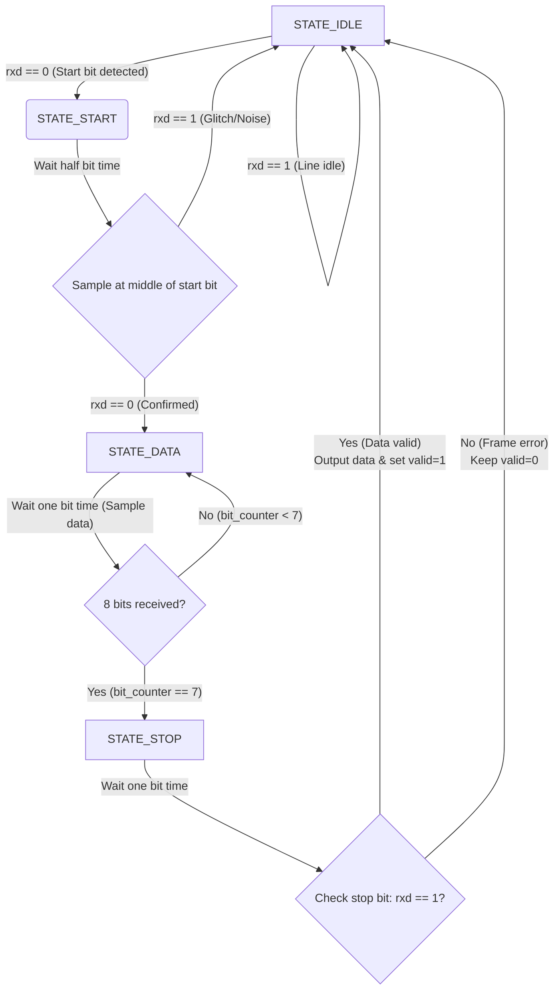
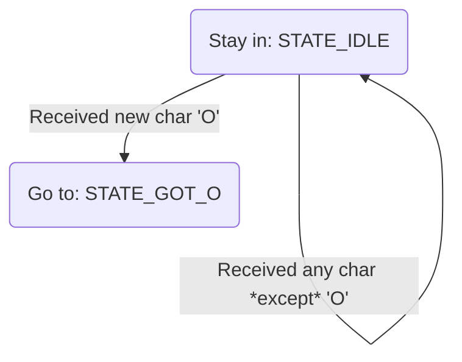
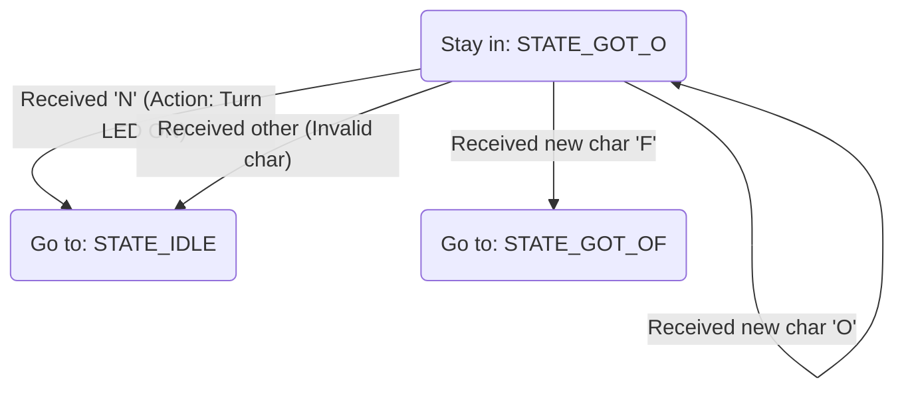
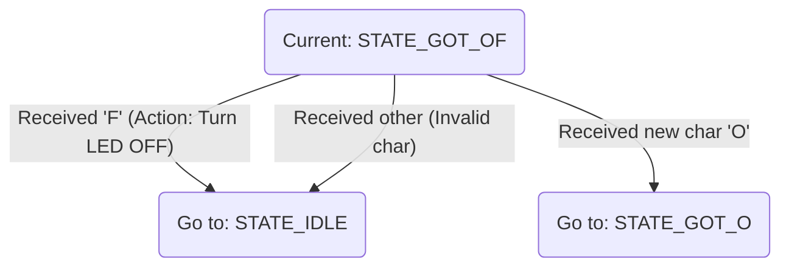

# [Important] Key Concept
1.The reason why we have to calculate (Frequency / Baud Rate) - [See Section 2.1.1](#211)<br>
2.The reason why we use data_valid here - [See Section 2.1.1](#211)<br>
***
# 1.Description
Short overview: minimal UART RX + simple command parser for FPGA.

- Goal: show a synthesizable UART receiver (`uart_rx`), a byte-oriented `command_parser` that recognizes "ON"/"OFF", and a small `fpga_top` that wires them.
- Key idea: `uart_rx` asserts `data_valid` when a full byte is ready; the parser samples only on that strobe.

# 2.Detailed Analysis
## 2.1.uart_rx.v
<a id="211"></a>
This section contains `uart_rx` (UART receiver) — very short summary:

- Purpose: sample `rxd`, detect start, read 8 data bits, check stop, and assert `data_valid` with `data_out`.
- Tuning: set `CLKS_PER_BIT = ClockHz / BaudRate` so sampling hits bit centers.
- Ports: `clk`, `rxd`, `data_out[7:0]`, `data_valid`.

Notes: FSM = IDLE → START → DATA → STOP. If stop bit fails, data_valid is not asserted (frame error).
 
```v
// Module: UART Receiver
// Function: Convert serial RXD signal to 8-bit parallel data_out 
module uart_rx(
    input             clk,        
    input             rxd,        
    output reg [7:0]  data_out,   
    output reg        data_valid  
    );

    parameter CLKS_PER_BIT = 5208;
    // Calculate (Clock Frequency / Baud Rate): For example, with FPGA clock at 50MHz and UART at 9600 baud,
    // FPGA needs 5208 clock cycles to receive one UART bit
    // Explanation (Key Concept #1): CLKS_PER_BIT = ClockFrequency / BaudRate. This value sets how
    // many system clock cycles correspond to one UART bit. Use it to time sampling so the receiver
    // samples near the middle of each bit period for best reliability.
    
    localparam STATE_IDLE = 0;
    localparam STATE_START = 1;
    localparam STATE_DATA = 2;
    localparam STATE_STOP = 3;
    // It's better to decide how many states we need.Here,We need four.
    reg [2:0] state = STATE_IDLE;
    // Initialize state register to hold 4 possible states (IDLE, START, DATA, STOP)
    reg [12:0] clk_counter = 0;
    // Clock counter, must be wide enough to hold 5208 cycles (needs 13 bits)
    reg [3:0] bit_counter = 0;
    // Counts received data bits (0 to 7, one byte)
    reg [7:0] data_reg = 0;
    // Temporary register to hold incoming data bits
```




```v
always @(posedge clk) begin
    // Key Concept #2: default data_valid to 0 at each clock; assert it only when a full,
    // valid byte has been captured. Downstream modules should sample `data_out` only when
    // `data_valid` is high (one-cycle strobe).
    data_valid <= 0; 

        case(state)
            STATE_IDLE: begin
                if(rxd == 0) begin
                    state <= STATE_START;
                    clk_counter <= 0; 
                end
            end
            
            STATE_START: begin 
                // CLKS_PER_BIT / 2
                // Explanation: sample the start bit at half a bit time to confirm a valid start and
                // align subsequent samples to the center of each data bit.
                if(clk_counter == (CLKS_PER_BIT / 2)) begin
                    if(rxd == 0) begin 
                        state <= STATE_DATA; 
                        clk_counter <= 0; 
                        bit_counter <= 0;   
                    end else begin
                        state <= STATE_IDLE;
                    end
                end else begin
                    clk_counter <= clk_counter + 1;
                end
            end
            
            STATE_DATA: begin 
                if(clk_counter == CLKS_PER_BIT - 1) begin
                    clk_counter <= 0;
                    data_reg[bit_counter] <= rxd; 
                    
                    if(bit_counter == 7) begin 
                        state <= STATE_STOP; 
                    end else begin
                        bit_counter <= bit_counter + 1; 
                    end
                end else begin
                    clk_counter <= clk_counter + 1;
                end
            end
            
            STATE_STOP: begin 
                if(clk_counter == CLKS_PER_BIT - 1) begin
                    if(rxd == 1) begin 
                        data_out <= data_reg; 
                        data_valid <= 1; 
                    end
                    state <= STATE_IDLE; 
                end else begin
                    clk_counter <= clk_counter + 1;
                end
            end
            
            default:
                state <= STATE_IDLE;
        endcase
    end
    
```


## 2.2.command_parser.v
<a id="222"></a>
Short summary of `command_parser`:

- Purpose: simple FSM that reads bytes on `data_valid` and recognizes "ON" / "OFF" to set `led_out`.
- Ports: `clk`, `rst`, `data_in[7:0]`, `data_valid`, `led_out`.
- FSM: IDLE → GOT_O → GOT_OF. Uses ASCII compares (e.g., `8'h4F` for 'O').

 
```v
module command_parser(
    input             clk,
    input             rst,        
    input      [7:0]  data_in,    
    input             data_valid, 
    output reg        led_out     
    );

    
    localparam ASCII_O = 8'h4F;
    localparam ASCII_N = 8'h4E;
    localparam ASCII_F = 8'h46;
    
   
    localparam STATE_IDLE = 0;   
    localparam STATE_GOT_O = 1; 
    localparam STATE_GOT_OF = 2; 

    reg [1:0] state = STATE_IDLE;

```


 



```v
always @(posedge clk) begin
        if(rst) begin
            led_out <= 0; 
            state <= STATE_IDLE; 
        
        end else if (data_valid) begin 
            case(state)
                STATE_IDLE: begin
                    if (data_in == ASCII_O) begin
                        state <= STATE_GOT_O; 
                    end
                end
                
                STATE_GOT_O: begin
                    if (data_in == ASCII_N) begin 
                        led_out <= 1; 
                        state <= STATE_IDLE; 
                    end else if (data_in == ASCII_F) begin 
                        state <= STATE_GOT_OF; 
                    end else if (data_in == ASCII_O) begin 
                        state <= STATE_GOT_O; 
                    end else begin
                        state <= STATE_IDLE;
                    end
                end
                
                STATE_GOT_OF: begin
                    if (data_in == ASCII_F) begin
                        led_out <= 0; 
                        state <= STATE_IDLE; 
                    end else if (data_in == ASCII_O) begin 
                        state <= STATE_GOT_O; 
                    end else begin
                        state <= STATE_IDLE; 
                    end
                end
                
                default:
                    state <= STATE_IDLE;
            endcase
        end
    end
```


## 2.3.tb_uart_parser.v
```sv

`timescale 1ns/1ps
// Self-checking testbench: uart_rx + command_parser integrated
module tb_uart_parser;
  // ====== Parameters for simulation ======
  localparam integer CLK_FREQ_HZ   = 100_000_000;   // 100 MHz sim clock
  localparam integer CLKS_PER_BIT  = 16;            // keep small in sim; 100e6/16 = 6.25 Mbps effective UART
  localparam integer TCLK_NS       = 10;            // 100 MHz => 10 ns

  // ====== Clock ======
  reg clk = 1'b0;
  always #(TCLK_NS/2) clk = ~clk;

  // ====== DUT wiring ======
  reg        rst = 1'b1;
  reg        rxd = 1'b1;   // UART idle = 1
  wire [7:0] data;
  wire       valid;
  wire       led;

  // Instantiate user RTL (make sure these module names match your files)
  uart_rx #(.CLKS_PER_BIT(CLKS_PER_BIT)) i_rx (
    .clk        (clk),
    .rxd        (rxd),
    .data_out   (data),
    .data_valid (valid)
  );

  command_parser i_parser (
    .clk        (clk),
    .rst        (rst),
    .data_in    (data),
    .data_valid (valid),
    .led_out    (led)
  );

  // ====== UART driver tasks (LSB-first) ======
  task automatic uart_write_byte(input [7:0] b);
    integer i;
    begin
      // start bit
      rxd <= 1'b0;
      repeat (CLKS_PER_BIT) @(posedge clk);

      // data bits
      for (i = 0; i < 8; i = i + 1) begin
        rxd <= b[i];
        repeat (CLKS_PER_BIT) @(posedge clk);
      end

      // stop bit
      rxd <= 1'b1;
      repeat (CLKS_PER_BIT) @(posedge clk);
    end
  endtask

  // Frame with wrong stop bit (should be rejected by rx)
  task automatic uart_write_byte_badstop(input [7:0] b);
    integer i;
    begin
      rxd <= 1'b0; repeat (CLKS_PER_BIT) @(posedge clk); // start
      for (i = 0; i < 8; i = i + 1) begin
        rxd <= b[i]; repeat (CLKS_PER_BIT) @(posedge clk);
      end
      rxd <= 1'b0; repeat (CLKS_PER_BIT) @(posedge clk); // BAD stop
      rxd <= 1'b1; repeat (CLKS_PER_BIT) @(posedge clk); // back to idle
    end
  endtask

  // ====== Utilities ======
  task automatic expect_led(input bit exp, input [255:0] msg);
    begin
      @(posedge clk);
      if (led !== exp) begin
        $display("[ERROR] %0t ns: %s  led=%b exp=%b", $time, msg, led, exp);
        $fatal(1);
      end else begin
        $display("[OK]    %0t ns: %s  led=%b", $time, msg, led);
      end
    end
  endtask

  // ====== Test sequence ======
  initial begin
    $dumpfile("uart_parser_tb.vcd");
    $dumpvars(0, tb_uart_parser);

    // reset
    repeat (10) @(posedge clk);
    rst <= 1'b0;

    // 1) Send "ON" => LED should turn ON
    uart_write_byte("O"); // 8'h4F
    uart_write_byte("N"); // 8'h4E
    expect_led(1'b1, "After 'ON'");

    // 2) Send "OFF" => LED should turn OFF
    uart_write_byte("O");
    uart_write_byte("F");
    uart_write_byte("F");
    expect_led(1'b0, "After 'OFF'");

    // 3) Send a frame with bad stop bit: should NOT assert data_valid, so LED must not change
    uart_write_byte_badstop("O");
    uart_write_byte("N"); // parser sees only 'N' => should not toggle
    expect_led(1'b0, "After bad stop + 'N' (no change expected)");

    // 4) Random bytes shouldn't form a valid command
    uart_write_byte(8'h55);
    uart_write_byte(8'hAA);
    expect_led(1'b0, "After random bytes");

    // 5) Back-to-back frames: OFF then ON with minimal idle
    uart_write_byte("O"); uart_write_byte("F"); uart_write_byte("F");
    uart_write_byte("O"); uart_write_byte("N");
    expect_led(1'b1, "After 'OFF' then 'ON' back-to-back");

    $display("All tests passed.");
    #200;
    $finish;
  end
endmodule

```