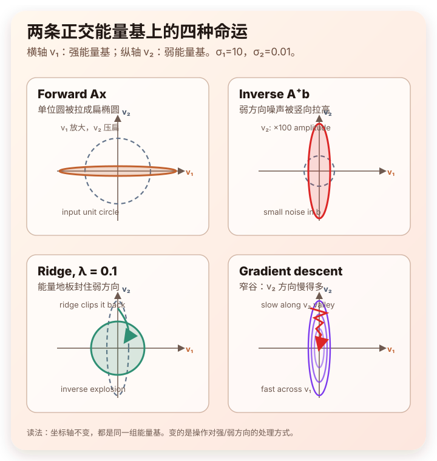

# 起点

学线性代数的时候，$Ax=b$ 通常被讲成"解方程"——给一个 $A$、一个 $b$，反求 $x$。但当我把矩阵和信号、能量、系统放到一起看时，$Ax=b$ 的味道就变了：它更像一台**工程系统**——$A$ 是矩阵，$x$ 是输入，$b$ 是输出。

而且这里有一个很容易忽视的**默认**：当我们写下 $Ax=b$，其实已经隐含了一张"能量高低分布"——**$A$ 内部对不同方向的输入并不一视同仁**：有的方向被放大、有的方向被压缩、有的方向几乎吃掉。

这篇博客就是把这张隐含的能量地图挑明，然后看 SVD、满秩、条件数、求逆、Ridge、梯度下降、PCA 等视角在这张地图上分别在做什么。结构上它们其实是**同一个根上长出来的两路分支**：

- **共同根**：A 的特征值分解 → 一组正交基 $V$ + 一份能量分布 $\sigma_i^2$（§1）
- **传递分支**：再引入 $U$，把 $x$ 投影到 $V$ 上、算 $b=Ax$——SVD、满秩、条件数、求逆、Ridge、梯度下降都站在这一路；末尾用一个能量基下的小例把这几件事一次收束（§2-§8）
- **描述分支**：不引入 $x$ 也不算 $b$，把 $A$ 当数据矩阵，用方差直接解读 $V$ 和 $\sigma_i^2$——这就是 PCA（§9）

# 一、特征值分解：A 自身的能量分布

最朴素的版本：把一个 $x$ 喂进 $A$，得到 $b = Ax$。但稍微观察一下，会发现 **$A$ 对不同方向的 $x$ 显然不平等**。

做一个心里实验：让 $x$ 取一组方向各异、模长相同的单位向量，看看 $\|Ax\|$ 怎么变。你会发现某些方向上 $\|Ax\|$ 很大、某些方向上接近 0。也就是说，同样大小的输入能量 $\|x\|^2$ 进了 $A$ 之后，被压缩还是放大、放大多少，完全取决于方向。

这件事的精确刻画是 **SVD**——它把任意 $A$ 写成

$$ A = U\Sigma V^\top $$

或者等价地，看对称矩阵 $A^TA$ 的特征值分解（一般非方阵 $A$ 本身没有特征值分解，但 $A^TA$ 永远有）：

$$ A^TA = V\,\Sigma^2\,V^\top $$

不管走哪一条，得到的都是 $A$ 自身的**能量地图**：

- $V = [v_1, v_2, \dots]$——$A$ 内部天然偏好的一组正交方向。
- $\sigma_i^2$——每条方向上的能量大小，并且按从大到小排好序：$\sigma_1^2 \ge \sigma_2^2 \ge \dots \ge 0$。

整张能量地图加起来正好是 $A$ 的 Frobenius 范数平方：

$$ \|A\|_F^2 = \sum_i \sigma_i^2 $$

——这就是 $A$ 这台机器的"总能量"。"能量集中在前几个奇异方向"这句话之所以重要，正是因为它直接通向后面的低秩近似、PCA、压缩这些事情。

**特别注意：$V$ 和 $\sigma_i^2$ 是 $A$ 内禀的——和任何 $x$ 都无关。**这是后面两条分支的**共同根**。SVD 里剩下的 $U$ 是输出端的基，下一节走传递路径时才用得上。

> $\sigma_i$ 和 $\sigma_i^2$ 的区分是整篇博客的基石之一。$\sigma_i$ 是**幅度增益**（线性放大倍数），$\sigma_i^2$ 是**能量权重**（平方意义下的尺子）。后面只要谈"能量"，量纲都是 $\sigma_i^2$。

# 二、SVD：把 x 投影到 A 的正交基上

§1 的能量地图是静态的。现在引入 $x$，把它用起来——这就是 SVD 传递路径。

给一个 $x$，$Ax$ 是怎么算出来的？三步流水线：

1. **拆 $x$**：把 $x$ 投影到正交基 $V$ 上，得到一组互不干扰的分量 $\langle v_i, x\rangle$。
2. **缩放**：每个分量乘上 $\sigma_i$（这就是这个方向上的幅度增益）。
3. **装 $b$**：缩放过的分量被 $U=[u_1, u_2, \dots]$ 重组到输出空间，得到 $b$。

整条流水线一行公式：

$$ Ax = \sum_i \sigma_i \,\langle v_i, x\rangle\, u_i $$

也就是 $b$ 在 $U$ 基下的展开系数恰好是 $\sigma_i \langle v_i, x\rangle$。这就回答了开篇那个"$A$ 对不同方向不平等"的现象——**$A$ 的偏好方向就是 $V$，每条方向上的偏好强度就是 $\sigma_i$**。

引入 $x$ 之后，$\sigma$ 和 $\sigma^2$ 的区分也跟着立起来：

$$ \|Ax\|^2 = \sum_i \sigma_i^2 \,|\langle v_i, x\rangle|^2 $$

整个系统对 $x$ 的能量响应，正是按 $\sigma_i^2$ 在各能量基之间分配的——和 §1 那张 $A$ 内禀的能量地图严丝合缝对得上。

下面 §3 到 §6，都是在这条传递路径上继续往下走，看这张能量地图引出哪些工程后果。

# 三、满秩：能量基的死活

SVD 视角告诉我们 $A$ 有一组能量基，但没说**这些基都带能量**。这就是秩要回答的问题：

> $\text{rank}(A) = r$ 就是 **$A$ 的非零能量基个数**——有 $r$ 个 $\sigma_i > 0$ 在传信号，剩下的 $\sigma_i = 0$ 都是**零能量基**。

也就是：

| 概念 | 能量翻译 |
|---|---|
| **列满秩**（$m \ge n$） | 输入端没有零能量基：任何 $x \ne 0$ 都会激起非零输出；$\text{null}(A) = \{0\}$ |
| **行满秩**（$m \le n$） | 输出端没有零能量基：任何 $b$ 都能被现有能量基组合出来；$\text{col}(A) = \mathbb{R}^m$ |
| **方阵满秩** | 两端都没零能量基 → $A$ 真正可逆 |
| **秩亏** | 有零能量基——某些 $x$ 方向"进去就消失了"（输入侧零能量基，对应非平凡 $\text{null}(A)$）：这些方向上的能量在 $\sigma=0$ 的零能量基上被直接吞掉，不会出现在 $b$ 里；或者某些 $b$ "永远到不了"（输出侧覆盖不到） |

回头看 §1 那个"$\|Ax\|$ 在某些方向上几乎为零"的现象，现在就有了精确的语言：**那些方向就是奔着 $\sigma=0$ 的零能量基去的**。

## 四个基本子空间：能量地图的四个角

上面表格已经偷偷用到了 $\text{null}(A)$ 和 $\text{col}(A)$ 两个子空间，现在把四个一起正式命名：**在能量视角下，四个基本子空间就是把 $V$ 和 $U$ 沿"$\sigma$ 是否非零"各切了一刀**。

设 $A = U\Sigma V^\top$，$r = \text{rank}(A)$。把 $V$ 拆成 $V = [\,V_r\ \mid\ V_0\,]$（前 $r$ 列对应 $\sigma > 0$，后 $n-r$ 列对应 $\sigma = 0$），$U$ 同样拆成 $U = [\,U_r\ \mid\ U_0\,]$。然后：

| 子空间 | SVD 基 | 能量身份 |
|---|---|---|
| **行空间** $\text{col}(A^\top)$ | $V_r$ | 输入端的**活方向**——能量进得去 |
| **零空间** $\text{null}(A)$ | $V_0$ | 输入端的**零能量基**——能量进去就消失 |
| **列空间** $\text{col}(A)$ | $U_r$ | 输出端的**活方向**——能量能到这里 |
| **左零空间** $\text{null}(A^\top)$ | $U_0$ | 输出端的**零能量基**——能量永远到不了 |

整齐的正交分解一句话就出来了：

$$ \mathbb{R}^n = \underbrace{\text{col}(A^\top)}_{V_r} \oplus \underbrace{\text{null}(A)}_{V_0}, \qquad \mathbb{R}^m = \underbrace{\text{col}(A)}_{U_r} \oplus \underbrace{\text{null}(A^\top)}_{U_0} $$

也就是说，**输入空间和输出空间都被 SVD 沿"能量 / 零能量"各切了一刀**。

### 零空间分量对输出毫无贡献

任何 $x \in \mathbb{R}^n$ 都能拆成 $x = x_{\text{行}} + x_{\text{零}}$，其中 $x_{\text{行}} \in \text{col}(A^\top)$、$x_{\text{零}} \in \text{null}(A)$。代进去：

$$ Ax = A\,x_{\text{行}} + \underbrace{A\,x_{\text{零}}}_{=\ 0} = A\,x_{\text{行}} $$

——**输入信号里掉进零能量基那部分，能量被 $A$ 一口吃掉，不参与 $b$ 的生成**。这正是前面表格里"某些 $x$ 方向'进去就消失了'"的精确数学表达。

类似地，输出端 $b$ 只能落在 $\text{col}(A)$ 里；$\text{null}(A^\top)$ 那部分输出空间 $A$ 永远到不了——这也就是为什么 $Ax=b$ 在 $b \notin \text{col}(A)$ 时无精确解、要走最小二乘。

# 四、条件数：能量基间的能量动态范围

把 SVD 和满秩拼起来，会看到 $A$ 的健康程度其实是一条**连续光谱**——

$$ \underbrace{\sigma = 0}_{\text{零能量基（秩亏）}}\ \longrightarrow\ \underbrace{\sigma \approx 0}_{\text{濒死（病态）}}\ \longrightarrow\ \underbrace{\sigma \text{ 适中 / 大}}_{\text{正常能量基}} $$

为这条谱配一个最常用的量化指标，就是**条件数**：

$$ \kappa(A) = \frac{\sigma_1}{\sigma_n} $$

它就是 **"最强能量基增益 / 最弱能量基增益"**——严格说，$\kappa$ 是各能量基的**幅度动态范围**，对应的**能量动态范围**是 $\kappa^2 = \sigma_1^2 / \sigma_n^2$。两者只差一个平方，下面用"能量动态范围"作直觉时心里有数即可。

- $\kappa$ 很小：所有能量基差不多，$A$ 很"听话"。
- $\kappa$ 很大：能量基间贫富差距悬殊，$A$ "病态"。
- $\kappa \to \infty$：有能量基的 $\sigma_i$ 归零，$A$ 秩亏。

也就是说，**秩亏其实就是病态的极限情况**——同一件事，只是程度不同。这条谱也直接预告了下一节：弱能量基在正向传递时看似无害，反向求逆时就会咬人。

# 五、求逆 $(A^TA)^{-1}$：把能量取倒数

现在反过来：观测到 $b$，要把 $x$ 反推回去。最经典的最小二乘解（在 $A$ 列满秩——即输入端没零能量基——时）走到的就是

$$ x = (A^TA)^{-1}A^T b $$

关键看 $(A^TA)^{-1}$。注意 $A^TA = V\Sigma^2 V^T$——它就是 §1 那张能量地图的对称版本，是一台**在各正交方向上测量能量 $\sigma_i^2$ 的能量测量仪**。对它求逆意味着：

> 在 $v_i$ 方向上的反向增益，正好是 $\dfrac{1}{\sigma_i^2}$。

**这就是问题的全部**：正向时能量微弱的小 $\sigma$ 基，反向时被取倒数变成了"放大噪声的黑洞"。假设 $\sigma_k = 10^{-5}$，反向增益就是 $\dfrac{1}{(10^{-5})^2} = 10^{10}$。观测 $b$ 里这个方向上一丁点儿噪声，会被放大一百亿倍灌进 $x$。

数值不稳定、过拟合、病态条件数——这些在能量视角下其实是同一件事：**反向取倒数让弱能量方向爆炸。**（如果 $A$ 已经秩亏，$\sigma_k = 0$，反向增益直接是无穷——这就是 §4 那条条件数光谱的另一头。）

> 严格说一下：这里的 $1/\sigma_i^2$ 是 $(A^TA)^{-1}$ 这一步在 $v_i$ 方向上的**能量增益**，对应噪声**方差**的放大倍数（所以例子里的 $10^{10}$ 是能量倍数）。从 $b$ 到 $x$ 的完整伪逆 $A^+ = V\Sigma^+ U^\top$ 在 $v_i$ 方向上的**幅度增益**是 $1/\sigma_i$（同例子下是 $10^5$）——前面还有一个 $A^\top$ 带来 $\sigma_i$，刚好把能量倒数"开方"成幅度倒数。两者只差平方关系，和博客一直强调的 $\sigma$ vs $\sigma^2$ 区分对应。

# 六、Ridge：给所有能量基铺能量地板

L2 正则化（岭回归 / Tikhonov）救的就是上一节那个爆炸。它的做法极其简单：

$$ x = (A^TA + \lambda I)^{-1}A^T b $$

为什么这一招能救命？因为 $\lambda I$ 是个非常温柔的扰动——单位矩阵在任何正交基下都是对角的，所以加上 $\lambda I$ 之后：

1. **方向绝对不变**：原来那组正交能量方向 $V$ 一毫米都不动。
2. **能量强行兜底**：每个方向上的能量从 $\sigma_i^2$ 抬到 $\sigma_i^2 + \lambda$。

于是反向增益从 $\dfrac{1}{\sigma_i^2}$ 变成

$$ \frac{1}{\sigma_i^2 + \lambda} $$

看它怎么"看人下菜碟"：

- **主导方向**（$\sigma_i^2 = 1000$，$\lambda = 0.1$）：增益 $\dfrac{1}{1000.1} \approx \dfrac{1}{1000}$——几乎不受影响。
- **危险方向**（$\sigma_k^2 = 10^{-10}$，$\lambda = 0.1$）：增益 $\dfrac{1}{10^{-10}+0.1} \approx 10$——从一百亿倍被死死压回 10 倍。

## Ridge 的本质：奇异谱上的低通滤波器

把 ridge 解整个投回 SVD 框架，会得到一个非常优美的形式：

$$ \hat{x}_{\text{ridge}} = V \cdot \mathrm{diag}\!\left(\frac{\sigma_i}{\sigma_i^2+\lambda}\right) U^T b $$

对比普通最小二乘的伪逆解 $\hat{x}_{\text{LS}} = V \cdot \mathrm{diag}(1/\sigma_i) \cdot U^T b$，ridge 等价于在每个奇异方向上多乘了一个**滤波因子**：

$$ f_i = \frac{\sigma_i^2}{\sigma_i^2 + \lambda} $$

它的行为是教科书级别的低通：

- $\sigma_i \gg \sqrt{\lambda}$：$f_i \to 1$，强能量基上的分量几乎原样通过。
- $\sigma_i \ll \sqrt{\lambda}$：$f_i \to 0$，弱能量基上的分量被柔性压制（注意是柔性，不是硬截断）。

所以一句话总结：**ridge 本质上是一台作用在奇异谱上的低通滤波器**——保留高能量、可信的方向，抑制低能量、噪声主导的方向。它顺便还把秩亏一并救了：即便 $\sigma_i = 0$，分母里还有个 $\lambda$ 兜底，不会真的爆掉。

## $\lambda$ 的量纲：噪声能量地板

$\lambda$ 是直接和 $\sigma_i^2$ 相加的，所以它的量纲就是**能量**。这意味着调 $\lambda$ 不是在调一个抽象的"惩罚强度"，而是在设定一条**噪声能量地板**：

> 我认为低于 $\sqrt{\lambda}$ 这个奇异值水平的方向都不可信，就当噪声处理。

这也是为什么 ridge 的 $\lambda$ 选择天然和数据的噪声水平、矩阵的条件数挂钩——它本来就是一个有物理意义的量。

# 七、梯度下降：能量地图的动力学

§5-§6 是**静态**地求解 $Ax=b$。换个镜头——日常工程里更常用的**梯度下降**——会发现同一张能量地图在做动力学的事。

## 损失就是势能

最小二乘的损失 $f(x) = \tfrac{1}{2}\|Ax - b\|^2$ 字面上就是这篇博客一直在讲的 $L^2$ 能量。把它当作参数空间上的**地形高度**，就完美对应经典力学里的**势能 $U(x)$**。

GD 的更新规则

$$ x_{t+1} = x_t - \eta\,\nabla f(x_t) $$

和保守力的定义 $F = -\nabla U$ 完全是同一回事——**$-\nabla f$ 就是地形上最陡下坡方向的推力**。

## 沿轨迹的能量耗散

把 GD 写成连续时间的梯度流 $\dot{x} = -\nabla f$，耗散公式立刻就出来：

$$ \frac{d}{dt}f(x(t)) = \nabla f \cdot \dot{x} = -\|\nabla f\|^2 \le 0 $$

——**$f$ 沿轨迹单调下降，耗散速率正是梯度的能量**。Lyapunov 意义下的能量耗散，参数空间里的"水往低处流"。

## 对偶：求逆爆炸 vs GD 慢收敛

把 GD 投回 SVD 基下看，每条方向独立收敛、速率正比于 $\sigma_i^2$——**小 $\sigma$ 方向走得慢**，整体被条件数 $\kappa$ 拖住。

对照 §5：反向求逆把 $\sigma_i^2$ 取倒数，**小 $\sigma$ 方向反向放大成噪声黑洞**。

> **求逆爆炸（静态）和 GD 慢收敛（动态），其实是同一张能量地图的两个面**——弱方向在反向求解时把噪声炸出去，在正向优化时把进展卡死。Ridge 抬高最小 $\sigma^2$，同时救两边。

## Momentum = 给小球加质量

到目前讲的 vanilla GD，物理上对应**过阻尼极限**——小球浸在**极粘的蜂蜜里**，没有惯性、走一步停一步。学习率 $\eta$ 就是阻尼系数的倒数（蜂蜜越稀，单步走得越远）。

**Momentum** 给小球加上**质量**：下坡时势能转化为**动能**积攒起来，靠惯性走过平缓区域。能量语言里就是**势能 ↔ 动能**的来回兑换。（**Adam** 在此基础上还引入了方向尺度自适应——RMSProp 那一支，不只是"加质量"；这里只取它"加惯性"的那一半。）

## 钩子：再加上"热运动"

如果在 Momentum 的基础上再给小球加随机扰动（**布朗运动**），就成了**朗之万动力学**——对应到机器学习里是 SGD 的隐含噪声、Langevin 采样、模拟退火这一族。这条线漂到统计物理 / 贝叶斯采样就跑远了，留作另一篇博客的开头。

# 八、数值小例：在能量基下看清四件事

§5-§7 一路把求逆、Ridge、梯度下降的故事各自讲了一遍。这一节用一个最简单的二维例子，把它们在**同一对 $\sigma$ 上**摆出来，一眼看清同一张能量地图被四种方式处理的样子。

设 $A$ 的两个奇异值是 $\sigma_1 = 10$、$\sigma_2 = 0.01$（条件数 $\kappa = 1000$，能量动态范围 $\kappa^2 = 10^6$）。把坐标轴**直接换成 $A$ 的两条能量基 $v_1, v_2$**——这一刻 $A$ 就是对角的：

$$ A = \begin{bmatrix} 10 & 0 \\ 0 & 0.01 \end{bmatrix} $$

两条轴上的能量地图清清楚楚摆着：$v_1$ 方向能量 $\sigma_1^2 = 100$，$v_2$ 方向能量 $\sigma_2^2 = 10^{-4}$。四件事在这两条轴上分别在做什么——

*同一对 $\sigma$ 在四种操作下的命运：正向压弱方向，反向放大弱方向，Ridge 封住弱方向，GD 被弱方向拖慢。*

**正向 $Ax$**：$(x_1, x_2) \mapsto (10\,x_1,\ 0.01\,x_2)$。$v_2$ 方向几乎听不到声响。

**反向 $A^+ b$（列满秩伪逆）**：$(b_1, b_2) \mapsto (b_1/10,\ 100\,b_2)$。$v_2$ 方向上幅度被放大 100 倍——观测 $b$ 里 0.01 的噪声进了 $x$ 变成 1。

**Ridge with $\lambda = 0.1$**：每条轴上 $\hat{x}_i = \dfrac{\sigma_i}{\sigma_i^2 + \lambda} b_i$，算出来：

$$ \hat{x}_1 = \frac{10}{100.1}\,b_1 \approx 0.0999\,b_1, \qquad \hat{x}_2 = \frac{0.01}{0.1001}\,b_2 \approx 0.0999\,b_2 $$

——$v_2$ 那条原本会放大 100 倍的反向增益，被 $\lambda$ 死死压回 $\approx 0.1$，**和强方向同等温和**。

**GD with step $\eta$**：每条轴上的收缩因子 $1 - \eta\sigma_i^2$：

- $v_1$：$1 - 100\,\eta$
- $v_2$：$1 - 10^{-4}\,\eta$

为了在 $v_1$ 方向不发散，需要 $\eta \lt 0.02$。这时 $v_2$ 方向的收缩因子至少 $> 0.999998$——**每步在 $v_2$ 上最多压掉百万分之二的误差**。要把 $v_2$ 误差压到原来的 $1/10$ 需要约 $10^6$ 步迭代，是 $v_1$ 方向的天文数字倍。

---

**一眼看清**：同一对 $\sigma$，正向把 $v_2$ 压成无声、反向把它炸成 100 倍噪声、Ridge 把这个炸药拆掉、GD 又把它卡到几乎不动。**四件事其实就是同一张能量地图在被不同操作处理**。

# 九、PCA：回到根，用方差解读 A 自己

§2 到 §8 全程走的都是**传递路径**：拿 §1 的能量地图、再引入 $U$、让 $x$ 推进去算 $b$（或用 GD 逼近 $x$）。**PCA 走的是另一条路——它直接回到 §1 那张能量地图，不引入 $x$、也不算 $b$，就用 $V$ 和 $\sigma_i^2$ 本身当答案。**

这一刻语境也悄悄换了：$A$ 不再是"系统的传递矩阵"，而是**数据矩阵**——每一行是一个观测样本 $x^{(i)} \in \mathbb{R}^d$，列是特征。

## 同一个 $A^TA$，两个身份

数学上 PCA 用的就是 §1 那个 $A^TA = V\Sigma^2 V^T$。中心化数据后，它正比于**协方差矩阵**：

$$ C = \frac{1}{n}A^TA = V \cdot \frac{\Sigma^2}{n} \cdot V^T $$

特征分解结构和 §5 那台"能量测量仪"完全一样——只是 $\sigma_i^2$ 的物理身份变了：

> 同一个 $\sigma_i^2$，物理身份从 **"$A$ 在 $v_i$ 方向上的增益能量"** 换成了 **"数据在 $v_i$ 方向上的方差"**。

讲的事不一样了，但语言完全一样。

## PCA 在干什么

PCA 就是找数据方差最大的几个方向——也就是 $A$ 最大的几个奇异方向 $v_1, v_2, \dots$。每个 $v_i$ 方向上数据"散得有多开"，正比于 $\sigma_i^2$。$\sigma_1^2$ 最大的那个方向，就是数据**最用力发声**的方向。

## 为什么"方差"就配得起"能量"：内积 / 范数视角

"方差"这个词拆开看，其实就是一个 $L^2$ 范数（除掉 $n$）。设数据已中心化、$v$ 是单位方向，

$$ \text{Var}_v = \frac{1}{n}\|Av\|^2 = \frac{1}{n}\sum_{i=1}^n \langle x^{(i)}, v\rangle^2 $$

读这个式子：

- $\langle x^{(i)}, v\rangle$ 是**第 $i$ 个样本和方向 $v$ 的内积**——样本在 $v$ 上的投影长度。
- 把所有样本的内积**平方加起来** = $\|Av\|^2$，正好是 $\{\langle x^{(i)}, v\rangle\}_i$ 这串实数的 $\ell^2$ 范数平方。

所以 **"方向 $v$ 上方差大" = "所有样本和 $v$ 的内积普遍大" = "数据投到 $v$ 这个泛函下的 $\ell^2$ 能量大"**。

这条 **方差 ↔ 内积 ↔ 能量** 的等价链，是 PCA 为什么从一开始就配得起"能量"这个词的根本原因——它本来就是希尔伯特空间里的范数平方。

进一步看协方差矩阵本身：

$$ C_{jk} = \frac{1}{n}\langle A_{:,j}, A_{:,k}\rangle $$

每一项都是两个特征列向量的内积——**协方差矩阵就是数据的 Gram 矩阵**。PCA 找最大特征值方向，等价于解

$$ \max_{\|v\|=1}\|Av\|^2 = \sigma_1^2 $$

一个内积空间里非常自然的优化问题——把数据 $L^2$ 范数推到最大的方向。

这套"内积 = 能量"的语言其实之前在 [Born 规则那篇博客](../born-rule-autocorrelation-energy/) 里已经铺过一次了——同一个希尔伯特空间在不同领域反复出现。

## 降维的能量保留率：Eckart–Young 给出的精确支付

PCA 给"降维"提供的**精确**能量解释。把数据 $A$ 投影到前 $k$ 个主方向上，得到的最佳低秩近似 $A_k$ 损失多少？Eckart–Young 定理给出了完全精确的答案：

$$ \|A - A_k\|_F^2 = \sum_{i>k}\sigma_i^2 $$

也就是**丢掉的能量正好是丢掉那些 $\sigma_i^2$ 之和**——不多不少。于是我们有了一个字面意义上的**能量保留率**：

$$ \eta(k) = \frac{\sum_{i\le k}\sigma_i^2}{\sum_i\sigma_i^2} $$

工程上常说"保留 95% 方差"，本质上就是选一个 $k$ 让 $\eta(k) \ge 0.95$。这是整个能量视角下最直接、最爽快的支付：**你想丢多少能量、保留多少能量，是可以精确选定的。**

## 小应用：可分离卷积也是能量保留率

刚才那条 $\eta(k) = \sum_{i\le k}\sigma_i^2 / \sum_i \sigma_i^2$ 的能量保留率，乍看是"数据降维"语境下的东西。但它的数学对任何矩阵都适用——给一个完全不属于"数据"语境的例子：**卷积核**。

一个 $3\times 3$ 或 $5\times 5$ 的卷积核 $K$ 本身就是个小矩阵，可以做它自己的 SVD：

$$ K = \sum_i \sigma_i\, u_i v_i^\top $$

每个 $u_i v_i^\top$ 是一个**秩-1 子核**（列向量乘行向量）。能量保留率告诉我们：用前 $k$ 个秩-1 子核近似 $K$，丢掉的能量正好是 $\sum_{i>k}\sigma_i^2$。

**最完美的例子**：高斯核 $G(x, y) = G(x) \cdot G(y)$ 天然是个张量积——也就是说它**严格只有一个非零奇异值**，秩为 1。保留率 $\eta(1) = 100\%$，没有任何能量损失。所以高斯核可以精确地拆成两次 1D 卷积。

工程上这件事的兑现，叫做**可分离卷积**：原本一次 $3\times 3$ 卷积每点要 9 次乘法，拆成"先竖向 1D 卷积，再横向 1D 卷积"只需 $3+3=6$ 次；$k\times k$ 卷积的成本从 $O(k^2)$ 降到 $O(k)$。这正是 MobileNet 等模型里 depthwise separable convolution 的最底层数学源头。

对非严格秩-1 的核（比如训练出来的 CNN 权重），可以用前 1-2 个奇异值做**近似可分解**——保留 95% 核能量，换来几倍的算力节省。这就是字面意义上的"$\eta(k) \ge 0.95$ 工程版"。

> 顺带一句免责：这里讲的"核 SVD"是把卷积核当作小矩阵自己做 SVD，能量基 $u_i, v_i$ 依赖具体的 $K$。这和**卷积算子**的 SVD（能量基永远是 Fourier 基）是两件事，后者会在未来的卷积博客里展开。

# 合幕

把整篇文章穿成一段：

> $Ax=b$ 这个等式背后，其实默认了一张"能量高低分布"——$A$ 对不同方向的输入并不平等。**特征值分解**把这张地图明明白白画出来：一组正交基 $V$ + 一份能量 $\sigma_i^2$，从大到小排好序。这是后面所有故事的**共同根**。
>
> 从这个根出发，文章分两路走。
>
> **传递分支**先引入 $U$，把 $x$ 投到 $V$ 上、按 $\sigma_i$ 缩放、用 $U$ 重组——这就是 **SVD**。沿着这条路再走几步：能量基有死有活就是**秩**；活能量基之间的贫富差距就是**条件数**，秩亏只是条件数无穷的极限。**求逆** $(A^TA)^{-1}$ 把每条能量基的能量取倒数，弱能量基因此变成放大噪声的黑洞；**Ridge** 给所有能量基铺一层 $\lambda$ 厚的能量地板，把弱能量基反向放大的能力柔性封印。
>
> 把这条路换上动力学的镜头，就是**梯度下降**：损失 $\|Ax-b\|^2$ 字面就是势能，负梯度就是地形上的推力，GD 是 Lyapunov 意义下的能量耗散。每条 SVD 方向独立收敛、收缩因子 $1 - \eta\sigma_i^2$ 直接由能量决定——所以**求逆爆炸（静态）和 GD 慢收敛（动态）其实是同一张能量地图的两个面**；Ridge 不只救前者，也顺手救后者。
>
> **描述分支**则反过来——它干脆不引入 $x$、也不算 $b$，直接把 $A$ 当数据矩阵看，用方差解读那张能量地图。这就是 **PCA**。同一个 $\sigma_i^2$，物理身份从"增益能量"换成"方差能量"；而方差 = 内积 = $L^2$ 范数平方，"保留 95% 方差"是字面意义上的能量保留率。
>
> 矩阵里这些看似零散的操作，在能量这把尺子下其实只在做一件事——**辨别、保留、抑制不同方向上的能量。**

# 延伸：当 $A$ 是卷积矩阵

顺着这条主线还可以再往下走一步——如果 $A$ 不是任意矩阵，而是**循环卷积矩阵**，那么它的能量坐标会固定成 **Fourier 基**：奇异值是频率响应的幅度 $|\hat{h}_k|$，相位被吸收到左右基之间的相位因子里。

这时 Ridge 的滤波因子立刻变成

$$ \frac{\hat{h}_k^*}{|\hat{h}_k|^2 + \lambda} $$

——一字不差，就是**维纳滤波**。也就是说，**维纳滤波就是 Fourier 基下的 Ridge**。同样的对偶在卷积语境下还会带出反卷积爆炸、Landweber 慢收敛、频域截断滤波这一整族——这条线值得单独成文，留作下一篇博客的主轴。
