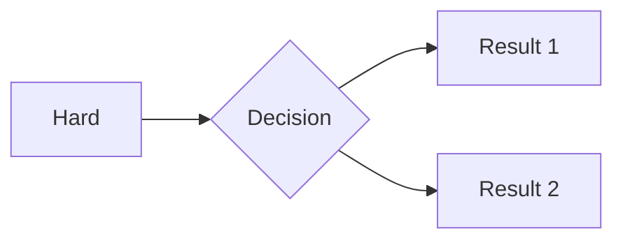

This post specifically tests the Markdown capabilities of this site, such as LaTeX and Mermaid.

## 1. LaTeX Test

psi function： $ \Psi(x, t) $。

Schrödinger equation：
$$
\begin{aligned}
&i\hbar\frac{\partial}{\partial t}\Psi(x, t) = \left[ -\frac{\hbar^2}{2m}\frac{\partial^2}{\partial x^2} + V(x, t) \right]\Psi(x, t)
\end{aligned}
$$
## 2. Mermaid Test

**Important：** ```mermaid：


## 3. Markdown Test

 Supported by Markdown 

```c
#include <stdio.h>
int main() {
    // 这应该会自动高亮
    printf("Hello, World!\n");
    return 0;
}
```