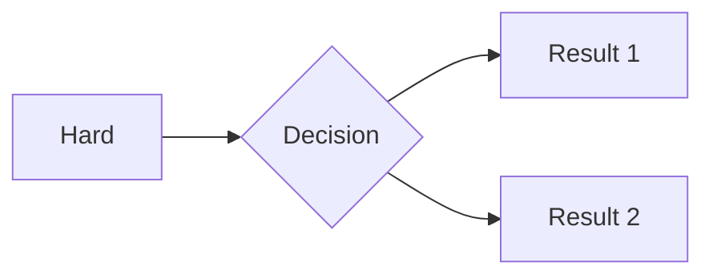

This post specifically tests the Markdown capabilities of this site, such as LaTeX and Mermaid.

## 1. LaTeX Test

psi function： $ \Psi(x, t) $。

Schrödinger equation：
$$
\begin{aligned}
&i\hbar\frac{\partial}{\partial t}\Psi(x, t) = \left[ -\frac{\hbar^2}{2m}\frac{\partial^2}{\partial x^2} + V(x, t) \right]\Psi(x, t)
\end{aligned}
$$
## 2. Mermaid Test

**Important：** ```mermaid：


## 3. Markdown Test

 Supported by Markdown 

```c
#include <stdio.h>
int main() {
    // 这应该会自动高亮
    printf("Hello, World!\n");
    return 0;
}
```


...内容...


<details>Makeleio>
  <summary>Fourier series</summary>
  
  <p>这里放你被折叠的内容。</p>
  <p>可以有很多行。</p>

</details>


<details>
  <summary style="cursor: pointer; color: #007bff; text-decoration: underline;">
    Diagram
  </summary>
  
  <br> 
  <div style="text-align: center; font-size: 11px; color: #888; margin-top: 6px;">
    Author: Krishnavedala (Wikimedia Commons) / License: CC BY-SA 3.0
    <br>
    Source: <a href="https://commons.wikimedia.org/wiki/File:Infinite_potential_well-en.svg" style="color: #007bff; text-decoration: none;">Wikimedia Commons</a>
  </div>
</details>
