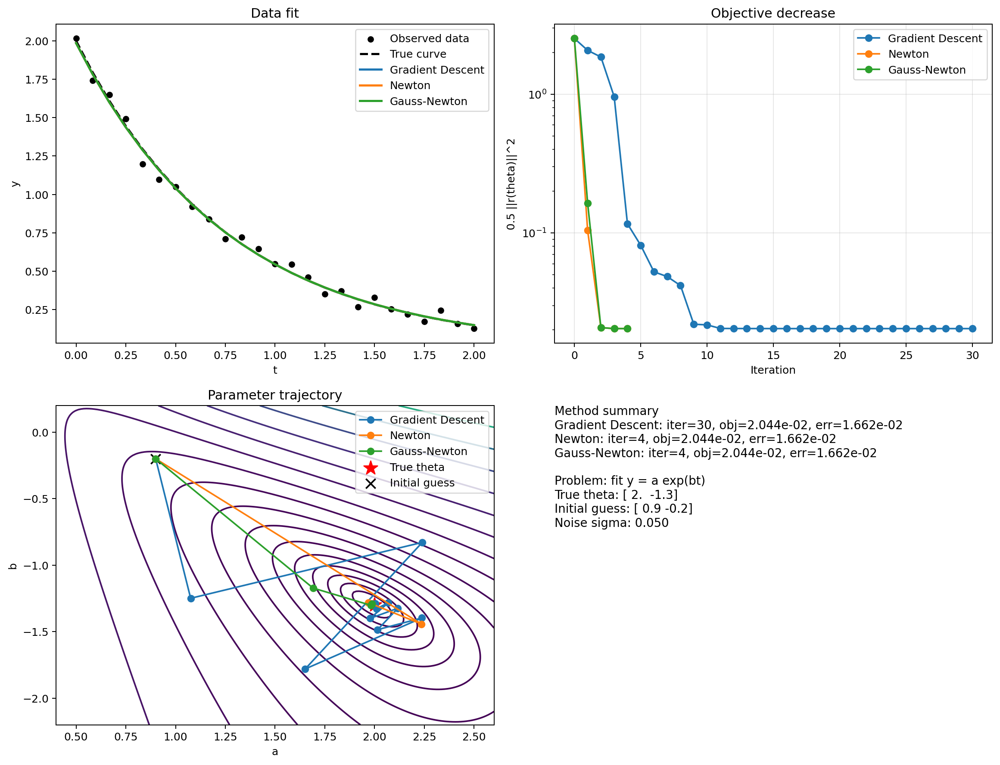

# 引言

本篇用 Python，把梯度下降法、牛顿法、高斯牛顿法三种方法放到同一个非线性最小二乘问题上跑一遍，看看它们到底是怎么走的。

概念分析，见上一篇：

- [梯度下降、牛顿法与高斯牛顿：三种优化方法分析](/posts/gradient-newton-gauss-newton/)

# 实验对象

这里对象是一个很简单的指数曲线拟合问题：

$$
y = a e^{bt}
$$

真实参数设成：

$$
\theta_{\text{true}} = [2.0,\,-1.3]
$$

然后在一组离散时间点上生成观测值，并加入少量噪声。  
最终要做的，就是通过观测数据反推出参数

$$
\theta = [a,b]
$$

使得模型预测尽量贴近观测数据。

# 目标函数

这个实验目标是一个标准的 nonlinear least-squares 问题。  
残差向量定义为：

$$
r(\theta)=a e^{bt}-y_{\text{obs}}
$$

对应的目标函数是：

$$
f(\theta)=\frac12 \|r(\theta)\|^2
$$

（这也是高斯牛顿法最自然的舞台。）

在代码里，几个核心函数都放在同一个公共模块里：

- `residual(theta)`：计算残差向量
- `jacobian(theta)`：计算 Jacobian
- `objective(theta)`：计算 $\frac12\|r(\theta)\|^2$
- `gradient(theta)`：计算梯度 $J^T r$
- `full_hessian(theta)`：计算完整 Hessian
- `gauss_newton_matrix(theta)`：计算 $J^T J$

换句话说，这个实验的结构其实很简单：  
三个方法共用同一个目标函数，只是在“下一步怎么走”这件事上，采用了不同的信息。

# 三个方法

## 梯度下降

梯度下降最朴素。  
它只拿当前点的梯度作为下降方向，然后通过一个简单的 backtracking line search 去决定步长。

核心思路还是上一篇里说的那句：

$$
\Delta x = -\eta \nabla f(x)
$$

在这个实验里，它的优点是实现最直接，几乎不用额外结构；缺点也很明显，就是当目标函数谷底比较狭长时，很容易一步一步“蹭”过去。

## 牛顿法

牛顿法会进一步利用完整的二阶信息。  
也就是说，它不只是看梯度，还会显式计算 Hessian：

$$
\Delta x = -H(x)^{-1}\nabla f(x)
$$

如果 Hessian 可逆，而且局部模型足够靠谱，它通常能非常快地逼近极小点。  
在代码里，也额外做了两层保护：

- 如果 Hessian 奇异，就退回负梯度方向
- 如果求出的方向不是下降方向，也退回负梯度方向


## 高斯牛顿

高斯牛顿利用的是 least-squares 结构。  
它不直接用完整 Hessian，而是用

$$
J^T J
$$

去近似局部曲率，因此更新写成：

$$
\Delta x = -(J^T J)^{-1}J^T r
$$

从代码角度看，和牛顿法其实非常像：  
都是先解一个线性系统，再配合 line search 更新；差别主要在于矩阵本身。

所以这三个方法：

- 梯度下降只看一阶信息
- 牛顿法看完整二阶信息
- 高斯牛顿只吃 least-squares 里最重要的那部分二阶结构

## 代码实现


<details>
<summary>核心代码片段</summary>

```python
def residual(theta: np.ndarray) -> np.ndarray:
    a, b = theta
    return a * np.exp(b * t_data) - y_obs


def jacobian(theta: np.ndarray) -> np.ndarray:
    a, b = theta
    exp_term = np.exp(b * t_data)
    return np.column_stack((exp_term, a * t_data * exp_term))


def objective(theta: np.ndarray) -> float:
    r = residual(theta)
    return 0.5 * float(r @ r)


def gradient(theta: np.ndarray) -> np.ndarray:
    j = jacobian(theta)
    r = residual(theta)
    return j.T @ r
```

上面这一段定义了整个实验共用的 least-squares 结构：残差、Jacobian、目标函数和梯度。

```python
def gradient_descent(x0: np.ndarray, max_iter: int = 30, tol: float = 1e-8):
    x = x0.astype(float).copy()

    for _ in range(max_iter):
        grad = gradient(x)
        obj = objective(x)

        if float(np.linalg.norm(grad)) < tol:
            break

        step_size = 1.0
        while step_size > 1e-8:
            trial = x - step_size * grad
            if objective(trial) <= obj - 1e-4 * step_size * float(grad @ grad):
                break
            step_size *= 0.5

        x = x - step_size * grad

    return x
```

梯度下降最直接：拿负梯度当方向，然后用 backtracking line search 控制步长。

```python
def newton_method(x0: np.ndarray, max_iter: int = 30, tol: float = 1e-8):
    x = x0.astype(float).copy()

    for _ in range(max_iter):
        grad = gradient(x)
        obj = objective(x)

        if float(np.linalg.norm(grad)) < tol:
            break

        hessian = full_hessian(x)
        try:
            direction = np.linalg.solve(hessian, -grad)
        except np.linalg.LinAlgError:
            direction = -grad

        if float(grad @ direction) >= 0.0:
            direction = -grad

        step_size = 1.0
        while step_size > 1e-8:
            trial = x + step_size * direction
            if objective(trial) <= obj + 1e-4 * step_size * float(grad @ direction):
                break
            step_size *= 0.5

        x = x + step_size * direction

    return x
```

牛顿法的核心仍然是解一个由完整 Hessian 给出的线性系统，只是这里额外加了 fallback 和 line search，让实验版更稳一些。

```python
def gauss_newton(x0: np.ndarray, max_iter: int = 30, tol: float = 1e-8) -> dict[str, object]:
    x = x0.astype(float).copy()
    params = [x.copy()]
    objectives = [objective(x)]
    gradient_norms = [float(np.linalg.norm(gradient(x)))]
    step_sizes = []

    for _ in range(max_iter):
        grad = gradient(x)
        grad_norm = float(np.linalg.norm(grad))
        obj = objective(x)

        if grad_norm < tol:
            break

        normal_matrix = gauss_newton_matrix(x)

        try:
            direction = np.linalg.solve(normal_matrix, -grad)
        except np.linalg.LinAlgError:
            direction = -grad

        if float(grad @ direction) >= 0.0:
            direction = -grad

        step_size = 1.0
        armijo = 1e-4
        directional_derivative = float(grad @ direction)

        while step_size > 1e-8:
            trial = x + step_size * direction
            obj_trial = objective(trial)
            if obj_trial <= obj + armijo * step_size * directional_derivative:
                break
            step_size *= 0.5

        x = x + step_size * direction

    return x

```

高斯牛顿和牛顿法长得很像，只是把完整 Hessian 换成了 $J^T J$ 这个近似矩阵；在这份实现里，它也同样配了 fallback 和 line search。
</details>

# 最终结果图

下面这张图是脚本最后输出的总览图：



它包含了四部分信息：

1. 左上角：三种方法最终拟合出的曲线，与观测数据和真实曲线的对比
2. 右上角：目标函数随迭代步数下降的过程
3. 左下角：参数空间里的轨迹图
4. 右下角：最终的数值摘要

# 数值结果

脚本实际跑出来的 summary 如下：

- true theta = `[2.0, -1.3]`
- initial guess = `[0.9, -0.2]`
- noise sigma = `0.05`

最终三种方法的结果是：

| 方法 | 迭代次数 | 最终目标函数 | 参数误差 | 最终参数 |
| --- | ---: | ---: | ---: | --- |
| Gradient Descent | 30 | $2.04401933\times 10^{-2}$ | $1.66158098\times 10^{-2}$ | $[1.9852,\,-1.2925]$ |
| Newton | 4 | $2.04401933\times 10^{-2}$ | $1.66158150\times 10^{-2}$ | $[1.9852,\,-1.2925]$ |
| Gauss-Newton | 4 | $2.04401933\times 10^{-2}$ | $1.66158167\times 10^{-2}$ | $[1.9852,\,-1.2925]$ |

可以看到，这个例子里三种方法最后几乎都收敛到了同一个地方。  
但是，“走过去花了多长时间、走得效果如何”？

# 理解

## 1. 拟合结果相近

先看左上角的数据拟合图。  
三种方法最后给出的拟合曲线几乎重合，也都和真实曲线非常接近。  
这说明在这个实验设定下，三者都能把参数估回来，而且估得都不差。


## 2. 目标函数下降速度明显不同

右上角的目标函数下降图就把差别放大了。

- 梯度下降下降得最慢
- 牛顿法和高斯牛顿几乎在很少几步内就压到了同一水平

这和上一篇里讲的直觉一致：

- 梯度下降只知道局部最陡下降方向
- 牛顿法和高斯牛顿都在某种意义上“看到了局部曲率”

所以它们会更会“走路”，而不只是更快地迈腿。

## 3. 参数轨迹

左下角的参数轨迹图最直观。  

- 梯度下降的路径会更弯、更慢，也更容易呈现一点“蹭过去”的感觉
- 牛顿法的步子更大、更直接
- 高斯牛顿的轨迹和牛顿法很接近，但它依赖的是 residual 结构里的 $J^T J$

也就是说，这张图把“方法差别”从抽象公式变成了真的路径。

## 4. 高斯牛顿和牛顿法速率相近

这一点其实很值得注意。  
因为它说明：在这个简单的 residual 型问题里，高斯牛顿已经抓住了最关键的局部结构，所以即使不显式计算完整 Hessian，也能得到和牛顿法非常接近的表现。

这也是为什么在很多非线性最小二乘问题里，高斯牛顿会这么常见。  
它往往不是“最一般”的方法，但在自己的主场里，非常好用。

# 边界

这个 demo 的目标不是证明某个方法永远最好，而是把三种方法的典型差别用一个很小的例子跑出来。  
所以它也有自己的边界：

- 问题维度很低，只有两个参数
- 初值不算特别离谱
- 残差结构比较干净
- 噪声也不大

在这种环境下，高斯牛顿和牛顿法表现都很好，并不意外。  
如果问题更病态、初值更差、噪声更大，或者 Hessian 更不稳定，结果就可能不一样。


# 小结

这一组图最想说明的，其实只有一件事：

**三种方法最终解决的是同一个优化问题，但它们利用局部信息的方式不同，因此会走出完全不同的路径。**

在这个小实验里：

- 梯度下降最朴素，也最慢
- 牛顿法最“完整”，但也最重
- 高斯牛顿利用 least-squares 的结构，在这个场景里几乎拿到了和牛顿法一样快的效果
