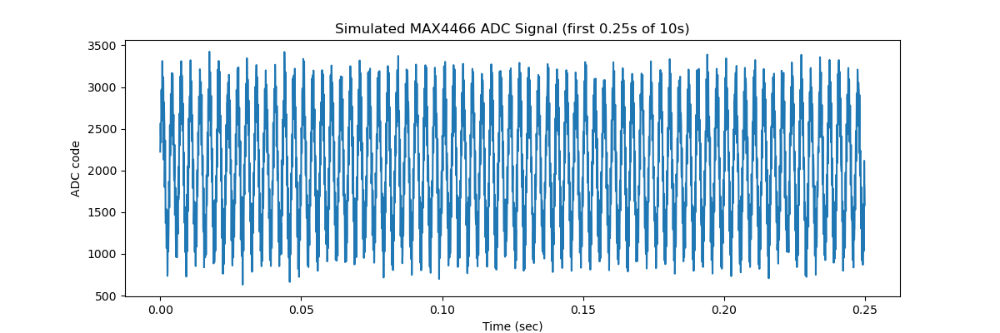
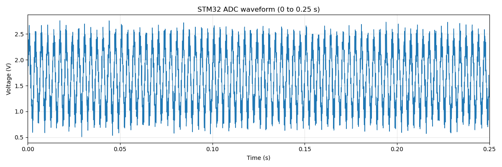
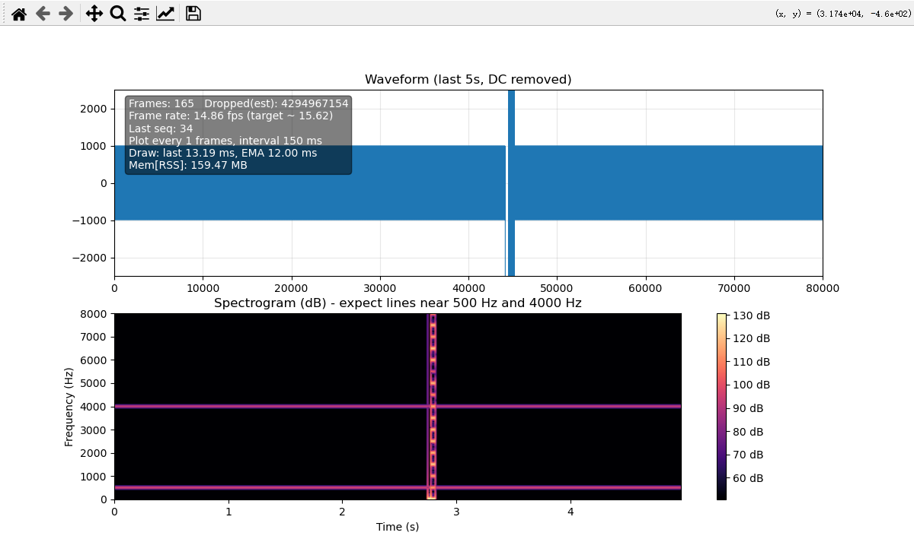

# 12.15
STM32 USART DMA callback test with Python-side waveform sender.
<details>
  <summary>Log</summary>
  
## main.c
Mainly configured **USART1 (circular buffer)**, **DMA**, the RX **callback**, LED_R check, and **rewrote fputc**.
<details>
  <summary>main.c</summary>
  
```c
volatile uint16_t rx_buffer[1024];

    HAL_UART_Receive_DMA(&huart1, (uint8_t*)rx_buffer, 2048);

void HAL_UART_RxCpltCallback(UART_HandleTypeDef *huart)
{
  if(huart->Instance == USART1)
  {
    HAL_GPIO_TogglePin(GPIOA, LED_R_Pin);
    uint8_t ack = 'K';
    HAL_UART_Transmit(&huart1, &ack, 1, 10);
  }
}

int _write(int file, char *data, int len)
{
  HAL_UART_Transmit(&huart1, (uint8_t*)data, len, 1000);
  return len;
}

```

</details>

## hil.sender1.py
Python utility to synthesize a sine wave and push it over UART for callback validation.

<details>
  <summary>hil.sender1.py</summary>

```python
import serial
import struct
import math
import time

# ================= Configuration Area =================
# ⚠️ Make sure the baud rate here is exactly the same as setting in CubeMX!
# If set it to 460800 in CubeMX, need to change it here too
STM32_PORT = 'COM5'      
BAUD_RATE  = 460800     
POINTS_LEN = 1024        # Number of data points (matching the length of the STM32 array)
# ===========================================

def generate_sine_wave(length):
    """
    Generate a sine wave for simulating ADC data
    Range: 0 ~ 4095 (12-bit)
    Center: 2048 (approximately 1.65V)
    """
    data = []
    print(f"Generating sine wave data with {length} sampling points...")
    
    for i in range(length):
        # Generate a sine wave: 2048 is the midpoint, 1800 is the amplitude (to avoid peaking)
        # i / 50 controls the frequency of the waveform (adjusting this denominator can change the density of the waves)
        value = 2048 + 1800 * math.sin(2 * math.pi * i / 50)
        
        # Ensure the data does not exceed 0-4095 (mathematically it won't, but it's rigorous in engineering)
        value = int(max(0, min(4095, value)))
        data.append(value)
        
    return data

def main():
    try:
        # 1. Open the serial port
        print(f"Connecting to STM32 ({STM32_PORT} @ {BAUD_RATE})...")
        ser = serial.Serial(STM32_PORT, BAUD_RATE, timeout=1)
        print("Connection successful! ✅")

        # 2. Prepare data
        wave_data = generate_sine_wave(POINTS_LEN)
        
        # 3. Package data (key step!)
        # STM32 uses little-endian mode, and uint16_t occupies 2 bytes
        # '<' represents little-endian, 'H' represents unsigned short (2 bytes)
        # This line of code converts an array like [2048, 2100...] into a binary byte stream
        binary_packet = struct.pack('<' + 'H' * len(wave_data), *wave_data)

        # 4. Send data
        print(f"Sending a data packet of {len(binary_packet)} bytes...")
        start_time = time.time()
        
        bytes_sent = ser.write(binary_packet)
        ser.flush()  # Ensure all data is pushed out
        
        end_time = time.time()
        print(f"Transmission completed! 🚀 Time taken: {(end_time - start_time):.4f} seconds")
        print(f"In theory, the rx_buffer of STM32 should now be full.")

        # Optional: If you have written code to send back 'K', you can read it here
        response = ser.read(1)
        if response: print(f"Received reply from STM32: {response}")

        ser.close()
        print("Serial port closed.")

    except serial.SerialException as e:
        print(f"❌ Serial port error: {STM32_PORT} not found or port is occupied!")
        print("Suggestion: Close other serial port assistant software and check the USB cable.")
    except Exception as e:
        print(f"❌ An error occurred: {e}")

if __name__ == "__main__":
    main()
```

</details>

## Terminal
The terminal output confirms the STM32 DMA/RX callback and the Python sender completed successfully (2048 bytes sent, ‘K’ ACK received).
<details>
  <summary>Terminal</summary>

```terminal
Connecting to STM32 (COM5 @ 460800)...
Connection successful! ✅
Generating sine wave data with 1024 sampling points...
Sending a data packet of 2048 bytes...
Transmission completed! 🚀 Time taken: 0.0433 seconds
In theory, the rx_buffer of STM32 should now be full.
Received reply from STM32: b'K'
Serial port closed.

```
</details>


</details>

***


# 12.19
USART DMA loopback using simulated MAX4466 data plus end-to-end integrity checks.
<details>
  <summary>Log</summary>

## main.c
USART1 DMA receives 2048 bytes and echoes them back for loopback verification.

<details>
  <summary>main.c</summary>

```c
uint8_t rx_buffer[2048];

HAL_UART_Receive_DMA(&huart1, (uint8_t*)rx_buffer, sizeof(rx_buffer));

void HAL_UART_RxCpltCallback(UART_HandleTypeDef *huart)
{
  if(huart->Instance == USART1)
  {
    HAL_GPIO_TogglePin(GPIOA, LED_R_Pin);
    HAL_UART_Transmit(&huart1, (uint8_t*)rx_buffer, sizeof(rx_buffer), 1000);
    HAL_UART_Receive_DMA(&huart1, rx_buffer, sizeof(rx_buffer));
  }
}

```

</details>


## mock_max4466_wave.py
Generates a 16 kHz, 10 s synthetic MAX4466-like signal and saves it as uint16 binary.

<details>
  <summary style="cursor: pointer; color: #007bff; text-decoration: underline;">
    Matplotlib
  </summary>
  
  <br> 
</details>

<details>
  <summary>mock_max4466_wave.py</summary>
  
```python
import numpy as np
import matplotlib.pyplot as plt

np.random.seed(0)
# ========== Configuration Information ==========
FS = 16000    # Sampling rate Hz
DURATION = 10 # seconds
ADC_BITS = 12 # STM32F103 ADC
ADC_MAX = 2**ADC_BITS - 1  # 4095

N = (FS * DURATION // 1024) * 1024   # Number of samples

# ========== Signal Synthesis ==========
t = np.arange(N) / FS

# Main signal (simulated ambient sound) — such as simulating speech, mechanical vibration
base_freq = 300           # Hz
base_wave = 2048 + 900 * np.sin(2 * np.pi * base_freq * t)
# Superimpose a high frequency
high_freq = 3000
high_wave = 300 * np.sin(2 * np.pi * high_freq * t)
# Simulate a burst event (abnormality): amplitude spike between 4th and 5th second
burst = np.zeros(N)
burst_idx = np.logical_and(t >= 4, t < 5)
burst[burst_idx] = 1200 * np.sin(2 * np.pi * 1000 * t[burst_idx])
# Superimpose ambient noise
noise = np.random.normal(0, 100, N)

# Total signal
wave = base_wave + high_wave + burst + noise
# Clip to [0, 4095]
wave = np.clip(wave, 0, ADC_MAX).astype(np.uint16)

# ========== Visualization ==========
plt.figure(figsize=(12, 4))
plt.plot(t[:4000], wave[:4000]) # Plot only the first 4000 points, approximately 0.25 seconds
plt.xlabel("Time (sec)")
plt.ylabel("ADC code")
plt.title("Simulated MAX4466 ADC Signal (first 0.25s of 10s)")
plt.show()

# ========== Save Binary File ==========
wave.tofile("sim_max4466_16k_10s.bin")  # Save as uint16 little-endian
print(f"Number of sampling points: {N}, file saved as sim_max4466_16k_10s.bin")
```

</details>

## try.py
Streams the generated binary to STM32 in 1024-sample frames and captures the echo.

<details>
  <summary>try.py</summary>
  
```python
# loopback_inject_and_capture.py
import serial
import numpy as np
import time

PORT = "COM5"
BAUD = 460800
TIMEOUT = 1.0

IN_FILE = "sim_max4466_16k_10s.bin"
OUT_FILE = "loopback_data.bin"

POINTS_PER_PACKET = 1024
BYTES_PER_PACKET = POINTS_PER_PACKET * 2  # uint16

def read_exact(ser, n: int) -> bytes:
    buf = bytearray()
    while len(buf) < n:
        chunk = ser.read(n - len(buf))
        if not chunk:
            raise TimeoutError(f"Timeout while reading: got {len(buf)}/{n} bytes")
        buf.extend(chunk)
    return bytes(buf)

def main():
    adc_codes = np.fromfile(IN_FILE, dtype=np.uint16)
    n_packets = len(adc_codes) // POINTS_PER_PACKET
    adc_codes = adc_codes[:n_packets * POINTS_PER_PACKET]  # Align to whole packets

    print(f"Total samples: {len(adc_codes)}")
    print(f"Packets: {n_packets}, {POINTS_PER_PACKET} points/packet, {BYTES_PER_PACKET} bytes/packet")

    with serial.Serial(PORT, BAUD, timeout=TIMEOUT) as ser, open(OUT_FILE, "wb") as f:
        # Optional: Clear input buffer to avoid interference from power-up residual data
        ser.reset_input_buffer()
        ser.reset_output_buffer()
        time.sleep(0.05)

        for i in range(n_packets):
            pkt_u16 = adc_codes[i*POINTS_PER_PACKET:(i+1)*POINTS_PER_PACKET]
            pkt_bytes = pkt_u16.tobytes()  # 2048 bytes

            ser.write(pkt_bytes)

            echo = read_exact(ser, BYTES_PER_PACKET)
            f.write(echo)

            # Optional: Consistency check (adds a bit of CPU load but is useful)
            if echo != pkt_bytes:
                print(f"[Mismatch] frame {i}: echo != sent (link corruption or misalignment)")
                # You can break here or continue collecting
                break

            if (i % 50) == 0:
                print(f"Frame {i}/{n_packets} OK")

    print(f"Saved loopback to {OUT_FILE}")

if __name__ == "__main__":
    main()
```

</details>

## plot_stm32_adc_wave.py
Loads the echoed data, converts to volts, and plots the first 0.25 seconds.

<details>
  <summary style="cursor: pointer; color: #007bff; text-decoration: underline;">
    Matplotlib
  </summary>
  
  <br> 
</details>

<details>
  <summary>plot_stm32_adc_wave.py</summary>
  
```python
import numpy as np
import matplotlib.pyplot as plt

# ====== Basic parameters ======
FS = 16000            # Sampling rate (Hz)
ADC_BITS = 12
ADC_MAX = 2**ADC_BITS - 1  # 4095
VREF = 3.3            # ADC reference voltage (V) (depends on your board supply)

FILENAME = "loopback_data.bin"

# ====== Load binary data ======
adc_codes = np.fromfile(FILENAME, dtype=np.uint16)
print(f"Total samples loaded: {len(adc_codes)}")

# ====== Convert ADC codes to voltage ======
voltages = adc_codes.astype(np.float32) * VREF / ADC_MAX

# ====== Plot 0 ~ 0.25 s waveform ======
T_SHOW = 0.25                         # seconds
N_show = min(int(FS * T_SHOW), len(voltages))
t = np.arange(N_show) / FS

plt.figure(figsize=(12, 4))
plt.plot(t, voltages[:N_show], linewidth=1.0)
plt.xlim(0, T_SHOW)
plt.xlabel("Time (s)")
plt.ylabel("Voltage (V)")
plt.title("STM32 ADC waveform (0 to 0.25 s)")
plt.grid(True, alpha=0.3)
plt.tight_layout()
plt.show()

# ====== Optional: statistics ======
print(f"Mean voltage: {voltages.mean():.3f} V")
print(f"Voltage range: {voltages.min():.3f} ~ {voltages.max():.3f} V")
```

</details>

## check.py

Compares size and MD5 of original and loopback binaries to confirm lossless transfer.

<details>
  <summary>check.py</summary>

```python
import hashlib
import os

def file_md5(filename):
    """Compute the MD5 checksum of a file."""
    hash_md5 = hashlib.md5()
    with open(filename, "rb") as f:
        # Read and update hash string value in blocks of 4K
        for chunk in iter(lambda: f.read(4096), b""):
            hash_md5.update(chunk)
    return hash_md5.hexdigest()

def main():
    files = [    "D:\\Github_Repos\\Project-Sonic-Implant\\python-scripts\\sim_max4466_16k_10s.bin",
    "D:\\Github_Repos\\Project-Sonic-Implant\\python-scripts\\loopback_data.bin"]

    for file in files:
        if not os.path.exists(file):
            print(f"Error: {file} not found.")
            return

    # Compare sizes
    size1 = os.path.getsize(files[0])
    size2 = os.path.getsize(files[1])

    print(f"path: {files[0]}\nsize: {size1}\nmd5 : {file_md5(files[0])}\n---")
    print(f"path: {files[1]}\nsize: {size2}\nmd5 : {file_md5(files[1])}\n")

    if size1 == size2:
        print("File size: OK")
    else:
        print("File size: MISMATCH")

    if file_md5(files[0]) == file_md5(files[1]):
        print("MD5: OK")
    else:
        print("MD5: MISMATCH")

if __name__ == "__main__":
    main()
```

</details>

## Terminal
Run logs showing generation, loopback transfer, plotting, and checksum match.

```terminal

(base) PS D:\Github_Repos\Project-Sonic-Implant\python-scripts> python .\mock_max4466_wave.py  
Number of sampling points: 159744, file saved as sim_max4466_16k_10s.bin
(base) PS D:\Github_Repos\Project-Sonic-Implant\python-scripts> python .\try.py
Packets: 156, 1024 points/packet, 2048 bytes/packet
Frame 0/156 OK
Frame 50/156 OK
Frame 100/156 OK
Frame 150/156 OK
Saved loopback to loopback_data.bin
(base) PS D:\Github_Repos\Project-Sonic-Implant\python-scripts> python .\plot_stm32_adc_wave.py
Total samples loaded: 159744
Mean voltage: 1.650 V
Voltage range: 0.000 ~ 3.300 V
(base) PS D:\Github_Repos\Project-Sonic-Implant\python-scripts> python .\check.py
path: D:\Github_Repos\Project-Sonic-Implant\python-scripts\sim_max4466_16k_10s.bin
size: 319488
md5 : 352c4e63873228067e670a493f649ae4
---
path: D:\Github_Repos\Project-Sonic-Implant\python-scripts\loopback_data.bin
size: 319488
md5 : 352c4e63873228067e670a493f649ae4

File size: OK
MD5: OK
```
</details>


# 12.20


<details>
  <summary>Log</summary>
  
## main.c

<details>
  <summary>main.c</summary>
  
```c
/* USER CODE BEGIN PV */
#define FS                 16000u
#define SAMPLES_PER_FRAME  1024u
#define PAYLOAD_BYTES      (SAMPLES_PER_FRAME * 2u)
#define FRAME_BYTES        (4u + 4u + PAYLOAD_BYTES)

static const uint32_t MAGIC = 0xAABBCCDD;
static uint32_t g_seq = 0;

static uint8_t  tx_frame[FRAME_BYTES];
static uint16_t tx_payload[SAMPLES_PER_FRAME];

static uint32_t phase500 = 0;
static uint32_t phase4k  = 0;
static const uint32_t STEP500 = (uint32_t)((500.0  * 4294967296.0) / FS);
static const uint32_t STEP4K  = (uint32_t)((4000.0 * 4294967296.0) / FS);
/* USER CODE END PV */

/* USER CODE BEGIN 0 */
// 256-point sine LUT, Q15 (-32767..32767)
static int16_t sin_lut[256];
static uint8_t lut_inited = 0;

static void init_sin_lut(void) {
  if (lut_inited) return;
  lut_inited = 1;
  for (int i = 0; i < 256; i++) {
    float a = 2.0f * 3.1415926f * (float)i / 256.0f;
    sin_lut[i] = (int16_t)(32767.0f * sinf(a));
  }
}
static inline uint16_t clamp12(int32_t v) {
  if (v < 0) return 0;
  if (v > 4095) return 4095;
  return (uint16_t)v;
}

static inline int16_t sin_q15_from_phase(uint32_t phase) {
  // use top 8 bits as index
  uint8_t idx = (uint8_t)(phase >> 24);
  return sin_lut[idx];
}

static void fill_payload_dualtone(uint16_t *dst, uint32_t n) {
  // amplitudes in ADC codes
  const int32_t A1 = 600;
  const int32_t A2 = 400;

  for (uint32_t i = 0; i < n; i++) {
    int16_t s1 = sin_q15_from_phase(phase500);
    int16_t s2 = sin_q15_from_phase(phase4k);

    // Q15 -> scale to amplitude: (A * s) / 32768
    int32_t v = 2048
      + (A1 * (int32_t)s1) / 32768
      + (A2 * (int32_t)s2) / 32768;

    dst[i] = clamp12(v);

    phase500 += STEP500;
    phase4k  += STEP4K;
  }
}
/* USER CODE END 0 */
/* Infinite loop */
  /* USER CODE BEGIN WHILE */
  while (1)
  {
    uint32_t t0 = HAL_GetTick();
    /* USER CODE END WHILE */

    /* USER CODE BEGIN 3 */
    uint32_t seq = g_seq++;
    memcpy(tx_frame + 4, &seq, 4);
    fill_payload_dualtone(tx_payload, SAMPLES_PER_FRAME);
    memcpy(tx_frame + 8, tx_payload, PAYLOAD_BYTES);

    HAL_UART_Transmit(&huart1, tx_frame, FRAME_BYTES, 1000);
    uint32_t elapsed = HAL_GetTick() - t0;
    if (elapsed < 64)
    {
      HAL_Delay(64 - elapsed);           
    }
  }
  /* USER CODE END 3 */
```

  </details>

## analyze.py

<details>
  <summary>analyze.py</summary>
  
```python
import serial
import struct
import time
import threading
import numpy as np
import matplotlib.pyplot as plt
import psutil


# =======================
# Config
# =======================
PORT = "COM5"
BAUD = 460800

FS = 16000
SECONDS_TO_SHOW = 5.0

SAMPLES_PER_FRAME = 1024
PAYLOAD_BYTES = SAMPLES_PER_FRAME * 2
FRAME_BYTES = 4 + 4 + PAYLOAD_BYTES

MAGIC_U32 = 0xAABBCCDD
MAGIC_BYTES = struct.pack("<I", MAGIC_U32)  # little-endian

# Plot throttling
UPDATE_SEC = 0.15        # UI 最小刷新间隔 (秒)
PLOT_EVERY_N_FRAMES = 1  # UI 刷新需累积的最小帧数
LAG_SEC = 0.0            # 显示滞后占位（当前未使用）
MAX_SERIAL_READ = 8192

# 绘图耗时 EMA
DRAW_TIME_ALPHA = 0.2    # 0.0~1.0，越大越敏感

# STFT parameters
NFFT = 512
HOP = 160                 # 10ms @ 16k
WIN = 400                 # 25ms @ 16k
FMAX = FS // 2


def pop_frame_from_buffer(buf: bytearray):
    idx = buf.find(MAGIC_BYTES)
    if idx < 0:
        if len(buf) > 3:
            del buf[:-3]
        return None

    if idx > 0:
        del buf[:idx]

    if len(buf) < FRAME_BYTES:
        return None

    seq = struct.unpack_from("<I", buf, 4)[0]
    payload = bytes(buf[8:8 + PAYLOAD_BYTES])
    del buf[:FRAME_BYTES]
    return seq, payload


def stft_db(sig: np.ndarray, fs: int, window: np.ndarray):
    sig = sig.astype(np.float32)
    n_frames = 1 + (len(sig) - len(window)) // HOP
    if n_frames <= 0:
        return None, None, None

    n_freq = NFFT // 2 + 1
    S = np.empty((n_freq, n_frames), dtype=np.float32)

    for i in range(n_frames):
        start = i * HOP
        frame = sig[start:start + len(window)] * window
        fft = np.fft.rfft(frame, n=NFFT)
        mag = np.abs(fft)
        S[:, i] = mag

    S_db = 20.0 * np.log10(S + 1e-6)
    freqs = np.fft.rfftfreq(NFFT, d=1.0 / fs)
    times = (np.arange(n_frames) * HOP) / fs
    return S_db, freqs, times


class RingBuffer:
    def __init__(self, size):
        self.buf = np.zeros(size, dtype=np.float32)
        self.size = size
        self.wptr = 0
        self.filled = False
        self.lock = threading.Lock()

    def write(self, x: np.ndarray):
        with self.lock:
            n = len(x)
            if self.wptr + n <= self.size:
                self.buf[self.wptr:self.wptr + n] = x
                self.wptr += n
                if self.wptr == self.size:
                    self.wptr = 0
                    self.filled = True
            else:
                k = self.size - self.wptr
                self.buf[self.wptr:] = x[:k]
                self.buf[:n - k] = x[k:]
                self.wptr = n - k
                self.filled = True

    def snapshot(self):
        with self.lock:
            if not self.filled:
                return None
            w = self.wptr
            return np.concatenate([self.buf[w:], self.buf[:w]])


def rx_thread_fn(stop_evt: threading.Event, ring: RingBuffer, stats: dict):
    ser = serial.Serial(PORT, BAUD, timeout=0.05)
    ser.reset_input_buffer()

    rx_buf = bytearray()
    last_seq = None

    while not stop_evt.is_set():
        chunk = ser.read(MAX_SERIAL_READ)
        if chunk:
            rx_buf.extend(chunk)

        while True:
            res = pop_frame_from_buffer(rx_buf)
            if res is None:
                break
            seq, payload = res

            # seq check
            if last_seq is not None:
                expected = (last_seq + 1) & 0xFFFFFFFF
                if seq != expected:
                    gap = (seq - expected) & 0xFFFFFFFF
                    stats["dropped"] += gap
            last_seq = seq
            stats["frames_ok"] += 1
            stats["last_seq"] = seq

            u16 = np.frombuffer(payload, dtype=np.uint16)
            x = u16.astype(np.float32)
            x = x - x.mean()

            ring.write(x)

    ser.close()


def get_mem_usage_mb():
    """Return (label, value_mb)."""
    
    p = psutil.Process()
    rss = p.memory_info().rss
    return "RSS", rss / (1024 * 1024)


def main():


    ring = RingBuffer(int(FS * SECONDS_TO_SHOW))
    stats = {"frames_ok": 0, "dropped": 0, "last_seq": None, "t0": time.time()}
    stop_evt = threading.Event()

    rx_thr = threading.Thread(target=rx_thread_fn, args=(stop_evt, ring, stats), daemon=True)
    rx_thr.start()

    # 预存 Hann 窗口
    window = np.hanning(WIN).astype(np.float32)

    plt.ion()
    fig, (ax1, ax2) = plt.subplots(2, 1, figsize=(12, 7))

    # Waveform plot (持久化 line)
    line, = ax1.plot(np.zeros(ring.size), lw=0.8)
    ax1.set_title("Waveform (last 5s, DC removed)")
    ax1.set_ylim(-2500, 2500)
    ax1.set_xlim(0, ring.size)
    ax1.grid(True, alpha=0.3)
    info = ax1.text(
        0.02, 0.95, "",
        transform=ax1.transAxes,
        va="top", ha="left",
        bbox=dict(boxstyle="round", facecolor="black", alpha=0.5),
        color="white"
    )

    # Spectrogram image (持久化 imshow + colorbar)
    img = None

    last_plot_time = time.time()
    last_frame_seen = -1
    draw_time_ms = 0.0  # EMA

    try:
        while True:
            now = time.time()
            if now - last_plot_time < UPDATE_SEC:
                plt.pause(0.001)
                continue
            if stats["frames_ok"] - last_frame_seen < PLOT_EVERY_N_FRAMES:
                plt.pause(0.001)
                continue

            snap = ring.snapshot()
            if snap is None:
                plt.pause(0.001)
                continue

            last_plot_time = now
            last_frame_seen = stats["frames_ok"]

            t_draw_start = time.time()

            # Stats
            dt = now - stats["t0"]
            fps = stats["frames_ok"] / dt if dt > 0 else 0.0

            # Waveform update
            line.set_ydata(snap)

            # Spectrogram update
            S_db, freqs, times_arr = stft_db(snap, FS, window)
            if S_db is not None:
                if img is None:
                    img = ax2.imshow(
                        S_db,
                        origin="lower",
                        aspect="auto",
                        extent=[times_arr[0], times_arr[-1], freqs[0], freqs[-1]],
                        cmap="magma",
                        vmin=S_db.max() - 80,
                        vmax=S_db.max()
                    )
                    fig.colorbar(img, ax=ax2, format="%.0f dB")
                    ax2.set_ylim(0, FMAX)
                    ax2.set_title("Spectrogram (dB) - expect lines near 500 Hz and 4000 Hz")
                    ax2.set_xlabel("Time (s)")
                    ax2.set_ylabel("Frequency (Hz)")
                else:
                    img.set_data(S_db)
                    img.set_extent([times_arr[0], times_arr[-1], freqs[0], freqs[-1]])
                    img.set_clim(vmin=S_db.max() - 80, vmax=S_db.max())

            # 绘图耗时统计
            t_draw_end = time.time()
            last_draw_ms = (t_draw_end - t_draw_start) * 1000.0
            draw_time_ms = (1 - DRAW_TIME_ALPHA) * draw_time_ms + DRAW_TIME_ALPHA * last_draw_ms

            # 内存占用统计
            mem_label, mem_mb = get_mem_usage_mb()

            info.set_text(
                f"Frames: {stats['frames_ok']}   Dropped(est): {stats['dropped']}\n"
                f"Frame rate: {fps:.2f} fps (target ~ {FS / SAMPLES_PER_FRAME:.2f})\n"
                f"Last seq: {stats['last_seq']}\n"
                f"Plot every {PLOT_EVERY_N_FRAMES} frames, interval {UPDATE_SEC*1000:.0f} ms\n"
                f"Draw: last {last_draw_ms:.2f} ms, EMA {draw_time_ms:.2f} ms\n"
                f"Mem[{mem_label}]: {mem_mb:.2f} MB"
            )

            plt.pause(0.001)

    except KeyboardInterrupt:
        pass
    finally:
        stop_evt.set()
        rx_thr.join(timeout=1.0)


if __name__ == "__main__":
    main()
```

</details>

## Output

<details>
  <summary style="cursor: pointer; color: #007bff; text-decoration: underline;">
    Matplotlib
  </summary>
  
  <br> 
</details>

</details>
