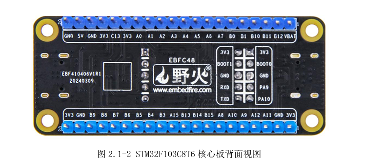
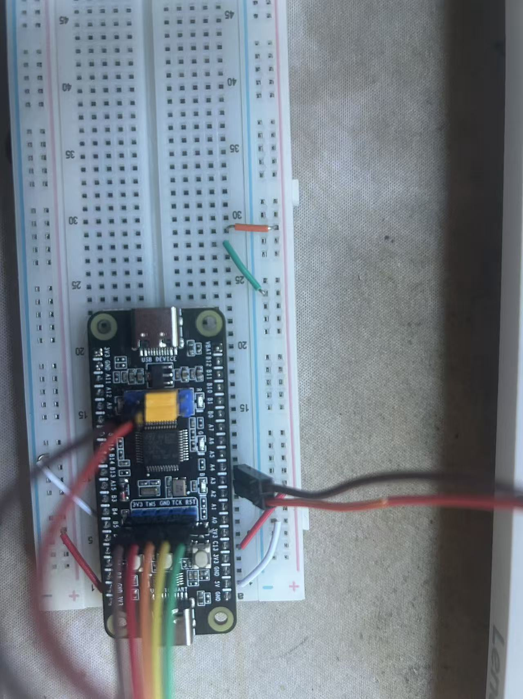
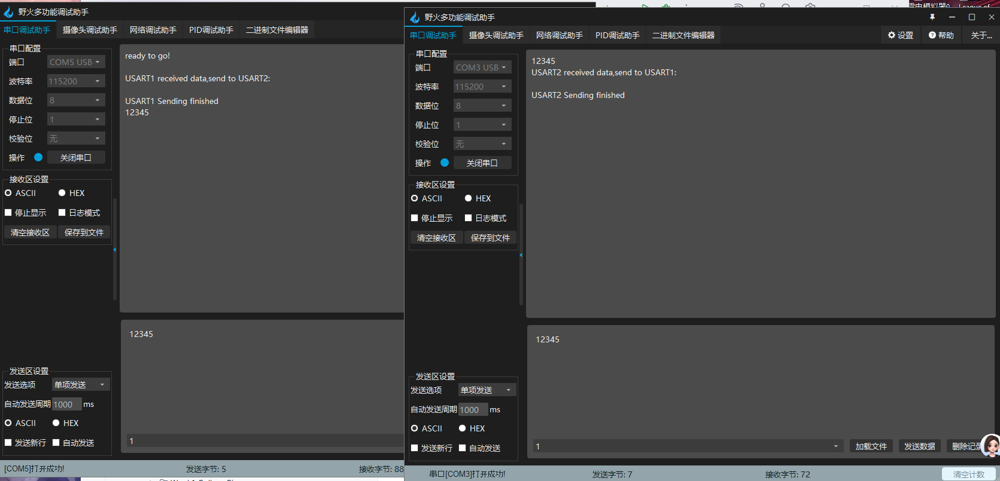

# Background

I spent a long time learning STM32 development with Keil MDK (Keil5), but eventually I started to feel the workflow limitations. A simple example is `printf` redirection: in Keil, we often solve it by rewriting `fputc`, and that usually means repeating the same boilerplate in every new project.

To move toward a more modern workflow, I migrated to CLion. Setting up STM32CubeMX, CLion, MinGW, and OpenOCD took almost an entire day, but the final environment was worth it.

# Problem Description

The real issue appeared when I began experimenting with multiple USART channels. I was following a tutorial written around Keil and tried to port it into my CLion environment. That required changing the low-level I/O retargeting from Keil-style `fputc` to the GCC-style `_write`.

Compilation succeeded, flashing succeeded, and the MCU looked alive, but the serial communication failed completely.

# Troubleshooting

## Step 1: Review the Code

At first I assumed the bug came from the migration itself, so I reviewed `main.c` and checked whether the initialization, interrupt path, and `_write` retargeting had obvious mistakes.

<details>
  <summary>main.c</summary>
  
```c
/* USER CODE BEGIN Header */
/**
  ******************************************************************************
  * @file           : main.c
  * @brief          : Main program body
  ******************************************************************************
  */
#include "main.h"
#include "usart.h"
#include "gpio.h"
#include <stdio.h>

#define LENGTH 64

uint8_t Rxbuff1[LENGTH];
uint8_t Rxbuff2[LENGTH];

void SystemClock_Config(void);
void USART_SendString(UART_HandleTypeDef *huart, char *str);

int main(void)
{
  HAL_Init();
  SystemClock_Config();
  MX_GPIO_Init();
  MX_USART1_UART_Init();
  MX_USART2_UART_Init();

  HAL_UARTEx_ReceiveToIdle_IT(&huart1, Rxbuff1, LENGTH);
  HAL_UARTEx_ReceiveToIdle_IT(&huart2, Rxbuff2, LENGTH);
  printf("Ready to go!!");

  while (1)
  {
  }
}

void HAL_UARTEx_RxEventCallback(UART_HandleTypeDef *huart, uint16_t Size)
{
  if(huart->Instance == USART1)
  {
    USART_SendString(&huart1, "\r\nUSART1 received data,send to USART2:\r\n");
    HAL_UART_Transmit_IT(&huart2, Rxbuff1, Size);
    USART_SendString(&huart1, "\r\nUSART1 Sending finished\r\n");
    HAL_UARTEx_ReceiveToIdle_IT (&huart1, Rxbuff1, LENGTH);
  }
  else if(huart->Instance == USART2)
  {
    USART_SendString(&huart2, "\r\nUSART2 received data,send to USART1:\r\n");
    HAL_UART_Transmit_IT(&huart1, Rxbuff2, Size);
    USART_SendString(&huart2, "\r\nUSART2 Sending finished\r\n");
    HAL_UARTEx_ReceiveToIdle_IT(&huart2, Rxbuff2, LENGTH);
  }
}

void USART_SendString(UART_HandleTypeDef *huart, char *str)
{
  while (*str)
  {
    HAL_UART_Transmit(huart, (uint8_t *)str, 1, HAL_MAX_DELAY);
    str++;
  }
}

int _write(int file, char *ptr, int len)
{
  HAL_UART_Transmit(&huart1, (uint8_t *)ptr, len, HAL_MAX_DELAY);
  return len;
}
```

</details>

## Step 2: Check Port Detection

Then I used a small Python script to enumerate the serial ports:

<details>
  <summary>c0mlist.py</summary>
  
```python
import serial.tools.list_ports

ports_list = list(serial.tools.list_ports.comports())

if len(ports_list) <= 0:
    print("No serial port device found. Please check if the USB is plugged in tightly!")
else:
    print("The following serial port devices are found:")
    for port in ports_list:
        print(f"Port number:{port.device} - Description:{port.description}")
```

</details>

The result was:

```text
The following serial port devices are found:
Port number:COM3 - Description:USB-SERIAL CH340 (COM3)
Port number:COM5 - Description:USB-SERIAL CH340 (COM5)
Port number:COM1 - Description:通信端口 (COM1)
```

From the OS perspective, everything looked normal. So I began wondering whether the `printf` path was still wrong.

## Step 3: Cross-Check with the Keil Version

I changed the key implementation from:

```c
int _write(int file, char *ptr, int len)
{
  HAL_UART_Transmit(&huart1, (uint8_t *)ptr, len, HAL_MAX_DELAY);
  return len;
}
```

back to a more Keil-style form:

```c
int fputc(int ch , FILE *f)
{
    HAL_UART_Transmit(&huart1 , (uint8_t *)&ch , 1 , HAL_MAX_DELAY);
    return ch;
}
```

It still did not work. At that point, the “toolchain migration bug” explanation started to weaken.

## Step 4: Run a Basic Hardware Sanity Check

I used the LEDs to verify the most basic board behavior:

```c
HAL_GPIO_WritePin(GPIOA, LED_R_Pin|LED_G_Pin|LED_B_Pin, GPIO_PIN_RESET);
```

<details>
  <summary style="cursor: pointer; color: #007bff; text-decoration: underline;">
    photo
  </summary>
  
  <br> 
</details>

The LEDs behaved correctly, which meant the board-level basics were still fine.

## Step 5: Go Back to the Schematic and the Wiring

<details>
  <summary style="cursor: pointer; color: #007bff; text-decoration: underline;">
    Schematic Diagram
  </summary>
  
  <br> 
</details>

<details>
  <summary style="cursor: pointer; color: #007bff; text-decoration: underline;">
    photo
  </summary>
  
  <br> 
</details>

My reasoning at that moment was still:

*PA2 (TX) -> RXD, PA3 (RX) -> TXD... this looks correct. So what is actually wrong?*

## Step 6: The Actual Answer

Then the key fact hit me:

as long as a USB-to-TTL adapter is plugged into the computer, the OS will recognize it as a valid COM port, even if the other end is not physically connected to the MCU at all.

That meant I had been watching a “Ghost Port.” The PC could see a serial device, but that did not mean the adapter was actually connected to STM32 PA2 and PA3.

I switched to a dedicated USB-to-TTL cable and rewired PA2 (TX) and PA3 (RX) properly. The communication worked immediately.

<details>
  <summary style="cursor: pointer; color: #007bff; text-decoration: underline;">
    photo
  </summary>
  
  <br> 
</details>

# Conclusion

This experience was nerve-wracking at the time, but very valuable. My final troubleshooting path can be summarized like this:

1. First use a simple LED program to confirm the most basic hardware logic.
2. Then revert to the original Keil implementation to rule out software migration errors.
3. If both software and basic hardware still look fine, go back to the physical layer.
4. In the end, it was not a complicated register problem at all, just a very ordinary wiring mistake.

Sometimes the problem really is just one wire.

# Root Cause

**A physical-layer wiring error.**

The fault was neither in the software migration nor in the toolchain. The serial adapter simply was not actually connected to the MCU the way I believed it was.
