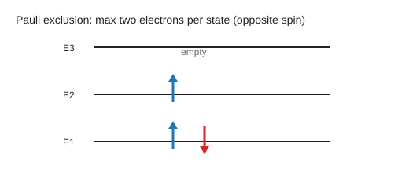
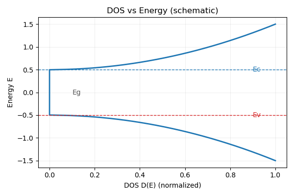
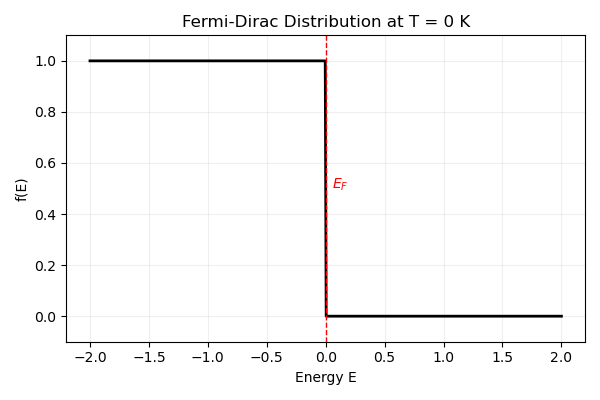
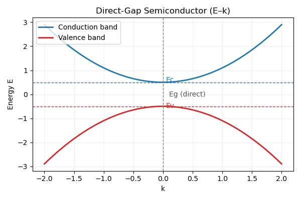
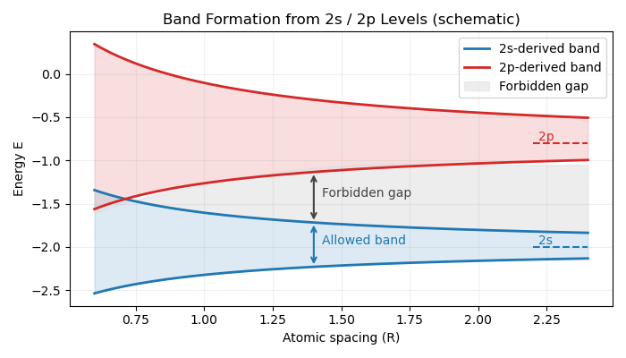
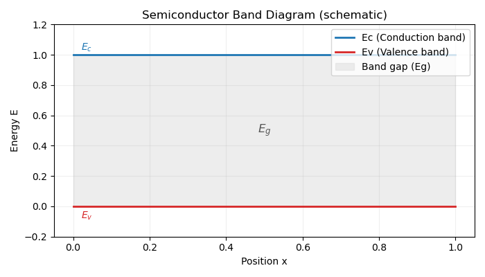

# Electrons Are Not Located, They Are Distributed

> **Core premise**  
> Electrons are not distributed in *space* as localized particles.  
> They are distributed in *probability* through quantum states.

In classical mechanics, asking *“where is a particle?”* implicitly assumes that the particle has a well-defined position $x(t)$ at every moment in time.  
For electrons, this assumption fails at a fundamental level.

In quantum mechanics, an electron is not described by a trajectory,  
but by a wave function $\psi(\mathbf r)$.

$$
\rho(\mathbf r) = |\psi(\mathbf r)|^2
$$

The quantity $\rho(\mathbf r)$ is the **probability density** of finding the electron near position $\mathbf r$ upon measurement.  
A larger value of $\rho$ means a higher probability, not a stronger presence or a smeared particle.

This distinction is crucial.

The electron is not *hidden* at an unknown position,  
nor is it *spread out* in space like a classical cloud.  
Before measurement, the position of the electron is simply **not a predefined property**.

What quantum mechanics provides is not a map of trajectories,  
but a **probabilistic structure** that governs measurement outcomes.

## From Probability Density to States

In [Part 1 (time-independent Schrodinger equation)](../量子力学1/#time-independent-schrodinger-equation), we derived
$$\hat H\psi = E\psi$$
This is where "states" actually come from. For a given potential $V(x)$ and
boundary conditions, only specific solutions $\psi_n(x)$ are allowed, and each
solution corresponds to an energy eigenstate.

So a "state" is not an abstract label. It is the mathematical solution selected
by the physics of the system:
- A potential well gives discrete $\psi_n$ and $E_n$
- A free particle allows continuous plane-wave solutions

When we say "electron distribution," what we really mean is: which eigenstates
are occupied. The probability density $\rho(\mathbf r)=|\psi(\mathbf r)|^2$ is
just the position-space projection of those states.
### Pauli Exclusion Sketch (Draft)

Each horizontal line represents one allowed energy eigenstate. A single arrow
means one electron occupies that state; two opposite arrows mean the state is
fully occupied. Pauli exclusion says you cannot put two electrons with the same
spin into the same state, so each level holds at most two electrons with
opposite spins.

## Bloch's Theorem

In a crystal, the potential is periodic, so the allowed states are not plain
free-space plane waves. Bloch's theorem says every eigenstate can be written as

$$
\psi_{\mathbf k}(\mathbf r) = u_{\mathbf k}(\mathbf r) e^{i\mathbf k \cdot \mathbf r}
$$

where $u_{\mathbf k}(\mathbf r)$ has the same periodicity as the lattice:
$u_{\mathbf k}(\mathbf r + \mathbf R) = u_{\mathbf k}(\mathbf r)$. This is the bridge from real space to $k$-space and is the reason we count states in bands instead of continuous free-particle energies.

  

    Bloch theorem sketch (periodic potential + Bloch-like wave)
  

  
    
  

    Gray: periodic potential V(x). 
    Red dashed: periodic envelope u_k(x). 
    Blue: real part of psi_k(x) = u_k(x) * cos(kx)  
    showing a plane wave dressed by a lattice-periodic modulation.
  

### Phase Shift Under Lattice Translation

Start from the Bloch form,

$$
\psi_k(x) = u_k(x)e^{ikx}, \quad u_k(x+a)=u_k(x)
$$

and translate by one lattice constant:

$$
\psi_k(x+a)=u_k(x+a)e^{ik(x+a)}=u_k(x)e^{ika}e^{ikx}
$$

So the wave keeps the same shape after a shift by $a$, and the only change is a
phase factor:

$$
\psi(x+a) = e^{ika}\psi(x)
$$

This makes the physical meaning explicit: lattice translation does not alter
the probability density, only the phase carried by the crystal momentum $k$.

Because translation only adds a phase, $k$ becomes a good quantum label for
states in a crystal. Once states are labeled by $k$, the next natural question
is: how many $k$-states exist in a given energy range? This is the idea behind
the density of states.

## Density of States (DOS)

To derive DOS cleanly, combine Bloch's theorem with a finite crystal and
periodic boundary conditions. For a cube of side $L$, we require

$$
\psi(x+L)=\psi(x).
$$

Using the Bloch form, the phase factor must satisfy

$$
e^{ikL}=1 \Rightarrow k=\frac{2\pi}{L}n,\quad n\in\mathbb{Z}.
$$

So allowed $k$ values form a uniform grid in $k$-space with spacing
$\Delta k = 2\pi/L$. Each $k$-state occupies a volume

$$
\Delta k^3 = \left(\frac{2\pi}{L}\right)^3
$$

in 3D $k$-space. The number of states in a thin spherical shell between $k$ and
$k+dk$ is the shell volume divided by the $k$-state volume, with spin factor 2:

$$
dN = 2 \cdot \frac{4\pi k^2\ dk}{(2\pi/L)^3}
    = \frac{V}{\pi^2} k^2\  dk,
$$

where $V=L^3$ is the crystal volume.

With the [free-electron dispersion](../量子力学1/#free-electron-dispersion)

$$
E=\frac{\hbar^2 k^2}{2m},
$$

we use $g(E)=\frac{dN}{dE}=\frac{dN}{dk}\frac{dk}{dE}$ to obtain

$$
g(E)=\frac{V}{2\pi^2}\left(\frac{2m}{\hbar^2}\right)^{3/2}\sqrt{E}.
$$

This shows explicitly why the DOS grows as $\sqrt{E}$ in 3D. 
**Physical meaning:** higher energy means a larger $k$-space shell, so there are
more available states to occupy.

For reference, the 3D DOS can also be written as
$$
g(E)=\frac{m}{\pi^2\hbar^3}\sqrt{2mE},
$$
which makes the $\hbar^{-3}$ dependence explicit.

In 2D (per unit area), the DOS is energy-independent:
$$
g_{2D}(E)=\frac{m}{\pi\hbar^2}.
$$

  

    DOS vs Energy (schematic)
  

  
    
  

    $E_c$: conduction-band edge. $E_v$: valence-band edge. $E_g$: band gap.
    The DOS is zero inside the gap and rises in the allowed bands.
  

## Fermi-Dirac Distribution

### T = 0 K (Step Function)

At absolute zero, every state below the Fermi energy $E_F$ is fully occupied
and every state above it is empty:

$$
f(E)=
\begin{cases}
1, & E < E_F \\\\
0, & E > E_F
\end{cases}
$$

This is the sharp step that defines the Fermi surface.
Here the occupation is strictly binary: $f(E)$ is either 1 (occupied) or 0
(empty), reflecting the absence of thermal excitation at $T=0$.

  

    f(E) at T = 0 K (step function)
  

  
    
  

    $E_F$ is the Fermi energy. 
    Below $E_F$: fully occupied ($f=1$). 
    Above $E_F$: empty ($f=0$).
  

### T > 0 K (Thermal Smearing)

At finite temperature, the occupation is no longer a sharp step. Thermal
excitation promotes some electrons above $E_F$ and leaves holes below:

$$
f(E)=\frac{1}{\exp\left(\frac{E-E_F}{k_B T}\right)+1}
$$

$k_B T$ sets the thermal energy scale. 
If $E \gg E_F$, then $f(E)\to 0$. 
If $E \ll E_F$, then $f(E)\to 1$. 
At $E=E_F$, the occupation is exactly $f(E_F)=\frac{1}{2}$. 
As $T$ increases, the transition around $E_F$ becomes smoother.

  

    f(E) at T > 0 K (thermal smearing)
  

  
    0K" width="100%" height="auto">
  

    The transition around $E_F$ is smeared over a few $k_B T$. 
    Finite temperature creates electrons above $E_F$ and holes below.
  

## Electron Density

The electron density follows from integrating the DOS weighted by the
occupation probability:

$$
n=\int_{0}^{\infty} g(E)f(E)dE
$$

### T = 0 K

At $T=0$, $f(E)$ is a step, so only states below $E_F$ contribute:

$$
n=\int_{0}^{E_F} g(E)dE
$$

Using the 3D free-electron DOS derived above gives

$$
n=\frac{1}{3\pi^2}\left(\frac{2m}{\hbar^2}\right)^{3/2} E_F^{3/2}.
$$

Solving for the Fermi energy gives

$$
E_F=\frac{\hbar^2}{2m}(3\pi^2 n)^{2/3}.
$$

### T > 0 K

  

    D(E), f(E), and n(E)=D(E)f(E)
  

  
    0K" width="100%" height="auto">

## Band Structure Construction

In an isolated atom, electrons occupy discrete atomic orbitals, so the energy
levels are discrete. When many atoms arrange into a periodic lattice, their
electronic wavefunctions overlap and interact, causing each atomic level to
split into many closely spaced levels. Because the number of atoms is enormous,
these split levels become so dense that they appear nearly continuous, forming
**energy bands** separated by gaps.

In a periodic lattice, allowed electron states organize into energy bands
separated by gaps. Each band comes from a family of Bloch states labeled by $k$,
and gaps open at Brillouin zone boundaries where the periodic potential mixes
states with wavevectors differing by a reciprocal lattice vector. This is the
bridge from single-particle wave mechanics to the electronic properties of
materials.

  

    Direct-gap semiconductor: E–k diagram
  

  
    
  

    Conduction-band minimum and valence-band maximum occur at the same k,
    which is the defining feature of a direct band gap.
  

  

    Band formation from 2s/2p levels (schematic)
  

  
    
  

    As atomic spacing decreases, discrete 2s/2p levels broaden into bands.
    The shaded region indicates the forbidden gap between bands.
  

> **Key idea:** conduction is not about electrons \"moving in place\" but about
> electrons *changing to available states*. Metals conduct because empty states
> already exist near $E_F$. Semiconductors and insulators need thermal or optical
> excitation to create carriers in the conduction band (and holes in the valence
> band).

## Semiconductors (Band Diagram)

  

    Semiconductor band diagram (Ec, Ev, Eg)
  

  
    

## Effective Mass

Near a band edge, the dispersion can be approximated as a parabola:

$$
E(k) \approx E_0 + \frac{\hbar^2 k^2}{2m^*}.
$$

The **effective mass** is defined by the band curvature:

$$
\frac{1}{m^*} = \frac{1}{\hbar^2}\frac{d^2E}{dk^2}.
$$

This connects band structure to dynamics: the group velocity is

$$
v_g=\frac{1}{\hbar}\frac{dE}{dk},
$$

so a flatter band (small curvature) gives a heavier effective mass and slower
response to an external field. For valence bands, the curvature can be negative,
which is why holes are treated as positive carriers with their own effective
mass.

### Effective Mass in DOS

Near the band edge, we can replace the free-electron mass with the effective
mass in the DOS:
$$
g(E)=\frac{1}{2\pi^2}\left(\frac{2m^*}{\hbar^2}\right)^{3/2}\sqrt{E}.
$$

### Dispersion Relation (Near Band Edge)

The dispersion relation is simply the energy-momentum relation $E(k)$.
Near a band edge it is approximately parabolic, which is why the effective
mass description works. Farther away from the edge, $E(k)$ deviates from a
parabola and the effective mass becomes energy-dependent.

### Mobility (Semiconductors)

Carrier mobility is
$$
\mu=\frac{q\tau}{m^*},
$$
so a smaller effective mass generally means higher mobility (faster response
to an applied field).
